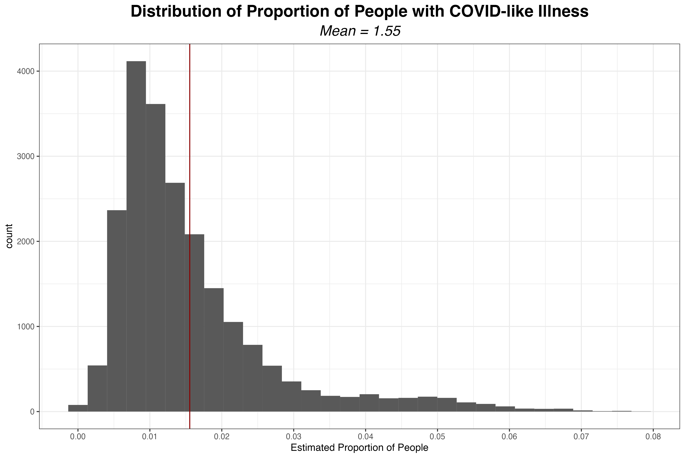

```{r, include=FALSE}
knitr::opts_chunk$set(echo = FALSE, 
                      eval = TRUE,
                      message = FALSE,
                      warning = FALSE,
                      cache = FALSE)
```


```{r}
knitr::opts_chunk$set(echo = FALSE)
```


# Definition of Prior Distributions for Bias Parameters


## Background on the Beta Distribution

The priors we are specifying here are for probabilities, with the exception of $\alpha$ and $\beta$, which represent ratios of probabilities. To define a prior for a parameter that takes on values in $[0,1]$, a particularly useful distribution is the beta distribution, which is only defined on the interval $[0,1]$. It is parameterized by two positive values $\alpha, \beta$^[In R, $\alpha$ = shape1 and $\beta$ = shape2.]. In this section, and only in this section, we refer to $\alpha$ and  $\beta$ as the parameters of the beta distribution, not the random variables that are inputs to the probabilistic bias analysis.

The $\beta$ distribution is an extremely flexible distribution^[The $\beta$ distribution is also useful in Bayesian statistics, because it is the conjugate prior distribution for the binomial distribution and negative binomial distributions. That is, if we have a binomial likelihood with parameter $p$ and $p$ is distributed according to the $\beta$ distribution, the resulting posterior follows a $\beta$ distribution.]; by altering the parameters $\alpha, \beta$, we can get an extensive array of shapes, as seen below. 


```{r, echo = FALSE, out.width = '80%'}

library(latex2exp)
library(tidyverse)
library(viridis)

alpha <- seq(.1, 6, by = .5)
  
beta <-  seq(.1, 6, by = .5)

x <- seq(0,1, length = 1000)


results <- map_df(alpha, function(alpha) {
  map_df(beta, ~{tibble(
    x = x,
    density = dbeta(x, 
                    shape1 = alpha, 
                    shape2 = .x),
    alpha = alpha,
    beta = .x)})})

results %>%
  mutate(params = paste0(alpha, 
                         beta,
                         sep = "_")) %>%
  ggplot(aes(x = x, 
             y = density, 
             color = params)) +
  geom_line( show.legend = FALSE) + 
  theme_bw() +
  scale_color_viridis(discrete=TRUE) +
  ylim(0, 7) +
  theme(axis.text.y = element_blank(),
        axis.ticks = element_blank(),
        plot.title =element_text(face = "bold",
                                 hjust = .5)) +
  labs(title = 
         TeX("Beta Distributions for Different Values of $\\alpha$ and $\\beta$"),
       y = TeX("$f(x|\\alpha,\\beta)$"))


```


In defining a beta distribution to reflect knowledge about a parameter, we need to work backwards to find the parameters $\alpha$ and $\beta$ that correspond to the desired mean and variance.  

There are multiple parameterizations of the beta distribution, but R uses that where we define the probability density function as

$$
f(x|\alpha,\beta) = \dfrac{\Gamma(\alpha + \beta)}{\Gamma(\alpha) \Gamma(\beta)} x^{\alpha - 1} (1-x)^{\beta - 1}.
$$
or equivalently as 
$$
f(x|\alpha,\beta) = \dfrac{1}{B(\alpha,\beta)} x^{\alpha - 1} (1-x)^{\beta - 1},
$$
where the beta function $B(\alpha, \beta) = \dfrac{\Gamma(\alpha)\Gamma(\beta) }{\Gamma ( \alpha + \beta)}$.


The expected value of the beta distribution is then $E(X) = \dfrac{\alpha}{\alpha + \beta}$ and the variance is given by $V(X) = \dfrac{\alpha \beta}{(\alpha + \beta)^2(\alpha + \beta + 1)}$; the derivation for both is given in the appendix. We can then solve for $\alpha$ and $\beta$ to obtain $\alpha = \Big(\frac{1-\mu}{\sigma^2} - \frac{1}{\mu}\Big) \mu^2$ and $\beta = \alpha\Big(\frac{1}{\mu} - 1\Big)$.  At this point, we can easily write a function in R that generates the parameters of the beta distribution with the desired mean and variance. 


## Background on the Gamma Distribution

The gamma distribution is another very flexible distribution. However, the support of the gamma distribution is $(0,\infty)$ rather than $[0,1]$. Because some of the bias parameters are not probabilities ($\alpha$ and $\beta$ are ratios of probabilities), we can instead use the gamma distribution to allow the random variable to take on values over 1. 

As with the beta distribution, a variety of shapes are possible with the gamma distribution.

```{r,  echo = FALSE, out.width = '80%'}

library(latex2exp)
library(tidyverse)
library(viridis)

shape <- seq(.1, 20, by = .8)
  
scale <-  seq(.1, 6, by = .8)

x <- seq(0,6, length = 1000)


results <- map_df(shape, function(shape_inp) {
  map_df(scale, function(scale_inp) {tibble(
    x = x,
    density = dgamma(x, 
                    shape = shape_inp, 
                    scale = scale_inp),
    shape = shape_inp,
    scale = scale_inp)})})

results %>%
  mutate(params = paste0(shape, 
                         scale,
                         sep = "_")) %>%
  ggplot(aes(x = x, 
             y = density, 
             color = params)) +
  geom_line( show.legend = FALSE) + 
  theme_bw() +
  scale_color_viridis(discrete=TRUE) +
  ylim(0, 7) +
  theme(axis.text.y = element_blank(),
        axis.ticks = element_blank(),
        plot.title =element_text(face = "bold",
                                 hjust = .5)) +
  labs(title = 
         TeX("Gamma Distributions for Different Values of Shape and Scale"),
       y = TeX("$f(x|shape,scale)$")) +
  xlim(0,4)


```

Let $k=shape$ and $\theta=scale$. The parameterization of the gamma distribution that R uses is 

$$f(x|k,\theta) = \frac{1}{\Gamma(k) \;\theta^k}x^{k-1} e^{x/\theta}$$
where the mean $\mu =k\theta$ and the variance $\sigma^2 = k\theta^2$.

This allows us to obtain $\dfrac{\mu^2}{\sigma^2} = \dfrac{k^2 \theta^2}{k\theta^2} = k =shape$.

Then, substituting this result in for $k$, we have $$\sigma^2 = k \theta^2 = \dfrac{\mu^2}{\sigma^2} \theta^2$$
$$\frac{\sigma^4}{\mu^2}=\theta^2$$

$$\frac{\sigma^2}{\mu}=\theta = scale.$$
This allows us to calculate the shape and scale parameters of a gamma distribution with the desired mean and variance. 

```{r}

get_gamma_params <- function(mu, sd) {
    var = (mu/sd)^2
    shape = (mu/sd)^2
    scale = sd^2/mu
    return(params = list(shape = shape, scale = scale))
}

```

```{r,eval=FALSE,include=FALSE}
####################
# TEST
####################


mean <- 2
std <- 1.5

params <- get_gamma_params(mu = mean, sd = std)


samp <- rgamma(1e4, 
       shape = params$shape, 
       scale = params$scale)

mean(samp)
sd(samp)

```


## Definition of Prior Distributions for Incomplete Testing Correction


```{r, eval= FALSE,include=FALSE}
---
title: "Defining Priors"
author: "Quinn White"
date: "`r Sys.Date()`"
output:
  rmdformats::readthedown:
    df_print: paged
    code_folding: hide
---
```


```{r setup, include=FALSE}
knitr::opts_chunk$set(echo = TRUE, 
                      eval = TRUE,
                      message = FALSE,
                      warning = FALSE,
                      cache = TRUE)

library(tidyverse)

library(latex2exp)

theme_c <- function(...){ 
    font <- "Helvetica"   #assign font family up front
   # font <- "Arial"
    theme_bw() %+replace%    #replace elements we want to change
    
    theme(
      
      
      #text elements
      plot.title = element_text(             #title
                   family = font,            #set font family
                   size = 14,                #set font size
                   face = 'bold',            #bold typeface
                   hjust = .5,
                   vjust = 3),               
      
      plot.subtitle = element_text(          #subtitle
                   family = font,            #font family
                   size = 14,
                   hjust = .5,
                   face = 'italic',
                   vjust = 3),               #font size
      
      axis.title = element_text(             #axis titles
                   family = font,            #font family
                   size = 12),               #font size
      
      axis.text = element_text(              #axis text
                   family = font,            #axis famuly
                   size = 9),
      # t, r, b, l
      plot.margin = unit(c(1,.5,.5,.5), "cm")
      ) %+replace%
      theme(...)
   
}

```
  
  

### Defining $P(S_1|Untested)$

We recall that $S_1$ denotes the event that an individual has moderate to severe symptoms, so
 $P(S_1|Untested)$ is the probability of having moderate to severe symptoms among those who were not tested. We note that this would include people that have moderate to severe COVID-like symptoms that do indeed have COVID-19 as well as people that do not have COVID-19 and have some other respiratory illness.
 
 The original distribution was defined such that $P(S_1|Untested) \sim TBeta(\alpha = 1.18, \beta = 45.97)$, bounded between 0 and 15%, as we see below. 


```{r, out.width = '80%',echo=FALSE}

alpha <- 1.18
beta <- 45.97

get_beta_params <- function(mu, sd) {
  var = sd^2
  alpha <- ((1 - mu) / var - 1 / mu) * mu ^ 2
  beta <- alpha * (1 / mu - 1)
  return(params = list(alpha = alpha, beta = beta))
}

# truncated support between a=0, b=0.15
trunc_beta_s1_untested <- function(x) {
  truncdist::dtrunc(x,spec = "beta",a = 0,b = 0.15,
                    shape1 = get_beta_params(mu = 0.025, sd = (0.15)^2)$alpha,
                    shape2 = get_beta_params(mu = 0.025, sd = (0.15)^2)$beta)
} 

tibble(x = seq(0, 1, by = 10^(-5)),
       y = trunc_beta_s1_untested(x)) %>%
  ggplot(aes(x=x, y = y)) +
  geom_area(alpha = .8) + 
  theme_c() +
  labs(x = "Value", y = "Probability Density", 
       title = latex2exp::TeX("Original Definition of $P(S_1|untested)$")) 

# 
# ggplot(data.frame(x = c(0,1)), aes(x=x)) +
#   stat_function(fun = dbeta, args = list(shape1= 20, shape2 = 1.4), geom = "area", fill = "purple", alpha = 0.35) 


```


However, to implement this approach over a more extended time interval, we need to allow this parameter to vary by time. Due to state-specific differences in symptom prevalence, it also makes more sense to allow this parameter to vary by state.
 
 To do this, we can use the COVID-like illness indicator from the COVID-19 Trends and Impact Survey  [@salomon2021]. The COVID-19 Trends and Impact Survey (CTIS) is a large scale internet-based survey that invites a sample of Facebook users to respond to questions on several topics of public health interest, including testing and symptom status. The survey effort selects participants using stratified random sampling by state, and responses are aggregated and made publicly available.
 
Below, we see that the distribution of the proportion of the population with COVID-like illness over all of 2021 is in a similar range as the original definition of $P(S_1|untested)$, with the bulk of the distribution between 0 and 15%. 


```{r, echo = FALSE, out.width="80%",eval=FALSE}

# https://cmu-delphi.github.io/delphi-epidata/api/covidcast.html
# influenza-like illness

fb_symptoms <- httr::GET('https://api.covidcast.cmu.edu/epidata/covidcast/?data_source=fb-survey&signal=smoothed_wcli&time_type=day&geo_type=state&time_values=20210101-20220226&geo_value=*')


fb_symptoms <-jsonlite::fromJSON(
     httr::content(fb_symptoms,
                   as = "text", 
                   encoding = "UTF-8"),
     simplifyVector = TRUE,
     flatten = TRUE)

fb_symptoms <- fb_symptoms$epidata %>%
  mutate(desc = case_when(
    signal == "smoothed_wili" ~ "Estimated percentage of people\nwith influenza-like illness",
    signal == "smoothed_wcli" ~ "Estimated percentage of people\nwith COVID-like illness"),
    date = lubridate::ymd(time_value),
    state = substr(geo_value, 1, 2)) 

m <- fb_symptoms  %>%
  group_by(signal) %>%
  mutate(m = mean(value, na.rm = TRUE)) %>%
  pull(m) %>% unique()

fb_symptoms  %>%
  mutate(value = value/100) %>%
  group_by(signal) %>%
  mutate(mean_pct = mean(value, na.rm = TRUE)) %>%
  ungroup() %>%
  ggplot(aes(x = value)) +
  geom_histogram() +
  geom_vline(aes(xintercept = mean_pct), color = "darkred") + 
  # geom_text(aes(x=mean_pct + 2, 
  #               label = paste0("Mean =", round(mean_pct,2)),
  #               y = 25000), 
  #           colour="darkred") +
 # facet_wrap(~desc) +
  theme_bw() +
  theme(strip.text =element_text(size = 14, face = "bold"),
        plot.title = element_text(face = "bold", hjust = .5, size = 18),
        plot.subtitle = element_text(face = "italic", hjust = .5, size = 16)) +
  labs(x = "Estimated Proportion of People",
       title = "Distribution of Proportion of People with COVID-like Illness",
                              subtitle = paste0("Mean = ", round(m,2))) +
  scale_x_continuous(n.breaks = 8)

ggsave("./figure/emp_distribution_p_s_untested.png", dpi = 400)

# percentage over time, by state 
fb_symptoms  %>%
  mutate(value = value/100) %>%
  ggplot(aes(x = date, y = value, color = state)) +
  geom_line(show.legend=FALSE, size = .2) +
  theme_bw() +
  theme(strip.text =element_text(size = 14, face = "bold"),
        plot.title = element_text(face = "bold", hjust = .5, size = 18),
        plot.subtitle = element_text(face = "italic", hjust = .5, size = 16),
        axis.title = element_text(size = 14)) +
  labs(title = "Estimated Percentages of People with\nCOVID-like Illness by State",
       y = "State Mean") +
  viridis::scale_color_viridis(discrete=TRUE, option = "inferno")
  
ggsave("./figure/cli_by_state.png", dpi = 400)


```

```{r, echo = FALSE,out.width = "80%"}

```


We also see that although the general trend is similar between states, there is variability in the proportion experiencing COVID-19-like illness by state. 


```{r, echo = FALSE,out.width = "80%"}
knitr::include_graphics("./figure/cli_by_state.png")
```

```{r, eval = FALSE, echo = FALSE}
# county values
fb_symptoms  %>%
  mutate(date = lubridate::ymd(time_value)) %>%
  ggplot(aes(x = date, y = value, color = geo_value)) +
  geom_line(show.legend=FALSE, size = .2) +
  facet_wrap(~desc, nrow = 2) +
  theme_c(strip.text =element_text(size = 14, face = "bold")) 
```


### Defining $\alpha$


 $\alpha$ is defined as the ratio of $\dfrac{P(test + |S_1, untested)}{P(test+|tested)}$, applied to allow $P(test + |S_1, untested)$ to vary by state. $P(test+|tested)$ is the state-level empirical estimate, but $\alpha$ itself is not calculated using the state-level empirical estimate. Instead, $P(test+|S_1, untested)$ is calculated as $P(test+|S_1, untested) =\alpha P(test+|tested)$. So we can think about $\alpha$ as the adjustment to the test positivity rate as we estimate the probability of testing positive among symptomatic untested individuals. This is assumed to be high, that is, that the probability of testing positive among **symptomatic untested** individuals would be near 90% of the probability of testing positive among **tested individuals** (not all of whom would be symptomatic).
 
 $\alpha \sim TBeta(\alpha = 49.73, \beta = 5.53)$, bounded between 80% to 100%, with the mean at $\dfrac{\alpha}{\alpha + \beta} = 0.90$.
 
 Due the the expansion of testing resources, it is plausible that $P(test +|untested,S_1)$ could exceed $P(test+|tested)$, so we will extend this distribution to be larger than one. 
 


```{r, out.width = '50%',echo=FALSE}

alpha <- 49.73	
beta <- 5.53


# truncated support between a=0, b=0.15
trunc_beta_alpha <- function(x) {
  truncdist::dtrunc(x,spec = "beta",
                    # upper limit
                    a = 0.80, 
                    # lower limite
                    b = 1,
                    shape1 = get_beta_params(
                      mu = 0.9, 
                      sd = (0.2)^2)$alpha,
                    shape2 = get_beta_params(
                      mu = 0.9, 
                      sd = (0.2)^2)$beta)
} 

tibble(x = seq(0, 1, by = 10^(-4)),
       y = trunc_beta_alpha(x)) %>%
  ggplot(aes(x=x, y = y)) +
  geom_area(alpha = .8) + 
  theme_c(axis.text.y = element_blank(),
          axis.ticks.y = element_blank()) +
  labs(x = "Value", y = "Probability Density", 
       title = TeX("$\\alpha$")) 


```


### Defining $\beta$


 Similar to the way we defined $\alpha$, $\beta$ is defined as the ratio of $\dfrac{P(test + |S_0, untested)}{P(test+|tested)}$, applied to allow $P(test + |S_0, untested)$ to vary by state. We use $\beta$ to calculate $P(test+|S_1, untested)$ by the expression $P(test+|S_0, untested) =\beta P(test+|tested)$. We can think about $\beta$ as the adjustment to the test positivity rate as we estimate the probability of testing positive among **aymptomatic untested** individuals (in contrast to $\alpha$, which is symptomatic untested individuals). This is assumed to be substantially lower than $\alpha$, reflecting we expect a much smaller proportion of asymptomatic untested individuals to test positive.
 
 The original definition of $\beta$ was 
 $\beta \sim TBeta(\alpha = 2.21, \beta = 12.53)$ with the mean at $\dfrac{2.21}{2.21 + 12.53} = 0.15$ and bounded between 0.2% to 40%.
 


```{r, out.width = '50%',echo=FALSE}


# truncated support between a=0, b=0.15
trunc_beta <- function(x) {
  truncdist::dtrunc(x,spec = "beta",
                    # upper limit
                    a = 0.2/100, 
                    # lower limit
                    b = 40/100,
                    shape1 = get_beta_params(
                      mu = 0.15, 
                      sd = (0.3)^2)$alpha,
                    shape2 = get_beta_params(
                      mu = 0.15, 
                      sd = (0.3)^2)$beta)
} 

tibble(x = seq(0, 1, by = 10^(-4)),
       y = trunc_beta(x)) %>%
  ggplot(aes(x=x, y = y)) +
  geom_area(alpha = .8) + 
  theme_c(axis.text.y = element_blank(),
          axis.ticks.y = element_blank()) +
  labs(x = "Value", y = "Probability Density", 
       title = TeX("$\\beta$")) 


```


Because $\beta$ is defined as the ratio of $\dfrac{P(test + |S_0, untested)}{P(test+|tested)}$, we can estimate $\beta$ empirically by taking the screening test positivity rate as an estimate of $P(test + |S_0, untested)$ and then dividing by the overall test positivity rate $P(test+|tested)$. State-level estimates for screening test positivity and overall test positivity are available through the COVID-19 Trends and Impact Survey, enabling us to obtain a time and state-specific estimate of $\beta$.

### Defining $P(S_0|test+,untested)$

$P(S_0|test +)$ is the probability of not having symptoms among those who test positive, that is, the percentage of asymptomatic infection among those with confirmed COVID-19. It is defined such that $P(S_0|Test +) \sim TBeta(\alpha = 6.00, \beta = 9.00)$, bounded between 25% and 70% with the mean at $\dfrac{\alpha}{\alpha + \beta} = 0.40$.

One large meta-analysis found $P(S_0|test+)$ to be 40.50% (95% CI: 33.50%-47.50%), although it did not restrict to screening studies [@ma2021a]. Another meta-analysis, when restricting to screening studies,  found $P(S_0|test+)$ to be 47.3% (95% CI: 34.0% -61.0%) [@sah2021a].

```{r, echo = FALSE, out.width='50%'}

p_s0_pos <- function(x){
  truncdist::dtrunc(x = x,spec = "beta",a = 0.25,b = 0.7,
                    shape1 = get_beta_params(mu = 0.4, sd = (0.35)^2)$alpha,
                    shape2 = get_beta_params(mu = 0.4, sd = (0.35)^2)$beta)
}

tibble(x = seq(0, 1, by = 10^(-4)),
       y = p_s0_pos(x)) %>%
  ggplot(aes(x=x, y = y)) +
  geom_area(alpha = .8) + 
  theme_c(axis.text.y = element_blank(),
          axis.ticks.y = element_blank()) +
  labs(x = "Value", y = "Probability Density", 
       title = TeX("$P(S_0|test +)$")) 

# 

```


## Definition of Priors for Test Inaccuracy Correction

### Defining Test Sensitivity ($S_e$)

The test sensitivity $P(test + | +)$ is defined as $P(test +|+ )\sim TBeta(\alpha = 4.20, \beta = 	1.05)$, bounded between 0.65 and 1 and with mean $\dfrac{\alpha}{\alpha + \beta} = 0.80$.


```{r, echo = FALSE, out.width = "80%"}

p_se <- function(x){
  truncdist::dtrunc(x = x,spec = "beta",a = 0.65,b = 1,
                    shape1 = get_beta_params(mu = 0.8, sd = (0.4)^2)$alpha,
                    shape2 = get_beta_params(mu = 0.8, sd = (0.4)^2)$beta)
}

tibble(x = seq(0, 1, by = 10^(-4)),
       y = p_se(x)) %>%
  ggplot(aes(x=x, y = y)) +
  geom_area(alpha = .8) + 
  theme_c(axis.text.y = element_blank(),
          axis.ticks.y = element_blank()) +
  labs(x = "Value", y = "Probability Density", 
       title = TeX("$S_e = P(test + | +)$")) 


```

**Data available for informing this prior distribution:** 

In a population-based retrospective study including both inpatients and outpatients, the clinical sensitivity was estimated to be 89.9% (95% CI 88.2 – 92.1%) by considering repeat-tested patients who initially tested negative but later tested positive [@kortela2021a]. However, as Kortela *et al.* discussed, this approach is likely an overestimate of the true clinical sensitivity, because individuals will only be tested twice if there is high clinical suspicion that they do have COVID-19. To account for this, they produced an estimate of sensitivity including cases with high clinical suspicion in the denominator, which resulted in an estimate closer to 50%, yet this is likely an underestimate due to the fact that even those with a classical COVID-19 symptom presentation may not have COVID-19. They concluded that due to these biases, the true value most likely falls between the overestimate near 90% and the underestimate near 50%.

Another analysis of repeat-tested patients using data from a large sample of patients tested at the provincial Public Health Laboratory in Canada estimated the clinical sensitivity to be 90.7% (95% CI 82.6–98.9%) [@kanji2021]. Green *et al.* found that the clinical sensitivity ranged from 58% to 96%: the estimate of 96% was dependent on the assumption that negative results, repeated or not, were true negatives, while the estimate of 58% assumed the rate of false negatives among the repeat-tested population would be the same as in the repeat-tested patients [@green2020]. In a meta-analysis of 51 studies, Mustafa *et al.* found a pooled estimate of the clinical sensitivity as 0.96 (95% CI 93% - 98%) [@mustafahellou2021]. 

Because PCR tests are designed to target a highly conserved region of the viral genome, their sensitivity was expected to be relatively robust to the circulation of different variants of SARS-CoV-2. However, analytical sensitivity has shown some differences by genetic variants [@chen2022]. Viral shedding dynamics also have differed by genetic variant, but the variants dominant throughout most of the time period considered here, Delta and Omicron, have similar viral loads [@fall2022; @singanayagam2022]. 


```{r, echo = FALSE, eval = FALSE}

library(lubridate)
library(tidyverse)

# source: https://dev.socrata.com/foundry/data.cdc.gov/jr58-6ysp
# https://www.cdc.gov/media/releases/2021/s1126-B11-529-omicron.html

var <- httr::GET(
   URLencode(paste0("https://data.cdc.gov/resource/jr58-6ysp.json?",
   "usa_or_hhsregion=USA&time_interval=weekly")))

#var <- httr::GET("https://data.cdc.gov/resource/jr58-6ysp.json?week_ending=2022-07-02T00:00:00.000")
var <-jsonlite::fromJSON(
      httr::content(var,
                    as = "text", 
                    encoding = "UTF-8")) %>%
  as_tibble()

var <- var %>%
  mutate(date = substr(week_ending,1,10),
         date =strptime(date, "%Y-%m-%d"),
         creation_date =strptime(creation_date, "%Y-%m-%d")) %>%
  filter(modeltype == "weighted" & date <= ymd("2022-02-25")) %>%
  mutate(across(c(share, share_hi, share_lo), as.numeric))

# B.1.1.529 omicron/ B.1.1 also omicron
# B.1.617.2 delta 
# only one creation date (most recent)
var <- var %>%
  group_by(date) %>%
  slice_max(order_by = creation_date, n = 1) %>%
  mutate(date = ymd(date)) %>%
  select(-contains("creation"))

# http://vrl.cs.brown.edu/color

pal <- c("#68affc", "#406087", "#8de6c0", "#096013", "#9de866",
         "#31a62e", "#11a0aa", "#4443b4", "#c052e4", "#722e57",
         "#e3a6d5", "#e01e82", "#8e80fb", "#5010c8", "#cad7d4",
         "#829951")


var %>% mutate(
  variant_name = case_when(
  variant %in% c("B.1.1.529", 
                  "B.1.1", 
                  "BA.1.1", 
                  "BA.2",
                  "BA.3", 
                  "BA.4",
                  "BA.5") ~ "Omicron",
  variant %in% "B.1.617.2" ~ "Delta",
  TRUE ~ "Other")) %>%
  ggplot(aes(x =date, 
             y = share, 
             fill = variant_name)) +
  geom_bar(stat="identity",
           alpha = .8) +
  scale_fill_viridis(discrete=TRUE)+
  #scale_fill_manual(values = pal ) +
  theme_bw() + 
  theme(legend.position = "right",
          legend.title = element_text(face = "bold", size = 16),
        plot.title = element_text(face = "bold", hjust = .5, size = 18))  +
  scale_x_date(date_breaks = "2 months", date_labels = "%b %Y") +
  labs(title = "Variant Proportions over Time",
       fill = "Variant")

ggsave("./figure/variant_plot.jpg", dpi = 600)


```

```{r, out.width = "80%", fig.cap = "Variant proportions in the United States from genomic surveillance data collected by the CDC. Data is not available for time periods earlier than May 8, 2021.", echo = FALSE}

knitr::include_graphics("./figure/variant_plot.jpg")

```

Ultimately, although it is plausible that test sensitivity may vary by time due to differences in viral shedding dynamics over time as well as differences due to the mutations present in circulating variants, there is a lack of data to inform exactly how the sensitivity may vary over time. As a result, we assume the test sensitivity is independent and identically distributed across time periods.
 

## Defining Test Specificity ($S_p$)

The test specificity $P(test -| -)$ is defined as $P(test -|- )\sim TBeta(\alpha = 4998.50, \beta = 	0.25)$, bounded between 0.9998 and 1 and with mean $\dfrac{\alpha}{\alpha + \beta} = 0.99995$. The high certainty for this parameter is based on the [CDC 2019-nCoV Real-Time RT-PCR Diagnostic Panel](https://www.fda.gov/media/134922/download). 


```{r,echo=FALSE, out.width = "80%"}

p_sp <- function(x){
  truncdist::rtrunc(n = x,spec = "beta",a = 0.9998	,b = 1,
                    shape1 = get_beta_params(mu = 0.99995, sd = (0.01)^2)$alpha,
                    shape2 = get_beta_params(mu = 0.99995, sd = (0.01)^2)$beta)
}

tibble(x = p_sp(10000)) %>%
  ggplot(aes(x=x)) +
  geom_density(fill = "black", alpha = .8) +
  xlim(0,1) +
  theme_c(axis.text.y = element_blank(),
          axis.ticks.y = element_blank()) +
  labs(x = "Value", y = "Probability Density", 
       title = TeX("$S_p = P(test - | -)$")) 


```


## Summary Table of Bias Parameter Distributions

To add 

## Correction for Incomplete Testing 

As discussed previously, once we have sampled values from the constrained distributions of $P(S_1|untested)$, $\alpha$, $\beta$, we estimate the test positivity among the symptomatic untested population as $P(+|S_1,untested) = \alpha \; P(test +|tested)$ and we estimate the test positivity among the asymptomatic untested population as $P(+|S_0,untested) = \beta \; P(test +|tested)$. Then, we compute the positives among the symptomatic and mild/asymptomatic parts of the population respectively as 

$$N^+_{untested,S_1} = N_{untested} \; P(S_1|untested) \cdot P(test + | S_1,untested) \;\;\;\text{ and }$$
$$N^+_{untested,S_0} = N_{untested}(1-P(S_1|untested))P(test + | S_0,untested).$$
Then, we take the total positives among the untested population as 

$$N^+_{untested} = N^+_{untested,S_1} + N^+_{untested,S_0}$$
and finally we add the number of observed positives, $N^+_{tested}$ to obtain the estimate for the positives among the total population, as 

$$N^+ = N^+_{untested} +N^+_{tested}.$$


```{r,echo=FALSE,include=FALSE,eval=FALSE}
### Acquiring $N^+_{{untested}, S_1}$

$N^+_{{untested}, S_1}$ = the number of **symptomatic untested people** who have COVID-19.

We know
\[ N^+_{untested} = (N_{\text{untested}})  \cdot P(+,S_1 | \text{untested}).\]

Now, we need to show \[ P(+,S_1 | {untested}) = P(S_1|untested) \cdot P(test \; + | S_1, untested).\]


We can see this by writing 

\[ P(+,S_1 | {untested})  =  \dfrac{P(+,S_1 , {untested}) }{P(untested)}\]

and since $P(+|S_1, untested ) = \dfrac{P(untested, +, S_1)}{P(S_1, untested)}$ we have

\[ P(+,S_1 | {untested})  =  \dfrac{P(+|S_1, untested )P(S_1, untested) }{P(untested)}.\]

Because $\dfrac{P(S_1, untested) }{P(untested)} = P(S_1| untested)$
we can substitute into this expression to give us 
\[ P(+,S_1 | {untested})  =  P(+|S_1, untested )P(S_1|untested) .\]
Thus, $N^+_{{untested}, S_1}$ can be acquired by taking

\[
N^+_{{untested}, S_1}= P(+|S_1, untested )\cdot P(S_1|untested) \cdot N_{untested}.
\]

### Acquiring $N^+_{{untested}, S_0}$

$N^+_{{untested}, S_0}$ = the number of **asymptomatic untested people** who have COVID-19.

Using similar logic, we can find $N^+_{{untested}, S_0}$. That is, we can take
\[
N^+_{{untested}, S_0}= P(+|S_0, untested )\cdot P(S_0|untested) \cdot N_{untested}
\]
where $P(S_0|untested)  = (1- P(S_1|untested))$.

  
```


## Correction for Diagnostic Test Inaccuracy

At this point, we have corrected for the incompleteness of testing. That is, we have an estimate of who would have tested positive if we tested the entire population. However, we also need to correct for imperfect test accuracy. 

Test accuracy is broken up into two components, specificity and sensitivity.

We define test sensitivity and specificity as follows:
* $S_e$ = test sensitivity = the probability an individual tests positive if they have COVID-19 (probability of a true positive), that is, $P(test + | +)$. 
* $S_p$ = test specificity = probability an individual tests negative if they do not have COVID-19 (probability of a true negative), that is, $P(test - |-)$.

Then, given that we have the number $N^+$ who tested positive (or, in the context of this work, would have tested positive), the specificity $S_p$, the sensitivity $S_e$, and the total population size $N$, we can calculate the true positives with the formula
$$\text{Number Truly Positive} = \dfrac{N^+ - (1-S_p) \times N}{S_e+S_p-1}$$
from Modern Epidemiology [@rothman2008].

### Derivation of Formula for Correction for Diagnostic Test Inaccuracy

We define test sensitivity and specificity as follows:
* $S_e$ = test sensitivity = the probability an individual tests positive if they have COVID-19 (probability of a true positive), that is, $P(test + | +)$. 
* $S_p$ = test specificity = probability an individual tests negative if they do not have COVID-19 (probability of a true negative), that is, $P(test - |-)$.

As defined previously, $S_e \sim TBeta(0.65, 1)$ and $S_p \sim TBeta(0.998, 1)$.

To correct case counts for diagnostic test inaccuracy, we use the formula 
$$\text{Number Truly Positive} = \dfrac{N^+ - (1-S_p) \times N}{S_e+S_p-1}$$
as defined in Rothman et al. (2008).

To obtain this formula, we let:

* $N$ denote the total population size
* $N^+$ denote the number *classified* as positive
* $N^-$ denote the number *classified* as negative
* $T^+$ denote the number that is *truly* positive
* $T^-$ denote the number that is *truly* positive


We also recall that 
\[ \text{Sensitivity} = S_e = P(test + | +) \]
\[ \text{Specificity} = S_p = P(test - | - ) \] 


The quantity we want to estimate is the number of truly positive individuals when accounting for imperfect test accuracy, that is, $T^+$.

The number classified as positive, $N^+$ can be written as 

\[ N^+ = P(test + | +) T^+ + P(test + | -) T^-\]

where $P(test + | +) T^+$ is the number of true positives and $P(test + | -) N^-$ is the number of false positives. By the definitions of  sensitivity $S_e$ and specificity $S_p$ we can write this more clearly as 
\[ N^+ =S_e T^+ + (1-S_p) T^-.\]


Meanwhile, the number classified as negative, $N^-$ can be written as 

\[ N^- = P(test - | -) T^- + P(test - | +) T^+\]

where $P(test - | -) T^-$ is the number of true negatives and $P(test - | +) T^+$ is the number of false negatives. Substituting in $S_e$ and $S_p$ we can express this as 

\[ N^- = S_p T^- + (1-S_e) T^+.\]

At this point, we can solve the expression $N^- = S_p T^- + (1-S_e) T^+$ for the number of people classified as positive for the number truly negative, $T^-$. This yields

\[\dfrac{( N^- - (1-S_e) T^+) }{S_p}=  T^- .\]

Now, we can substitute this result into our expression for $N^+ =S_e T^+ + (1-S_p) T^-$ and solve for the desired value, the number of truly positive individuals, $T^+$. This gives us

\[
 N^+ =S_e T^+ + (1-S_p)  \left( \dfrac{( N^- - (1-S_e) T^+) }{S_p} \right)
\]

\[
 S_pN^+ =S_pS_e T^+ + (1-S_p)  \left( {( N^- - (1-S_e) T^+) } \right)
\]

\[
 S_pN^+ =S_pS_e T^+ + (1-S_p)  ( N^-)  - (1-S_p)(1-S_e) T^+
\]

\[
 S_pN^+ -   (1-S_p)  ( N^-) =S_pS_e T^+  - (1-S_p)(1-S_e) T^+
\] 

\[
 S_pN^+ -   (1-S_p)  ( N^-) = (S_pS_e  - (1-S_p)(1-S_e)) T^+
\] 

\[
 S_pN^+ -   (1-S_p)  ( N^-) = (S_p + S_e - 1) T^+
\] 

\[
 T^+ = \dfrac{ S_pN^+ -   (1-S_p)  ( N^-)}{(S_p + S_e - 1)} 
\] 

At this point we can simplify the numerator as follows by using the fact $N = N^+ + N^-$. This gives us 

\begin{align*} =S_pN^+ -   (1-S_p)  N^-\\
=  S_pN^+ + S_p  N^- - N^-\\
=  S_p(N^+ +  N^-) - N^- \\
=  S_pN - (N-N^+) \\
=  S_pN - (N-N^+) \\
=  (S_p-1)N + N^+ \\
=    N^+ - (1-S_p)N\\
\end{align*}

so we have 
\[
 T^+ = \dfrac{  N^+ - (1-S_p)N}{(S_p + S_e - 1)}.
\] 

  

