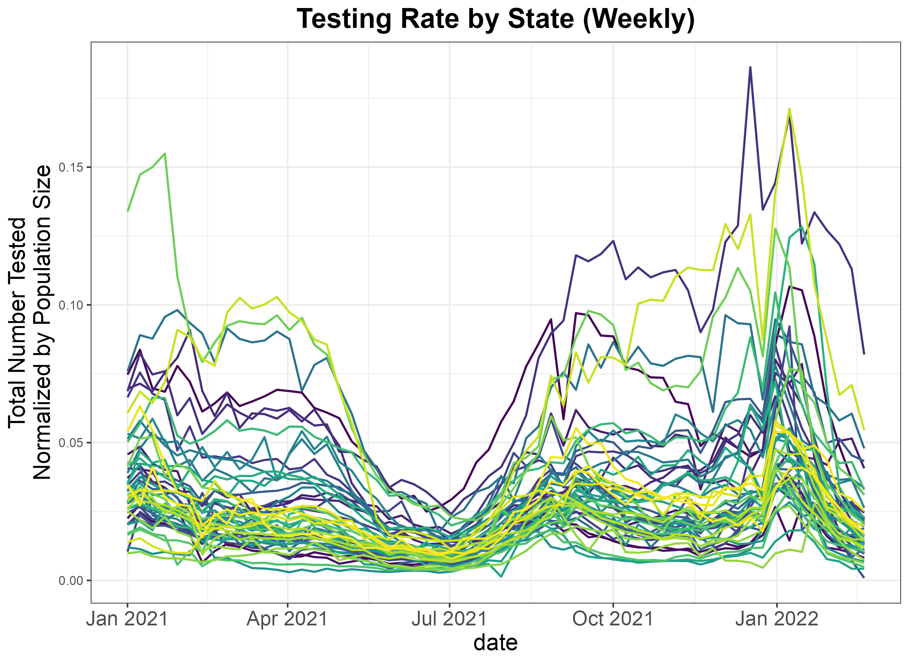
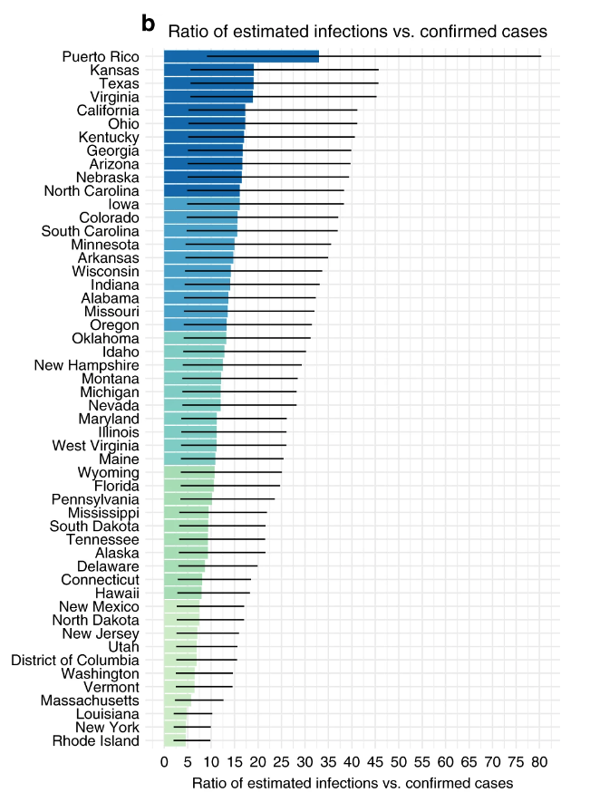
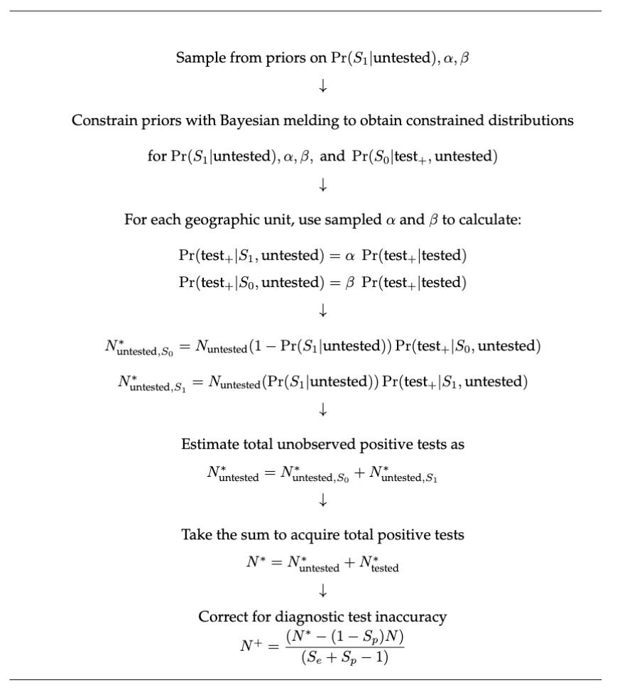

<!--
This is for including Chapter 1.  Notice that it's also good practice to name your chunk.  This will help you debug potential issues as you knit.  The chunk above is called intro and the one below is called chapter1.  Feel free to change the name of the Rmd file as you wish, but don't forget to change it here from chap1.Rmd.
-->

<!--
The {#rmd-basics} text after the chapter declaration will allow us to link throughout the document back to the beginning of Chapter 1.  These labels will automatically be generated (if not specified) by changing the spaces to hyphens and capital letters to lowercase.  Look for the reference to this label at the beginning of Chapter 2.
-->

```{r,eval=FALSE, include = FALSE}
rbbt::bbt_update_bib(path_rmd = "./01-chap1.Rmd", path_bib = "./references.bib")
rbbt::bbt_insert()

## Misc

```


# Introduction  

  \vspace{.2 mm}
|   Throughout the COVID-19 pandemic, observed infections have guided decisions at both the individual and government levels. At the state-level, policies on phased reopening, for example, often include criteria on COVID-19 cases [@californiadepartmentofpublichealth2021; @tomwolf2020; @charlesd.baker2021]. 

 To make this data accessible to the public, several organizations, including the CDC [@centersfordiseasecontrolandprevention2020], John Hopkins University [@dong2020], and the New York Times [@thenewyorktimes2022], compiled comprehensive dashboards presenting key metrics such as positive tests and test positivity rates across states.

However, our interpretation of case counts as a measure of transmission is limited by the fact that testing rates impact these trends. The number of positive tests we observe in a county, for instance, will be a result of that county’s testing capacity and testing behavior of its population. This means that trends in the infections may not always reflect trends in the true number of infections.

The importance of considering testing rate led John Hopkins University to organize the most comprehensive testing database available in the United States [@dong2020], which enables us to see that testing rate varies substantially by state and time.

```{re,eval=FALSE,echo=FALSE}

  
library(tidyverse)
library(viridis)

setwd("../honors_analysis")

testing <- readRDS("../honors_analysis/data/all_states/cdc_daily_allstates.RDS") %>%
  filter(date >= "2021-01-01")

# style = 'display:inline-block;margin-bottom:1vw;padding:1vw;'

pop_link <- "https://www2.census.gov/programs-surveys/popest/datasets/2010-2019/state/detail/SCPRC-EST2019-18+POP-RES.csv"
pop <- read_csv(pop_link)

statecodes <- read_csv("../honors_analysis/data/statecodes.csv")

pop <- pop %>%
  left_join(statecodes, by = c("NAME" = "state")) %>%
  select(population = POPESTIMATE2019,
         state = code) %>%
  filter(!is.na(state))

testing <- testing %>%
  left_join(pop)

testing <- testing %>%
  mutate(week = week(date), year = year(date)) %>%
  mutate(week = case_when(
    year == 2021 ~ week,
    year == 2022 ~ week + 52
  )) %>%
  group_by(week, state, population) %>%
  summarize(date = min(date), 
            total = sum(total))

   

testing  %>%
  mutate(`Total Number Tested\nNormalized by Population Size` = total/population ) %>%
  ggplot(aes(x = date, 
             y = `Total Number Tested\nNormalized by Population Size`, 
             color = state)) +
  geom_line(size = .7) +
  scale_color_viridis(discrete=TRUE) +
  theme_bw() +
  theme(axis.title = element_text(size = 16),
          legend.position = "none",
        plot.title = element_text(hjust = .5, face = "bold", size = 19),
        text = element_text(family = "Arial"),
        axis.text.x = element_text(size = 14)) +
  labs(title = "Testing Rate by State (Weekly)")

ggsave("./figure/testing_rate.png")


```

```{r, out.width = "90%"}



```


As we study the impact and transmission of SARS-CoV-2 as well as the efficacy of different interventions, we often turn to case counts for information. In this way, case counts form the basis for numerous types of analyses that inform our understanding of the pandemic. This means that bias in case counts due to unobserved infections can greatly impact our understanding of the pandemic.

One way testing rates can influence our understanding of COVID-19 is when we are seeking to make comparisons across different locations. 

The government response to the pandemic has differed greatly by state, with a range of different policies and timelines as local governments weighted complex tradeoffs. The variability in state-level policies sparks several questions related to the consequences of these policies. Comparing case counts enables us to compare the impact of state-level management of the pandemic. For example, Kaufman *et al.* used cumulative case counts to study the effect of state-level social distancing policies [@kaufman2021]. At the county scale, Jiang *et al.* evaluated the association between stay-at-home orders and daily incident cases [@jiang2022a], and Kao *et al.* looked at how the duration of multiple policy interventions -- face mask mandates, stay-at-home orders, and gathering bans -- affected monthly incidence [@kao2023].

The bias in case counts is particularly important for inference related to government interventions. With regard to government interventions, it is highly likely that lower testing resources may be related to less stringent policies in other respects. If this is the case, then lower cases may be observed in locations with less stringent policies as an artifact of inadequate testing rather than lower transmission. As a result, when we estimate the effect of a policy intervention based on observed cases, we may be underestimating the true impact. 

Besides interventions, there has been substantial concern over the disparities in the impact of COVID-19. As a result, it is important  to understand the relationship between various socioeconomic variables and case burden. Chen and Krieger showed a consistent monotonic relationship between the percent poverty and cumulative case burden at the zip-code tabulation area level in Illinois, with higher percent poverty associated with a higher case burden [@chen2021a]. Similarly, Karmakar *et al.* showed in a cross-sectional analysis that for counties in the U.S., incident cases were associated with higher social vulnerability index [@karmakar2021a]. This social vulnerability index is defined by the CDC, and includes information from a collection of census variables related to poverty, unemployment, and racial and ethnic minority status.
Similar issues may arise when studying the effect of socioeconomic variables. Counties with higher social vulnerability (due to, for example, low economic resources) may also have lower testing resources, which may bias our comparisons to counties where testing is more adequate. 

We also use cases to study the effect of vaccination at the population scale. Work in this area has been expansive. Harris showed an inverse relationship between cross-sectional COVID-19 incidence and county-level vaccination coverage during the Delta surge considering a sample of the  counties with the largest population size  [@harris2022a], and Cuadros *et al.* found a similar trend in counties across the United States [@cuadros2022c]. Nevertheless, as the virus has evolved, the relationship between transmission and case counts has shifted, particularly with the evolution of the highly transmissible Omicron variant. Mclaughlin *et al.* found that there wasn't a relationship between the percentage of the population fully vaccinated and case counts, contrasting findings from other waves [@mclaughlin2022a]. However, they did find that higher booster uptake rates were associated with meaningful decreases in case counts, and higher vaccination rates and booster rates were both associated with decreases in COVID-19 mortality.

Beyond the efficacy of vaccines at the individual level, these studies also demonstrate that we can use case data to quantify the impact of vaccination efforts as a public health intervention. Coupled with information about genetic variants that are circulating, they also can extend our knowledge about the effect of this intervention across different phases of the pandemic. 

Looking to the future, infection counts also may be informative as we better understand the impacts of long COVID-19\footnote{The syndrome goes by a number of names, including long-haul COVID-19, post-acute post-acute sequelae SARS-CoV-2 infection (PASC), among others.} on a population scale. There is increased concern over the poorly characterized but widespread phenomenon of lingering COVID-19 symptoms, which includes but is not limited to symptoms of fatigue, dyspnea, chest pain, and palpitation. The heterogeneity of presentations and definitions has complicated research on the syndrome, yet its impact has been pervasive. In light of this, the NIH has made the initiative  Researching COVID to Enhance Recovery (RECOVER) Initiative to better understand and treat long COVID-19.

Infection counts are particularly relevant for the study of long COVID-19 at the population scale because, contrary to what we might expect, the severity of COVID-19 disease is not associated with the persistence of several symptoms, including anosmia, chest pain, cough, and palpitation [@dirican2022]. Since lingering symptoms can be problematic even with mild cases, trying to characterize the cumulative burden of COVID-19 through a proxy such as hospitalization counts would not capture the full impact.    

Ultimately, COVID-19 case counts are a key metric that informs our understanding of the pandemic. Case numbers are interesting in themselves to quantify the reach of the pandemic across different time periods, and they are also the inputs to an extensive array of analyses that aid our understanding of public health interventions, disparities in the impact of the virus, and differences in the dynamics among circulating genetic variants. This underlies the importance of quantifying the underestimation of COVID-19 infections and how the extent of underestimation differs across time and space. 

# Overview of Approach 

 
 
 This work is based on the paper *Substantial underestimation of SARS-CoV-2 infection in the United States* [@wuSubstantialUnderestimationSARSCoV22020]. Wu *et al.* considered a single time interval early in the pandemic, estimating the true number of infections as of April 18, 2020 at the state level. When we consider the estimates, we can look at both the estimates for total infections by state, but also the ratio of the estimated total cases to the observed cases.  This enables us to think about the way case ascertainment varies by state, as we see in Figure 
 \ref{fig:originalfigwu}.
 
 
 
```{r, echo = FALSE, out.width="50%", fig.cap = "\\label{fig:originalfigwu}Figure from Wu et al. (2020) showing the ratio of total estimated infections when accounting for imperfect diagnostic test accuracy and incomplete testing to the number of cases confirmed by a positive PCR test."}
 

# {width=200}

```

The core idea of the approach is to break up the unobserved infections into unobserved infections among those with no or mild symptoms or those with moderate to severe symptoms. We denote this symptom status by an indicator variable, where $S_1$ represents having moderate to severe symptoms and $S_0$ represents having no or mild symptoms. In what follows, $\text{test}_+$  denotes the event that an individual *would* test positive if they were tested, not that they actually did. For example, $\Pr(\text{test}_+|S_1,\text{untested})$ represents the probability a symptomatic untested individual would test positive if they were tested. 

We let $N^*$ denote the number of positive tests, to distinguish positive tests $N^*$, which is affected by testing inaccuracy, from the number of active SARS-CoV-2 infections, $N^+$. 

Our first goal is to estimate the number of untested individuals who would test positive, $N^*_{\text{untested}}$.


To estimate the number of untested individuals with moderate to severe COVID-19-like symptoms who would test positive untested population, we can take

\begin{align*}
N^*_{\text{untested},S_1} &=N_{\text{untested},S_1} \; \Pr(\text{test}_+ | S_1,\text{untested})\\
&=N_{\text{untested}} \; \Pr(S_1|\text{untested})) \; \Pr(\text{test}_+ | S_1,\text{untested}).
\end{align*}


Similarly, we can estimate the asymptomatic (or mild) infections among the untested population as

\begin{align*}
N^*_{\text{untested},S_0} &=N_{\text{untested},S_0} \; \Pr(\text{test}_+ | S_0,\text{untested})\\
&=N_{\text{untested}} \Pr(S_0|\text{untested}) \; \Pr(\text{test}_+ | S_0,\text{untested})\\
&=N_{\text{untested}}(1-\Pr(S_1|\text{untested})) \; \Pr(\text{test}_+ | S_0,\text{untested}).
\end{align*}

Taking the sum of the positive tests among gives us the total:

$$N^*_{\text{untested}} = N^*_{\text{untested},S_1} + N^*_{\text{untested},S_0}.$$
This allows us to obtain the estimated number of positive tests as 

$$N^* = N^*_{\text{untested}} +N^*_{\text{tested}},$$
where $N^*_{\text{tested}}$ is the number of positive tests in a given location.

At this point, we can apply a simple epidemiology formula to that corrects for the test specificity and sensitivity of the diagnostic test [@rothman2008]. Denoting the sensitivity $S_e$ and specificity $S_p$, this formula is given by

$$\text{Number Truly Positive} = \dfrac{N^+ - (1-S_p) \times N}{S_e+S_p-1}.$$


The uncertainty inherent in this estimation process is in the quantities  $\Pr(S_1|\text{untested})$, $\Pr(\text{test}_+| S_1,\text{untested})$, and $\Pr(\text{test}_+ | S_0,\text{untested})$.

It is particularly difficult to think about how we would estimate $\Pr(\text{test}_+ | S_0,\text{untested})$ or $\Pr(\text{test}_+ | S_1,\text{untested})$ directly because there is a lack of data on these quantities. 

Instead, we define random variables to relate the symptomatic and asymptomatic test positives to the observed positivity rate $\Pr(\text{test}_|\text{tested})$.

In particular, we define

\begin{align*}
\alpha &= \dfrac{\Pr(test + |S_1, \text{untested})}{\Pr(\text{test}_+ | \text{tested})}\\
\beta  &= \dfrac{\Pr(test + |S_0, \text{untested})}{\Pr(\text{test}_+ | \text{tested})}.
\end{align*}

We can think of $\alpha$ and $\beta$ as variables that correct the observed test positivity rate to estimate the test positivity rate among the symptomatic and asymptomatic partitions of the population respectively.

We can think of $\alpha$ as the correction factor for estimating $\Pr(+|S_1,\text{untested})$ from the test positivity $\Pr(\text{test}_+ |\text{tested})$.

We can define $\beta$ analogously for the asymptomatic case, where 
$$\beta =  \dfrac{\Pr(\text{test}_+ |S_0, \text{untested})}{\Pr(\text{test}_+ | \text{tested})},$$
so we have $\Pr(\text{test}_+ |S_0, \text{untested}) = \beta \; \Pr(\text{test}_+ | \text{tested})$.

This formulation enables us to estimate $\Pr(\text{test}_+ |S_0, \text{untested})$ and $\Pr(\text{test}_+ |S_1, \text{untested})$ with information from the observed test positivity rate among the tested population, which means it can reflect differences in transmission dynamics by the location and time interval considered.

We expect $\alpha$ to be higher than $\beta$ to reflect that the test positivity rate among the asymptomatic untested population is lower than the symptomatic untested population. The specification of these distributions is discussed in greater detail in the [Definition of Prior Distributions for the Bias Parameters ] section.

Because of the uncertainty around $\alpha$ and $\beta$, it is useful to relate these parameters to the asymptomatic rate of the virus, $\Pr(S_0|\text{test}_+, \text{untested})$. Due to the importance of asymptomatic transmission to controlling the pandemic, the asymptomatic rate has been an area of substantial interest. This has led to extensive studies on the topic, including multiple meta-analyses summarizing these results [@ma2021a;@sah2021a].  

We can represent the relationship between $\theta = \{ \alpha, \beta, \Pr(S_1|\text{untested})\}$ and $\phi = \{\; \Pr(S_0|\text{test}_+, \text{untested})\;\}$ by the deterministic function
 $M: \theta \to \phi$ for $\theta =  \{\Pr(S_1|\text{untested}), \alpha, \beta \}$ and $\phi = \Pr(S_0|test +,\text{untested})$ defined as:
$$\Pr(S_0|\text{test}_+, \text{untested}) = \dfrac{\beta(1 - \Pr(S_1|\text{untested}))}{\beta(1-\Pr(S_1|\text{untested})) + \alpha \Pr(S_1|\text{untested})}.$$ 

When we have prior knowledge about the distributions of the inputs and output of a deterministic function, we can use [Bayesian melding](#meld) to generate constrained distributions for the inputs and outputs that are in concordance with one another. In essence, this approach considers the distinct distributions we have for $\phi$: the distribution informed by previous literature on the asymptomatic rate, and the distribution formed by evaluating $M$ at values of $\theta$. We can combine these distributions with logarithmic pooling to yield a constrained distribution for $\phi=\Pr(S_0|\text{test}_+, \text{untested})$, and then can approximate the inverted distribution to obtain constrained distributions for the inputs $\theta =  \{\Pr(S_1|\text{untested}), \alpha, \beta \}$.


We can summarize this process in Figure \ref{fig:diagram}. We repeat this process for every geographic unit (a state or county) and time interval (a 2 week interval). 

 
```{r, echo = FALSE, out.width="100%", fig.align = 'center', fig.cap = '\\label{fig:diagram}Implementation of probabilistic bias analysis.'}
 

# {width=200}

```


We divide the time period into 2-week intervals specifically due to the duration of test positivity, which is about two weeks on average [@mallett2020a; @kojima2022a]. Because 
\[ \text{Prevalence} = (\text{Incidence Rate}) \times (\text{Average Duration of Disease}), \]

prevalent infections and incident infections are approximately equivalent on the two-week time scale, which enables us to  think of our estimates for each two-week period as incident infections.


With the implementation of the implementation of @wu2020, $\alpha, \beta, \text{and} \Pr(S_1|\text{untested})$ were assumed to be independent and identically distributed across states. However, because we are considering a wider time interval over all of 2021 and into early 2022, it makes sense to vary these parameters by time and location. Due to the availability of data to inform $\beta$ and $\Pr(S_1|\text{untested})$, we allow these parameters to vary by time and location, as discussed further in [Definition of Prior Distributions](#defpriors).

When we allow $\beta$ and $\Pr(S_1|\text{untested})$ to vary over time and location, rather than implementing Bayesian melding once and using the same melded distribution for each time interval, we must implement melding for each time interval separately.