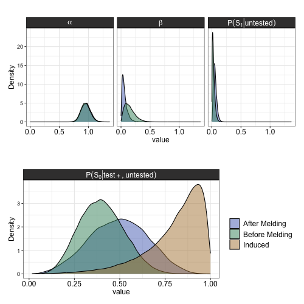

```{r, include=FALSE}
knitr::opts_chunk$set(echo = FALSE, 
                      eval = TRUE,
                      message = FALSE,
                      warning = FALSE,
                      cache = FALSE)
```


```{r,eval=FALSE, include = FALSE}
rbbt::bbt_update_bib(path_rmd = "./02-chap2.Rmd", path_bib = "./bib/references.bib")
rbbt::bbt_insert()
```


# Background 

```{r, echo = FALSE }

library(tidyverse)

library(latex2exp)

theme_c <- function(...){ 
   # font <- "Helvetica"   #assign font family up front
  #  font <- "Arial"
    theme_bw() %+replace%    #replace elements we want to change
    
    theme(
      
      
      #text elements
      plot.title = element_text(             #title
                 #  family = font,            #set font family
                   size = 14,                #set font size
                   face = 'bold',            #bold typeface
                   hjust = .5,
                   vjust = 3),               
      
      plot.subtitle = element_text(          #subtitle
                #   family = font,            #font family
                   size = 14,
                   hjust = .5,
                   face = 'italic',
                   vjust = 3),               #font size
      
      axis.title = element_text(             #axis titles
                #   family = font,            #font family
                   size = 12),               #font size
      
      axis.text = element_text(              #axis text
                #   family = font,            #axis famuly
                   size = 9),
      # t, r, b, l
      plot.margin = unit(c(1,.5,.5,.5), "cm")
      ) %+replace%
      theme(...)
   
}
```


## Probabalistic Bias Analysis 

Often the focus of quantifying error about an effect estimate focuses on random error rather than the systematic error. For example, typical frequentist confidence intervals are frequent in medical and epidemiological literature, although they have faced rising criticism [@greenland2016]. These confidence intervals quantify the fraction of the times we expect the true value to fall in this interval under the assumption that our model is correct. That is, if we ran an experiment 100 times and computed the effect size each time, we would expect the true value to fall within our 95% confidence interval in 95 of those times, on average. Neyman stressed this in his original publication formalizing the concept of a confidence interval in 1937 [@neyman1937]. The nuance that the confidence interval is not the probability that the true value falls within this interval, however, is often lost in the discussion of results, in part because the true meaning of a confidence interval is less intuitive.

The aim of quantitative bias analysis is to estimate systematic error to give a range of possible values for the true quantity of interest. In this sense, it is a type of sensitivity analysis. It can be used to estimate various kinds of biases, from misclassification, as is implemented in this work, as well as selection bias and unmeasured confounding [@petersen2021]. Often, the goal of performing such an analysis is to see how these sources of bias affect our estimates; in particular, under what situations of bias the observed effect would be null. 

There are multiple different forms of bias analysis [@lash2009]. The most simple case, simple bias analysis, is correcting a point estimate for a single source of error. Multidimensional bias analysis extends this to consider sets of bias parameters, but still provides a corrected point estimate rather than a range of plausible estimates. Probabilistic bias analysis, meanwhile, defines probability distributions for bias parameters to generate a distribution of corrected estimates by repeatedly correcting estimates for bias under different combinations of the parameter values. Then, via Monte Carlo we obtain a distribution of corrected estimates that reflect the corrected values under different scenarios of bias, that is, under different combinations of the bias parameters. This can give us a better idea for the extent of uncertainty about the corrected estimates, although this uncertainty does depend on the specification of the bias parameter distributions. Inherent in bias analysis is the dependence of our results on the specification of bias parameters, which reflect what is known from available data, literature, or theory on the extent of bias that may occur. There is uncertainty about how we define these distributions or values; otherwise, if the precise values of the bias parameters were known, we could simply correct the estimates and probabilistic bias analysis would not be useful.

Although some forms of probabilistic bias analysis can be applied to summarized data, for example, frequencies in a contingency table, the methods are most often implemented with unsummarized data in its original form, as implemented here. 

In choosing specific distributions for the bias parameters, different specifications may yield density functions where most of the density is within a similar interval (MAKE PLOT WITH EXAMPLE), which means the choice of the specific distribution will not be sensitive to the particular choice of density. 


## Bayesian Melding 

### Theoretical Background for the Approach 
The Bayesian melding approach was proposed by Poole et al. [@poole2000].

The Bayesian melding approach enables us to account for both uncertainty from inputs and outputs of a deterministic model. The initial motivation for the approach was to study the population dynamics of whales in the presence of substantial uncertainty around model inputs for population growth [@poole2000]. However, the framework provided by Poole et al. can applied in any circumstance where we have uncertainty around some quantities $\theta$ and $\phi$ where there is a deterministic function $M:\theta \to\phi$. Due the utility of Bayesian melding in various contexts, since this deterministic model $M$ could take on a wide range of forms, the approach has since been applied in various fields, including urban simulations [@sevcikova2007], ecology [@robson2014], and infectious disease [@powers2011].  

At this point, we can define how Bayesian melding works more formally.

Let $M: \theta \to \phi$ be the deterministic model defined by the function relating a vector of input parameters $\theta$ to an output vector $\phi$, and suppose we have a prior on $\theta$ denoted $q_1(\theta)$ and  a prior on $\phi$ denoted $q_2(\phi)$.

However, note that we actually have two distinct priors on $\phi$. There is the prior formed by the distribution induced on $\phi$ by the prior for $\theta$ and the function $M$, where we denote this induced prior $q^*_1(\phi)$. 
If $M^{-1}$ exists, we can write this induced prior $q_1^*(\phi) = q_1(M^{-1}(\phi)) |J(\phi)|$. This result follows from the fact $M(\theta) = \phi$, so we apply a change of variables to obtain the distribution of $\phi$ from the distribution of $\theta$. This is a generalization to the multivariate case of the change of variables result often covered in probability courses in the univariate case. That is, if we have a continuous random variable $X$ with probability density function $f_X$ and $Y=g(X)$ for a differentiable monotonic function, then the probability density function of $Y$ is $f_Y(y) = f_X(g^{-1}(y)) \Big| \frac{dx}{dy} \Big|$. In practice,  $M^{-1}$ rarely exists exists since $\theta$ is often of higher dimensionality then $\phi$, in which cases $M$ is not invertible. This means we generally approximate $q^*_1(\phi)$ without acquiring its analytical form. 


 In addition to this induced prior, we have the prior $q_2(\phi)$, which does not involve $M$ nor the inputs $\theta$. Since these priors are based on different sources of information and may reflect different uncertainties, often it useful to use both sources of information to inform our estimates. To do so, we need to combine the distributions for $q^*_1(\phi)$ and $q_2(\phi)$ to create a pooled distribution.

Multiple pooling strategies exist for distinct distributions, but one requirement for a Bayesian analysis is that the distribution should be independent of the order in which the prior is updated and the combining of the prior distributions. That is, updating the prior distributions using Bayes’ theorem and then combining distributions should yield the same result as combining distributions and then updating this combined distribution; pooling methods that have this property are deemed externally Bayesian. Logarithmic pooling has been shown to be externally Bayesian under some conditions, which are likely to hold in most settings. Furthermore, logarithmic pooling has actually been shown to be the only pooling method where this holds [@genest1986].

The logarithmically pooled prior for $\phi$ by pooling $q^*_1(\phi)$ and $q_2(\phi)$ is proportional to 

$$q^*_1(\phi)^{\alpha} q_2(\phi)^{1-\alpha}$$

where $\alpha \in [0,1]$ is a pooling weight. Commonly, a choice of $\alpha = 0.5$ is used to give the priors equal weight. In this case, logarithmic pooling may be referred to as geometric pooling since it is equivalent to taking a geometric mean.

If $M$ is invertible, we can obtain the contrained distributions for the model inputs by simply inverting. However, this is rare, so we have to think about how to proceed in the noninvertible case.

To get intuition for a valid strategy, consider a mapping $M: \theta \to \phi$ for $\theta \in \mathbb{R}$ and $\phi \in \mathbb{R}$ 
defined as follows. Note the choice of $q_1,q_2$ does not matter here as long as they are valid densities.


```{r, echo = FALSE}
library(kableExtra)
df <- tibble::tibble(
             `$\\theta$` = c(1,2,3),
             `$q_1(\\theta)$` = c(.3,.2,.5),
             `$\\phi$` = c(1,2,2),
             `$q_2(\\phi)$` = c(0.4,0.6,0.6))

kbl(df, escape=FALSE) %>%
  kable_classic()%>%
  kable_styling(latex_options = "HOLD_position")


```


We see that $M$ is not invertible since $\theta=1$ and $\theta = 2$ both map to $\phi=2$, which implies the inverse $M^{-1}$ would not be well defined.

We can compute $q_1^*(\phi)$ using our function $M$ and taking $q_1^*(\phi) = q_1(M^{-1}(\phi))$; in the continuous case we need to multiply by $|J(\phi)|$, but not in the discrete case [@blitzsteinIntroductionProbability2019].

So we have $q^*_1(1) = q_1(1) = 0.3$ since $M(1)=1$, and $q^*_1(2) = q_1(2) + q_1(3) = 0.2 + 0.5=0.7$ since $M(2) = 2$ and $M(3)=2$.

Then, we can compute the logarithmically pooled pooled prior with $\alpha=0.5$ by taking $q_1^*(\phi)^{\alpha} q_2(\phi)^{1-\alpha}$.

For $\phi = 1$, we have $q_1^*(\phi)^{\alpha} q_2(\phi)^{1-\alpha} = (0.3)^{0.5}(0.4)^{0.5} = 0.3464$
For $\phi = 2$, we have $q_1^*(\phi)^{\alpha} q_2(\phi)^{1-\alpha} = (0.6)^{0.5}(0.7)^{0.5} = 0.6481$

To make this a valid density, however, these probabilities must sum to 1, so we renormalize by dividing by (0.3464 + 0.6481). This gives us the pooled prior $q^{\sim[\phi]}(\phi)$ as

$0.3464 / (0.3464 + 0.6481) = 0.3483$ for $\phi =1$ and $0.6481 / (0.3464 + 0.6481) =0.6517$ for $\phi=2$. 

Summarizing these results, we have 

```{r, echo = FALSE}
df <- tibble::tibble(
             # `$\\theta$` = c(1,2,3),
             # `$q_1(\\theta)$` = c(.3,.2,.5),
             `$\\phi$` = c(1,2),
             `$q_2(\\phi)$` = c(0.4,0.6),
            `$q_1^*(\\phi)$` = c(0.3, 0.7),
            `$q^{\\sim[\\phi]}(\\phi)$` = c(0.3483,0.6517 ))

kbl(df, escape=FALSE) %>%
  kable_classic()%>%
  kable_styling(latex_options = "HOLD_position")
```


However, we want the pooled prior on the inputs $\theta$, that is, $q^{\sim[\theta]}(\theta)$.

Poole et al. reasoned as follows. Since $M$ uniquely maps $\theta=1$ to $\phi =1$, the probability that $\theta=1$ should be equal to the probability $\phi = 1$. That is, we should have $q^{\sim[\theta]}(1) = q^{\sim[\phi]}(1)$.

However, the relationship for $\theta=2$ or $\theta=3$ to $\phi$ is not one to one, but since $M(2)=2$ and $M(3)=2$, the sum of the probabilities for $\theta=1$ and $\theta=2$ should be equal to that for $\phi=2$, that is, $q^{\sim[\theta]}(2) + q^{\sim[\theta]}(3) = q^{\sim[\phi]}(2) = 0.6517$. 

The challenge here is how we divide the probability for $q^{\sim[\phi]}(2)$, which is defined, among $q^{\sim[\theta]}(2)$ and $q^{\sim[\theta]}(3)$. The prior for $\phi$ yields no information to assist in this choice, because knowing which value $\phi$ takes on does not give us any information about whether $\theta=2$ or $\theta=3$. Thus, the information we have about $\theta$ must be taken from $q_1(\theta)$.

That is, we can assign a probability for $q^{\sim[\theta]}(2)$ by considering the probability that $\theta = 2$ relative to the probability $\theta =3$, computing

$$q^{\sim[\theta]}(2) = q^{\sim[\phi]}(2) \Big( \frac{q_1(2)}{q_1(2) + q_1(3)}\Big).$$ 

That is, if the probability $\theta$ takes on the value $2$ is lower in this case than the probability $\theta=3$ which we know from the prior on $\theta$, $q_1(\theta)$, then the pooled prior on $\theta$,  $q^{\sim[\theta]}(2)$, should reflect this.

Using this reasoning, we have $q^{\sim[\theta]}(2) = (0.7) \frac{0.2}{0.2+0.5} = 0.1862$ and $q^{\sim[\theta]}(3) = (0.7) \frac{0.5}{0.2+0.5} = 0.4655$.

The result in this simple example, using $q_1(\theta)$ to determine how to distribute the probability for values of $\phi$ where multiple $\theta$ map to $\phi$, can be used to derive general formulas to compute $q^{\sim[\theta]}(\theta)$ for discrete and continuous distributions [@poole2000]. 


### Implementation through the Sampling-Importance-Resampling Algorithm 

The steps are:

1. We draw $\theta$ from its prior distribution $q_1(\theta)$, where we note $\theta$ can be multidimensional.
2. For every $\theta_i$ we compute $\phi_i = M(\theta_i)$.
3. Since $q_1^*(\phi)$ is unlikely to have an analytical form, we can compute it via a density approximation by computing $M(\theta)$ for our sampled values of $\theta$ and then estimating the density from this sample using kernel density estimation.
4. Construct weights proportional to the ratio of the prior on $\phi$ evaluated at $M(\theta_i)$ to the induced prior $q_1^*$ evaluated at $M(\theta_i)$. Note that this is applying the same logic as considering $q_1(\theta)/q^*_1(\theta)$, as discussed in the previous concrete example, but representing these probabilities in $\phi$ space.
5. Sample values from step (1) with probabilities proportional to the weights from (4).


### Bayesian Melding Applied to COVID-19 Misclassification


In this work, we can relate the inputs $\theta =  \{P(S_1|untested), \alpha, \beta \}$ and  $\phi = P(S_0|test +,untested)$ by the deterministic model $M: \theta \to \phi$ given by 
 $$P(S_0|test+, untested) = \frac{\beta(1 - P(S_1|untested))}{\beta(1-P(S_1|untested)) + \alpha P(S_1|untested)}.$$ The derivation of $M$ is in the following section.

Now, we have two distributions on $\phi$: the distribution based on data on the asymptomatic rate of infection of COVID-19, and the distribution formed by taking $M(\theta)$ where $\theta$ represents the values from the defined distributions of $\alpha,\beta,$ and $P(S_1|untested)$. With Bayesian melding, we pool these distributions using logarithmic pooling, and then implement the sampling-importance-resampling algorithm to obtain constrained distributions of the inputs $\theta$ that are in accordance with information about the asymptomatic rate of the virus. 

Due to the uncertainty around our definitions of $\alpha$ and $\beta$, it is particularly useful to leverage the information we have about the asymptomatic rate of the virus $P(S_0|test +,untested)$ because a large collection of studies has been published in this area. In a meta-analysis pooling data from 95 studies, the pooled estimate among the confirmed population that was asymptomatic was 40.50% [95% CI, 33.50%-47.50%] [@ma2021]. Another meta-analysis including 350 studies  estimated the asymptomatic percentage as 36.9% [95% CI: 31.8 to 42.4%] [@sah2021].

To clarify the use of this method, we can look at the distributions before and after applying Bayesian melding.


```{r,echo=FALSE,eval=FALSE}
Consider the case where we have distributions for bias parameters $\alpha$, $\beta$, $P(S_1|untested)$, and $P(S_0|test+,untested)$ where:

* $S_0$ is an indicator variable for being asymptomatic, and $S_1$ is an indicator of having moderate to severe COVID-19 symptoms.
* $P(S_0|+,untested)$ is the probability of being asymptomatic given you have COVID-19.
* $\alpha$ is the correction factor to adjust the overall test positivity rate for the probability of testing positive among **symptomatic untested** individuals, where $P(+|S_1,untested) = \alpha P(+|tested)$. Let $\alpha \sim TBeta(\alpha = 49.73, \beta = 5.53)$, bounded between 80% to 100%, with the mean at $\frac{\alpha}{\alpha + \beta} = 0.90$.
* $\beta$ is the correction factor to adjust the overall test positivity rate for the probability of testing positive among **asymptomatic untested** individuals, where $P(+|S_0,untested) = \beta P(+|tested)$. Let $\beta \sim TBeta(\alpha = 2.21, \beta = 12.53)$ with the mean at $\dfrac{2.21}{2.21 + 12.53} = 0.15$ and bounded between 0.2% to 40%.
*  $P(S_1|untested)$ is the probability of having symptoms among those who were **not tested** and is defined such that $P(S_1|Untested) \sim TBeta(\alpha = 1.18, \beta = 45.97)$, bounded between 0 and 15% with the mean at $\dfrac{\alpha}{\alpha + \beta} = 0.0250$.


Since $P(test+|+)$ represents the test positivity rate, we use an empirical estimate for this value. Suppose $P(test + | +) = 0.10$. Since $P(+|S_1,untested) = \alpha P(+|tested)$ and $P(+|S_0,untested) = \beta P(+|tested)$ represent $\alpha$ and $\beta$ multiplied by a constant, the distributions of $P(+|S_1,untested)$ and $P(+|S_0,untested)$ will be identical to identical to $\alpha$ and $\beta$ respectively.

We can visualize the distributions of $\alpha,\beta$, and $P(S_1|untested)$  as follows.


Now, consider that we can calculate the rate of asymptomatic infection, that is,  $P(S_0|+,untested)$ by defining the function $M: \theta \to \phi$ for $\theta = (P(S_1|untested), \alpha, \beta)$ and $\phi = P(S_0|test+,untested)$ as

$$P(S_0|test+, untested) = \dfrac{\beta(1 - P(S_1|untested))}{\beta(1-P(S_1|untested)) + \alpha P(S_1|untested)}.$$
Refer to section [Derivation of $M$] for the derivation of this formula using laws of probability.

Now, consider the induced prior on $\phi$ in this case, denoted $q_1^*(\phi)$. That is, the distribution we acquire by sampling from the defined distributions of $P(S_1|untested), \alpha, \beta$ and computing $P(S_0|test+,untested)$ with the function $M$.  
```

```{r,out.width = "95%",echo=FALSE}



```


```{r,include = FALSE,eval=FALSE}

posrate <- 0.10

get_beta_params <- function(mu, sd) {
  var = sd^2
  alpha <- ((1 - mu) / var - 1 / mu) * mu ^ 2
  beta <- alpha * (1 / mu - 1)
  return(params = list(alpha = alpha, beta = beta))
}

###############  DISTRIBUTION OF ALPHA ###############  


alpha_sd <- 0.2
# alpha_sd <- 0.3

# truncated support between a=0, b=0.15
dtrunc_alpha <- function(x) {
  truncdist::dtrunc(x,spec = "beta",
                    a = 0.80, 
                    b = 1,
                    shape1 = get_beta_params(
                      mu = 0.9, 
                      sd = (alpha_sd)^2)$alpha,
                    shape2 = get_beta_params(
                      mu = 0.9, 
                      sd = (alpha_sd)^2)$beta)
} 
rtrunc_alpha <- function(x) {
  truncdist::rtrunc(x,spec = "beta",
                    a = 0.80, 
                    b = 1,
                    shape1 = get_beta_params(
                      mu = 0.9, 
                      sd = (alpha_sd)^2)$alpha,
                    shape2 = get_beta_params(
                      mu = 0.9, 
                      sd = (alpha_sd)^2)$beta)
} 

tibble(x = seq(0, 1, by = 10^(-4)),
       y = dtrunc_alpha(x)) %>%
  ggplot(aes(x=x, y = y)) +
  geom_area(alpha = .8) +
   theme_c(axis.text.y = element_blank(),
           axis.ticks.y = element_blank(),
          plot.title =element_text(size = 20)
          )  +
   labs(x = "Value",
        y = "Probability Density",
       # title = expression(alpha),
        title = TeX("$\\alpha$"))


###############  DISTRIBUTION OF BETA ###############  

# truncated support between a=0, b=0.15
dtrunc_beta <- function(x) {
  truncdist::dtrunc(x,spec = "beta",
                    # upper limit
                    a = 0.2/100, 
                    # lower limit
                    b = 40/100,
                    shape1 = get_beta_params(
                      mu = 0.15, 
                      sd = (0.3)^2)$alpha,
                    shape2 = get_beta_params(
                      mu = 0.15, 
                      sd = (0.3)^2)$beta)
} 

rtrunc_beta <- function(x) {
  truncdist::rtrunc(x,spec = "beta",
                    # upper limit
                    a = 0.2/100, 
                    # lower limit
                    b = 40/100,
                    shape1 = get_beta_params(
                      mu = 0.15, 
                      sd = (0.3)^2)$alpha,
                    shape2 = get_beta_params(
                      mu = 0.15, 
                      sd = (0.3)^2)$beta)
} 


tibble(x = seq(0, 1, by = 10^(-4)),
       y = dtrunc_beta(x)) %>%
  ggplot(aes(x=x, y = y)) +
  geom_area(alpha = .8) + 
  theme_c(axis.text.y = element_blank(),
          axis.ticks.y = element_blank(),
          plot.title =element_text(size = 20)) +
  labs(x = "Value", y = "Probability Density", 
       title = TeX("$\\beta$"))
      # title = bquote(beta)) 


###############  DISTRIBUTION OF P(S1|untested) ###############  

# truncated support between a=0, b=0.15
rtrunc_beta_s1_untested <- function(x) {
  truncdist::rtrunc(x,spec = "beta",a = 0,b = 0.15,
                    shape1 = get_beta_params(mu = 0.025, 
                                             sd = (0.15)^2)$alpha,
                    shape2 = get_beta_params(mu = 0.025, 
                                             sd = (0.15)^2)$beta)
} 
dtrunc_beta_s1_untested <- function(x) {
  truncdist::dtrunc(x,spec = "beta",a = 0,b = 0.15,
                    shape1 = get_beta_params(mu = 0.025, 
                                             sd = (0.15)^2)$alpha,
                    shape2 = get_beta_params(mu = 0.025, 
                                             sd = (0.15)^2)$beta)
} 

tibble(x = seq(0, 1, by = 10^(-4)),
       y = dtrunc_beta_s1_untested(x)) %>%
  ggplot(aes(x=x, y = y)) +
  geom_area(alpha = .8) + 
  theme_c(plot.title =element_text(size = 16)) +
  labs(x = "Value", y = "Probability Density", 
       title = TeX("$P(S_1|untested)$"))

      # title = bquote("P(" ~ S[1] ~ "|untested)"))

```


```{r, fig.height = 6, fig.width = 6,eval=FALSE}

phi_induced_col <- "#7475A0"

 est_P_A_testpos = function(P_S_untested, alpha, beta){
    beta * (1 - P_S_untested) / (( beta * (1 - P_S_untested)) + (alpha * P_S_untested))
 }

nsamp <- 1e4

theta <- tibble(alpha = rtrunc_alpha(nsamp),
       beta= rtrunc_beta(nsamp),
       P_S_untested = rtrunc_beta_s1_untested(nsamp))

theta <- theta %>%
  mutate(phi_induced = est_P_A_testpos(P_S_untested = P_S_untested,
                                       alpha = alpha, 
                                       beta=beta))

theta %>% 
  ggplot(aes(x = phi_induced)) +
  geom_density(alpha = .8, fill =phi_induced_col) + 
  theme_c(axis.text.y = element_blank(),
          axis.ticks.y = element_blank(),
          plot.title =element_text(size = 20)) +
  labs(
    title = TeX("$Induced \\; Prior \\; q_1^*(\\phi) \\; on \\; \\phi = P(S_0|test+,untested)$"),
                x = TeX("$P(S_0|test+,untested)$"))


```


```{r,eval=FALSE,include=FALSE}

phi_prior_col <- "#A08974"

dp_s0_pos <- function(x){
  truncdist::dtrunc(x = x,spec = "beta",a = 0.25,b = 0.7,
                    shape1 = get_beta_params(mu = 0.4, sd = (0.35)^2)$alpha,
                    shape2 = get_beta_params(mu = 0.4, sd = (0.35)^2)$beta)
}
rp_s0_pos <- function(x){
  truncdist::rtrunc(x,spec = "beta",a = 0.25,b = 0.7,
                    shape1 = get_beta_params(mu = 0.4, sd = (0.35)^2)$alpha,
                    shape2 = get_beta_params(mu = 0.4, sd = (0.35)^2)$beta)
}

tibble(x = seq(0, 1, by = 10^(-4)),
       y = dp_s0_pos(x)) %>%
  ggplot(aes(x=x, y = y)) +
  geom_area(alpha = .8, fill =phi_prior_col) + 
  theme_c(axis.text.y = element_blank(),
          axis.ticks.y = element_blank()) +
  labs(x = "Value", y = "Probability Density", 
       title = TeX("$Prior \\; q_2(\\phi) \\, on \\, \\phi = P(S_0|test+,untested)$"),
                   x = TeX("$P(S_0|test +, untested)$"))

```


Comparing these priors above, we see that although they have shared support, some values from the induced distribution we acquire by using $M$ to generate values of $\phi$ from sampled values of $\theta$ are very unlikely to be in accordance with the information we know about SARS-CoV-2 asymptomatic infection. This is where Bayesian melding comes into play. Pooling these distributions enable us to take both the prior on  $q_2(\phi)$ from published analyses on asymptomatic infection, and the induced prior, $q_1^*(\phi)$, into account to constrain the distributions of $\phi$ and $\theta$ to be in accordance.

```{r,eval=FALSE,include=FALSE}

theta %>%
  mutate(phi_prior = rp_s0_pos(nsamp)) %>%
  pivot_longer(c(phi_prior, 
                 phi_induced), names_to = "density") %>%
  ggplot(aes(x=value, fill = density)) +
  geom_density(alpha = .8) +
  scale_fill_manual(values = list(phi_induced="#7475A0",
                                  phi_prior=phi_prior_col), 
                    labels = list(phi_induced = TeX("$q_1^*(\\phi)$"), 
                                  phi_prior=TeX("$q_2(\\phi)$"))) +
  theme_c(axis.text.y = element_blank(),
          axis.ticks.y = element_blank()) +
  labs(title = TeX("$\\overset{Comparing \\; Priors \\; q_2(\\phi) \\, and \\, q^*_1(\\phi)}{  \\, on \\, \\phi = P(S_0|test+,untested)}$"),
         x = TeX("$P(S_0|test +, untested)$"))
  
  
```

```{r,eval=FALSE,include=FALSE}

# theta contains values sampled from alpha, beta, P_S_untested, and M(theta) = phi_induced
# induced phi
phi <- theta$phi_induced

# approximate $q_1^*(\phi)$ via a density approximation
phi_induced <- density(x = phi, n = nsamp, adjust = 2,kernel = "gaussian")


```

```{r,include=FALSE, eval=FALSE}
# we note that  phi_induced$x[which(phi_induced$x > p)[1]] gets the closest value of 
# in phi_induced$x to our value of phi
phi_sampled_density <- unlist(parallel::mclapply(
    X = phi,
    FUN = function(p){
      phi_induced$x[which(phi_induced$x > p)[1]]
  }))
tibble(phi_sampled=phi_sampled_density,
       phi=phi) %>% 
  ggplot() + geom_density(aes(x= phi_sampled),
                          color="red") + 
  geom_density(aes(x= phi), color = "blue")


# y is the estimated density values
# for each value of phi, we get the density for the closest value in the induced density
# i.e., for each value of phi, get estimate for density at that value of phi
phi_sampled_density <- unlist(parallel::mclapply(
    X = phi,
    FUN = function(p){
      phi_induced$y[which(phi_induced$x > p)[1]]
  }))

# dp_s0_pos = P(A|test+, untested)
weights <- parallel::mcmapply(
    FUN = function(p,
                   phi_sampled_density,
                   alpha){
      (phi_sampled_density/ dp_s0_pos(p))^(1-alpha)
    },
    p=phi, 
    phi_sampled_density=phi_sampled_density,
    MoreArgs = list(alpha=0.5))

# resample the posterior
nsamp_post <- 1e4 # number of samples from the posterior
post_samp_ind <-sample.int(n=nsamp, size=nsamp_post, prob=1/weights,replace=T)

pi_samp <- cbind(theta[post_samp_ind,], 
                 P_A_testpos =  phi[post_samp_ind]) %>%
  select(-phi_induced)

pi_samp_long <- pi_samp %>%
  pivot_longer(cols=everything()) %>%
  mutate(type = "After Melding")


getTex <- function(string) {
      TeX(string) 

}

theta  %>%
  mutate(P_A_testpos = rp_s0_pos(nsamp)) %>%
  select(-phi_induced) %>%
 # rename(P_A_testpos = phi_induced) %>%
  pivot_longer(cols=everything()) %>%
  mutate(type = "Before Melding") %>%
  bind_rows(pi_samp_long) %>%
  mutate(name = case_when(
    name == "alpha" ~"$\\alpha$",
    name == "beta" ~"$\\beta$",
    name == "P_A_testpos" ~ "$P(S_0|test+,untested)$",
    name == "P_S_untested" ~ "$P(S_1|untested)$")
  ) %>%
  ggplot(aes(x = value, fill = type)) +
  geom_density(alpha = .5) +
  facet_wrap(~name, labeller = as_labeller(getTex, 
                            default = label_parsed)) + 
  theme_c(axis.text.y = element_blank(),
          axis.ticks.y = element_blank(),
          plot.title =element_text(size = 16),
          strip.text = element_text(size = 16),
          legend.text = element_text(size = 16)) +
  labs(title = TeX("$Comparing \\, Distributions \\, Before \\, and \\, After \\, Melding$"),
       fill = "")


```

### Derivation of $M$ 


Define $M: \theta \to \phi$ for $\theta = (P(S_1|untested), \alpha, \beta)$ and $\phi = P(S_0|test +)$ as
$$P(S_0|test+, untested) = \frac{\beta(1 - P(S_1|untested))}{\beta(1-P(S_1|untested)) + \alpha P(S_1|untested)}.$$
We define $test +$ to denote the event that an individual *would* test positive if they were tested, not that they actually did test positive. 

Since we have $\alpha = \frac{P(test+|S_1, untested)}{P(test+|tested)}$ and $\beta = \frac{P(test+|S_0, untested)}{P(test+|tested)}$, we can write 

$$ = \frac{\frac{P(test+|S_0, untested)}{P(test+|tested)}(1 - P(S_1|untested))}{\frac{P(test+|S_0, untested)}{P(test+|tested)}(1-P(S_1|untested)) + \frac{P(test+|S_1, untested)}{P(test+|tested)} P(S_1|untested)}$$
and cancelling out the term $P(test+|tested)$ we have


$$ = \frac{{P(test+|S_0, untested)}(1 - P(S_1|untested))}{P(test+|S_0, untested)(1-P(S_1|untested)) + P(test+|S_1, untested) P(S_1|untested)}.$$

Notice that $P(S_0|untested) = 1 - P(S_1|untested)$, so  we have 
$$P(S_0|test+) = \frac{{P(test+|S_0, untested)}P(S_0|untested)}{P(test+|S_0, untested)P(S_0|untested) + P(test+|S_1, untested) P(S_1|untested)}.$$ 

We can write the numerator $$P(test+|S_0, untested)P(S_0|untested) = \Big( \frac{P(test+,S_0, untested)}{P(S_0, untested)} \Big) \Big(\frac{P(S_0, untested)}{P(untested)}\Big)$$
$$= \frac{P(test+,S_0, untested)}{P(untested)} = P(S_0, test+|untested).$$
With the same reasoning, we obtain $P(test+|S_1, untested)P(S_1|untested) = P(S_1, test+|untested)$.

Thus, using this result, we have 

$$ = \frac{P(S_0, test+|untested)}{P(S_0, test+|untested) + P(S_1, test+|untested)}.$$

We can write 

$$P(S_0,test +|untested) = \frac{P(S_0,test +,untested)}{P(untested)} = \frac{P(test + ,untested |S_0) P(S_0)}{P(untested)}$$
and similarly $P(S_1,test +|untested) = \frac{P(test + ,untested |S_1) P(S_1)}{P(untested)}$.

Thus, we can write the denominator as $$P(S_0,test +|untested) + P(S_2,test +|untested)$$
$$= \frac{P(test + ,untested |S_1) P(S_1) + P(test + ,untested |S_0) P(S_0)}{P(untested)}$$
$$ = \frac{P(test+,untested)}{P(untested)} = P(test + |untested).$$


Putting these results together, we have
$$ = \frac{P(S_0, test+|untested)}{P(test+|untested)} = \frac{\frac{P(S_0, test+, untested)}{P(untested)}}{ \frac{P(test+,untested)}{P(untested)}} = 
\frac{P(S_0, test+, untested)}{P(test+,untested)} =
P(S_0 |test+, untested).$$
