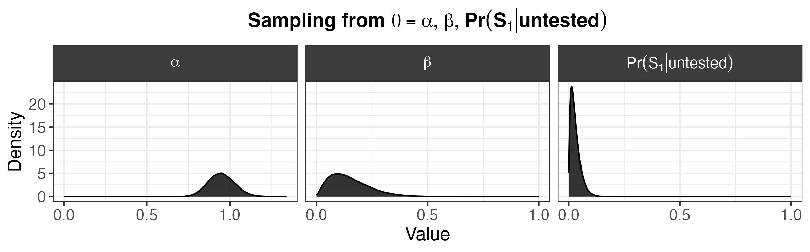

```{r, include=FALSE}
knitr::opts_chunk$set(echo = FALSE, 
                      eval = TRUE,
                      message = FALSE,
                      warning = FALSE,
                      fig.align ='center',
                     out.width="100%")

library(tidyverse)
library(knitr)
library(latex2exp)

```


# Background 

```{r, echo = FALSE }

library(tidyverse)

theme_c <- function(...){ 
   # font <- "Helvetica"   #assign font family up front
  #  font <- "Arial"
    theme_bw() %+replace%    #replace elements we want to change
    
    theme(
      
      
      #text elements
      plot.title = element_text(             #title
                 #  family = font,            #set font family
                   size = 14,                #set font size
                   face = 'bold',            #bold typeface
                   hjust = .5,
                   vjust = 3),               
      
      plot.subtitle = element_text(          #subtitle
                #   family = font,            #font family
                   size = 14,
                   hjust = .5,
                   face = 'italic',
                   vjust = 3),               #font size
      
      axis.title = element_text(             #axis titles
                #   family = font,            #font family
                   size = 12),               #font size
      
      axis.text = element_text(              #axis text
                #   family = font,            #axis famuly
                   size = 9),
      # t, r, b, l
      plot.margin = unit(c(1,.5,.5,.5), "cm")
      ) %+replace%
      theme(...)
   
}
```


## Probabalistic Bias Analysis 

|   Often the focus of quantifying error about an effect estimate focuses on random error rather than the systematic error. For example, typical frequentist confidence intervals are common in medical and epidemiological literature, although they have faced rising criticism [@greenland2016]. These confidence intervals quantify the fraction of the times we expect the true value to fall in this interval under the assumption that our model is correct. That is, if we ran an experiment 100 times and computed the effect size each time, we would expect the 95% confidence interval to contain the true value to 95 of those times, on average.^[Neyman stressed this in his original publication formalizing the concept of a confidence interval in 1937 [@neyman1937]. The nuance that we cannot interpret a 95% confidence interval as indicating that the probability the true value falls within this interval is 95%, however, is often lost in the discussion of results, in part because the true meaning of a confidence interval is less intuitive.]

In contrast to focusing on random error, the aim of quantitative bias analysis is to consider systematic error to give a range of possible values for the true quantity of interest. In this sense, it is a type of sensitivity analysis. It can be used to estimate various kinds of biases, from misclassification, as is implemented in this work, as well as selection bias and unmeasured confounding [@petersen2021]. Often, the goal of performing such an analysis is to see how these sources of bias affect our estimates; in particular, under what situations of bias the observed effect would be null. 

There are multiple different forms of bias analysis [@lash2009]. The most simple case, simple bias analysis, is correcting a point estimate for a single source of error. Multidimensional bias analysis extends this to consider sets of bias parameters, but still provides a corrected point estimate rather than a range of plausible estimates. Probabilistic bias analysis, meanwhile, defines probability distributions for bias parameters to generate a distribution of corrected estimates by repeatedly correcting estimates for bias under different combinations of the parameter values. Then, via Monte Carlo we obtain a distribution of corrected estimates that reflect the corrected values under different scenarios of bias, that is, under different combinations of the bias parameters. This can give us a better idea for the extent of uncertainty about the corrected estimates, although this uncertainty does depend on the specification of the bias parameter distributions. Inherent in bias analysis is the dependence of our results on the specification of bias parameters, which reflect what is known from available data, literature, or theory on the extent of bias that may occur. There is uncertainty about how we define these distributions or values; otherwise, if the precise values of the bias parameters were known, we could simply correct the estimates and probabilistic bias analysis would not be useful.

Although some forms of probabilistic bias analysis can be applied to summarized data, for example, frequencies in a contingency table, the methods are most often implemented with unsummarized data in its original form, as implemented here. 

In choosing specific distributions for the bias parameters, different specifications may yield density functions where most of the density is within a similar interval, which means the choice of the specific distribution will not be sensitive to the particular choice of density. 


## Bayesian Melding 

|   As mentioned in the [Overview of the Approach](#overview), we use Bayesian melding to incorporate information on the asymptomatic rate of infection to inform the prior distributions for $\alpha$, $\beta$, and $\Pr(S_1|\text{untested})$. In this section, we discuss Bayesian melding in general terms, which provides the background needed to understand how we apply Bayesian melding with bias parameters of the probabilistic bias analysis, detailed in the [following section](#meld).

The Bayesian melding approach was proposed by Poole et al. [@poole2000].

This approach enables us to account for both uncertainty from inputs and outputs of a deterministic model. The initial motivation for the approach was to study the population dynamics of whales in the presence of substantial uncertainty around model inputs for population growth [@poole2000]. However, the framework provided by @poole2000 can be applied in any circumstance where we have uncertainty around some quantities $\theta$ and $\phi$ where there is a deterministic function $M:\theta \to\phi$. Due the utility of Bayesian melding in various contexts, since this deterministic model $M$ could take on a wide range of forms, the approach has since been applied in various fields, including urban simulations [@sevcikova2007], ecology [@robson2014], and infectious disease [@powers2011].  

Let $M: \theta \to \phi$ be the deterministic model defined by the function relating a vector of input parameters $\theta$ to an output vector $\phi$, and suppose we have a prior on $\theta$ denoted $f_\theta(\theta)$ and  a prior on $\phi$ denoted $f_\phi^{direct}(\phi)$.

However, note that we actually have two distinct priors on $\phi$. There is the prior formed by the distribution induced on $\phi$ by the prior for $\theta$ and the function $M$, where we denote this induced prior $f_\phi^{induced}(\phi)$. Secondly, there is the prior on the output $\phi$ that does not incorporate information from $\theta$; for our work, we refer to this prior as the direct prior. Generally, these priors are based on different sources of information.


If $M^{-1}$ exists, we apply a change of variables to obtain the distribution of $\phi$ from the distribution of $\theta$. That is, since $M(\theta) =\phi$, we can write the induced prior $$f_\phi^{induced}(\phi) = f_\theta(M^{-1}(\phi)) |J(\phi)|, \tag{1}$$ where $J(\phi)$ is the Jacobian of the transformation from $\theta \to \phi$, with $J(\phi)=\frac{d\theta}{d\phi}$.^[In the continuous case we need to multiply by $|J(\phi)|$, but not in the discrete case [@blitzsteinIntroductionProbability2019].]


However, in practice,  $M^{-1}$ rarely exists since $\theta$ is often of higher dimensionality than $\phi$, in which case $M$ is not invertible. This means we generally approximate $f_\phi^{induced}$ without acquiring its analytical form. 


 In addition to this induced prior, we have the prior $f_\phi^{direct}(\phi)$, which does not involve $M$ nor the inputs $\theta$. Since these priors are based on different sources of information and may reflect different uncertainties, often it useful to use both sources of information to inform our estimates. To do so, we need to combine the distributions for $f_\phi^{induced}$ and $f_\phi^{direct}$ to create a pooled distribution.

Multiple pooling strategies exist for distinct distributions, but one requirement for a Bayesian analysis is that the distribution should be independent of the order in which the prior is updated and the combining of the prior distribution. That is, updating the prior distributions using Bayes’ theorem and then combining distributions should yield the same result as combining distributions and then updating this combined distribution; pooling methods that have this property are deemed externally Bayesian. Logarithmic pooling has been shown to be externally Bayesian under some conditions, which are likely to hold in most settings. Furthermore, logarithmic pooling has actually been shown to be the only pooling method where this holds [@genest1986]. For this reason, Poole *et al.* recommend proceeding with logarithmic pooling for Bayesian melding.

The logarithmically pooled prior for $\phi$ by pooling the two distributions $f_\phi^{induced}$ and $f_\phi^{direct}$ is

$$f_\phi^{pooled} (\phi) = t(\boldsymbol{\alpha}) (f_\phi^{induced}(\phi))^{\alpha} (f_\phi^{direct}(\phi))^{1-\alpha}.$$

The pooling weights are given by $\boldsymbol{\alpha} = (\alpha, \;\;1-\alpha)$ where $\alpha \in [0,1]$, and $t(\boldsymbol{\alpha})$ is the normalizing constant corresponding to the set of pooling weights. More precisely, $t(\boldsymbol \alpha)$ is  given by
$$t(\boldsymbol \alpha) = \Big[ \int_\Phi  (f_\phi^{induced}(\phi))^{\alpha} (f_\phi^{direct}(\phi))^{1-\alpha} d\phi \Big]^{-1}.$$

\noindent Multiplying by $t(\boldsymbol \alpha)$ ensures $f_\phi^{pooled} (\phi)$ is a valid probability density.

Commonly, a choice of $\alpha = 0.5$ is used to give the priors equal weight. In this case, logarithmic pooling may be referred to as geometric pooling since it is equivalent to taking a geometric mean.

At this point, we see that we can obtain the pooled distribution on $\phi$ by taking the logarithmic pool of $f^{induced}_\phi(\phi)$ and $f^{direct}_\phi(\phi)$. However, we still need to consider how to obtain the melded distributions of the inputs $\theta$ when $M$ is not invertible. 

### Simple Discrete Example 

To develop intuition the strategy  @poole2000 recommend for handling the case where $\phi$ is not invertible, we consider a mapping $M: \theta \to \phi$ for $\theta \in \mathbb{R}$ and $\phi \in \mathbb{R}$ 
defined as follows (Figure \ref{fig:dex}). Note the choice of $f_\theta,f_\phi^{direct}$ does not matter here as long as they are valid densities.

<!-- \begin{multicols}{2} -->

```{r, fig.height=3, out.width="70%", fig.cap = "\\label{fig:dex}A simple discrete example where $M$ is not invertible, since $M(2)=M(3)=2$."}

library(gridExtra)
library(grid)

# plot(mpg ~ hp, data = mtcars)


library(kableExtra)
df <- tibble::tibble(
             `$\\theta$` = c(1,2,3),
             `$f_\\theta(\\theta)$` = c(.3,.2,.5),
             `$M(\\theta)=\\phi$` = c(1,2,2),
             `$f_\\phi^{direct}(\\phi)$` = c(0.4,0.6,0.6))

df %>%
  ggplot(aes(x = `$\\theta$`, y = `$M(\\theta)=\\phi$`)) +
  geom_point(size = 2, color = "darkblue") +
  labs(x = TeX("$\\theta$"), y = TeX("$M(\\theta)$")) +
  theme_bw() +
  theme(axis.title = element_text(size = 18),
        axis.text = element_text(size = 7)) +
  scale_y_continuous(breaks = c(1,1.5,2), limits = c(.8,2.2)) 

```
<!-- \columnbreak --> 
```{r,fig.cap = "\\label{table:example-dist}Defining the distributions for $f_\\theta(\\theta)$ and $f_\\phi^{direct}(\\phi)$."}


kbl(df, escape=FALSE, 
    caption = "\\label{table:example-dist}Specifing the Distributions of $f_\\theta(\\theta)$ and $f_\\phi^{direct}(\\phi)$") %>%
  kable_classic()%>%
  kable_styling(latex_options = "HOLD_position") 


```

<!--  \end{multicols} --> 

We see that $M$ is not invertible since $\theta=1$ and $\theta = 2$ both map to $\phi=2$, which implies the inverse $M^{-1}$ would not be well defined.

We can determine $f_\phi^{induced}$, we calculate $M(\theta)$ and the corresponding probability mass values for each possible value $M(\theta)$ can take on. 


That is, we have
\begin{align*}
f_\phi^{induced}(1) &= f_{\theta}(1) = 0.3 & \text{ (since $\theta = 1$ maps to $\phi = 1$) } \\
f_\phi^{induced}(2) &= f_{\theta}(2) +  f_{\theta}(3) = 0.2 + 0.5=  0.7 & \text{ (since $\theta = 2$ and $\theta=3$ both map to $\phi = 2$) .}
\end{align*}


Then, we can compute the logarithmically pooled pooled prior. If we have weights $\alpha=\{0.5,\;0.5\}$, then the normalizing constant $t(\alpha)$ is given by


\begin{align*} 
t(\alpha) &= \left[ \sum_\Phi  (f_\phi^{induced}(\phi))^{\alpha} (f_\phi^{direct}(\phi))^{1-\alpha} \right]^{-1} \\
&=  \left[ \sum_{\phi \in \{1,2\}}  (f_\phi^{induced}(\phi))^{0.5} (f_\phi^{direct}(\phi))^{0.5} \right]^{-1} \\
&= \Big[ (f_\phi^{induced}(1))^{0.5} (f_\phi^{direct}(1))^{0.5} + (f_\phi^{induced}(2))^{0.5} (f_\phi^{direct}(2))^{0.5} \Big]^{-1} . \tag{1}\\
\end{align*}

\noindent Using values of $f^{induced}$ calculated above and values of $f^{direct}$ from Table \ref{table:example-dist}, we obtain

\begin{align*}
f_\phi^{induced}(1))^{0.5} (f_\phi^{direct}(1))^{0.5}&= (0.3)^{0.5}(0.4)^{0.5} =0.3464\\
f_\phi^{induced}(2))^{0.5} (f_\phi^{direct}(2))^{0.5} &= (0.7)^{0.5} (0.6)^{0.5}=0.6481,
\end{align*}

\noindent so we can plug these terms into (1) to yield

\[ t(\alpha) = [0.3464 +0.6481 ]^{-1}. \]


\noindent Denoting the pooled prior in $\phi$-space as $f_\phi^{pooled}(\phi)$, we have

\begin{align*}
f_\phi^{pooled}(1) &= t(a)(f_\phi^{induced}(1))^{0.5} (f_\phi^{direct}(1))^{0.5} \\
&= [0.3464 + 0.6481]^{-1} (0.3464)  = 0.3483\\
f_\phi^{pooled}(2)  &= t(a)(f_\phi^{induced}(2))^{0.5} (f_\phi^{direct}(2))^{0.5} \\
&= [0.3464 + 0.6481]^{-1}   (0.6481) 
=0.6517.
\end{align*}


We summarize these results and compare $f_\phi^{induced}, f_\phi^{direct}$, and $f_\phi^{pooled}$ in Figure \ref{fig:comp}, the specific values for each probability mass are in Table \ref{table:table-pooled} .

<!-- \begin{multicols}{2} -->

```{r }
df <- tibble::tibble(
             # `$\\theta$` = c(1,2,3),
             # `$f_\theta(\\theta)$` = c(.3,.2,.5),
             `$\\phi$` = c(1,2),
             `$f_\\phi^{direct}(\\phi)$` = c(0.4,0.6),
            `$f_\\phi^{induced}(\\phi)$` = c(0.3, 0.7),
            `$f_\\phi^{pooled}(\\phi)$` = c(0.3483,0.6517 ))


```

<!-- \columnbreak -->

```{r, fig.height = 2, fig.width = 4, fig.cap = "\\label{fig:comp} Comparing the direct, induced, and pooled distributions on $\\phi$. Each is a discrete distribution where $\\phi$ can take on only values 1 or 2.  Note that the probability mass of a given value of $\\phi$ for the pooled distribution falls in between the probability masses of the induced and direct distributions for that value of $\\phi$."}


df %>% 
  select(`$\\phi$`,
         `$f_\\phi^{induced}(\\phi)$`,
         `$f_\\phi^{direct}(\\phi)$`,
         `$f_\\phi^{pooled}(\\phi)$`) %>%
  pivot_longer(cols=c(`$f_\\phi^{induced}(\\phi)$`,
                      `$f_\\phi^{direct}(\\phi)$`,
                      `$f_\\phi^{pooled}(\\phi)$`)) %>%
  mutate(name = factor(name, levels = c("$f_\\phi^{induced}(\\phi)$",
                                        "$f_\\phi^{pooled}(\\phi)$",
                                        "$f_\\phi^{direct}(\\phi)$"
                                        ))) %>%
  ggplot(aes(x = `$\\phi$`, ymin = 0, ymax = value, color = name)) +
  geom_linerange(position=position_dodge(width = .2)) +
  geom_point(aes(y=value), size =2,position=position_dodge(width = .2)) +
  theme_bw() +
  theme(axis.title.y = element_text(size = 9),
        axis.text = element_text(size = 7),
        axis.title.x = element_text(size = 11),
       # legend.position = "none",
        strip.text = element_text(size = 10),
       legend.text = element_text(size = 10)) +
  viridis::scale_color_viridis(discrete = TRUE, end = .8, begin = .2,
                               labels = c(`$f_\\phi^{induced}(\\phi)$` =TeX("$f_\\phi^{induced}(\\phi)$"),
                                   `$f_\\phi^{direct}(\\phi)$`= TeX("$f_\\phi^{direct}(\\phi)$"), 
                                  `$f_\\phi^{pooled}(\\phi)$`= TeX("$f_\\phi^{pooled}(\\phi)$"))) +
  scale_x_continuous(breaks = c(1,1.5,2)) +
  labs(x = TeX("$\\phi$"),
       y = "Probability Mass",
       color = "")

```


```{r}


kbl(df, escape=FALSE,
    caption="\\label{table:table-pooled} Comparing the probability mass values of the direct, induced, and pooled distributions on $\\phi$.") %>%
  kable_classic()%>%
  kable_styling(latex_options = "HOLD_position")

```


<!-- \end{multicols} -->


However, we also want the pooled prior on the inputs $\theta$, that is, $f_\theta^{pooled}(\theta)$. @poole2000 reasoned as follows. Since $M$ uniquely maps $\theta=1$ to $\phi =1$, the probability that $\theta=1$ should be equal to the probability $\phi = 1$. That is, we should have $f_\theta^{pooled}(1) = f_\phi^{pooled}(1)$.

However, the relationship for $\theta=2$ or $\theta=3$ to $\phi$ is not one to one. Since $M(2)=2$ and $M(3)=2$, the sum of the probabilities for $\theta=1$ and $\theta=2$ should be equal to that for $\phi=2$, that is, $f_\theta^{pooled}(2) + f_\theta^{pooled}(3) = f_\phi^{pooled}(2) = 0.6517$. 

The challenge here is how we divide the probability for $f_\phi^{pooled}(2)$, which is defined, among $f_\theta^{pooled}(2)$ and $f_\theta^{pooled}(3)$. The prior for $\phi$ yields no information to assist in this choice, because knowing which value $\phi$ takes on does not give us any information about whether $\theta=2$ or $\theta=3$. Thus, the information we have about $\theta$ must be taken from $f_\theta(\theta)$.

That is, we can assign a probability for $f_\theta^{pooled}(2)$ by considering the probability that $\theta = 2$ relative to the probability $\theta =3$, computing


$$f_\theta^{pooled}(2) = f_\phi^{pooled}(2) \Big( \frac{f_\theta(2)}{f_\theta(2) + f_\theta(3)}\Big).$$ 

If the probability $\theta$ takes on the value $2$ is lower in this case than the probability $\theta=3$ which we know from the prior on $\theta$, $f_\theta(\theta)$, then the pooled prior on $\theta$, denoted $f_\theta^{pooled}(2)$, should reflect this.

Using this reasoning, we have 
\begin{align*} f_\theta^{pooled}(2) &= (0.7) \frac{0.2}{0.2+0.5} = 0.1862\\
f_\theta^{pooled}(3) &= (0.7) \frac{0.5}{0.2+0.5} = 0.4655.
\end{align*}

The result in this simple example, using $f_\theta(\theta)$ to determine how to distribute the probability for values of $\phi$ where multiple $\theta$ map to $\phi$, can be used to derive general formulas to compute $f_\theta^{pooled}(\theta)$ for discrete and continuous distributions [@poole2000]. 

### General Solution for the Discrete Case

Denote the possible values of $\theta$ as $A_1, A_2, \dots$, the possible values of $\phi$ as $B_1, B_2, \dots$, and a mapping $m: \mathbb{N} \to \mathbb{N}$ such that $M(A_i) = B_{m(i)}$ 
and $C_j = M^{-1}(B_j) = \{A_i : M(A_i) = B_j\}$. Then

$$f_\theta^{pooled}(A_i) = f_\phi^{pooled}(B_{m(i)}) \left( \frac{f_\theta(A_i)}{f_\phi^{induced}(B_{m(i)})} \right).$$

### General Solution for the Continuous Case


We denote $B = M(A) = \{M(\theta) : \theta \in A \}$ and $C = M^{-1}(B) = \{\theta: M(\theta) \in B \}$.


Then 

$$
f_\phi^{pooled} (M(\theta)) =t({\alpha}) f_\theta(\theta) \left( \frac{f_\phi^{direct}(M(\theta))}{f_\phi^{induced}(M(\theta))} \right)^{1-\alpha} \tag{2}
$$
where $t({\alpha})$ is a renormalizing constant for the choice of $\alpha$.

\newpage

### Implementation through the Sampling-Importance-Resampling Algorithm 

We can obtain the pooled distributions $f^{pooled}_\theta$ and $f^{pooled}_\phi$ by using the Sampling-Importance-Resampling Algorithm.

The steps are as follows.

1. We draw $m$ observations of $\theta$ from its prior distribution $f_\theta(\theta)$.
2. For every $\theta_i$ we compute $\phi_i = M(\theta_i)$ to obtain a sample from the induced distribution.
3. Since the density $f_\phi^{induced}(\phi)$ is unlikely to have an analytical form, we can compute it via a density approximation such as kernel density estimation.
4. Construct weights proportional to the ratio of the prior on $\phi$ evaluated at $M(\theta_i)$ to the induced prior $f_\phi^{induced}$ evaluated at $M(\theta_i)$. If a likelihood $L_1(\theta)$ for the inputs and $L_2(\phi)$ is available, the weights are 
$$w_i = \left( \frac{f_\phi^{direct}(M(\theta_i))}{f_\phi^{induced}(M(\theta_i))} \right)^{1-\alpha}L_1(\theta_i) \; L_2(M(\theta_i)).$$
However, in this work, no likelihood is available for the variables of interest, so the likelihood is left out of the weights, leaving us with
$$w_i = \left( \frac{f_\phi^{direct}(M(\theta_i))}{f_\phi^{induced}(M(\theta_i))} \right)^{1-\alpha}.$$
5. Sample $r$ observations from $\theta$ and $\phi$ from step (1) with probabilities proportional to the weights from (4).


\newpage

## Bayesian Melding Applied to COVID-19 Misclassification {#meld}


|    We can relate the inputs $\theta =  \{\Pr(S_1|\text{untested}), \alpha, \beta \}$ and  $\phi = \Pr(S_0|\text{test}_+,\text{untested})$ by the deterministic model^[For the derivation of $M$ using the laws of probability, see the section [Derivation of $M$](#derivation).] $M: \theta \to \phi$ given by
 $$\Pr(S_0|\text{test}_+, \text{untested}) = \dfrac{\beta(1 - \Pr(S_1|\text{untested}))}{\beta(1-\Pr(S_1|\text{untested})) + \alpha \Pr(S_1|\text{untested})}.$$
 
Now, we have two distributions on $\phi$. One is the distribution we can specify based on data on the asymptomatic rate of infection of COVID-19. We refer to this prior as the direct prior. We also have the distribution generated by taking $M(\theta)$ where $\theta$ represents the values from the defined distributions of $\alpha,\beta,$ and $\Pr(S_1|\text{untested})$. With Bayesian melding, we pool these distributions using logarithmic pooling, and then implement the sampling-importance-resampling algorithm to obtain constrained distributions of the inputs $\theta$ that are in accordance with information about the asymptomatic rate of the virus. 

Due to the uncertainty around our definitions of $\alpha$ and $\beta$, it is particularly useful to leverage the information we have about the asymptomatic rate of the virus $\Pr(S_0|\text{test}_+,\text{untested})$ because a large collection of studies has been published in this area. In a meta-analysis pooling data from 95 studies, the pooled estimate among the confirmed population that was asymptomatic was 40.50% [95% CI, 33.50%-47.50%] [@ma2021]. Another meta-analysis including 350 studies estimated the asymptomatic percentage to be 36.9% [95% CI: 31.8 to 42.4%], and, when restricting to screening studies, 47.3% (95% CI: 34.0% -61.0%) [@sah2021].

To summarize, we have two priors on the asymptomatic rate $\phi$, that by taking $M(\theta)$ for sampled values of $\theta$, denoted $f_\phi^{induced}$ in the previous section, and that based on data about the asymptomatic rate, $f_\phi^{direct}$. By applying Bayesian melding, we can obtain the contrained distributions of $\alpha,\beta,$ and $\Pr(S_1|\text{untested})$ that are in accordance with information about the asymptomatic rate of infection.

In this section, we use the distributions of $\alpha,\beta,$ and $\Pr(S_1|\text{untested})$ as specified in in [Chapter 4.](#defpriors)

\newpage 


The first step of Bayesian melding in this context is obtaining a sample of size $m$ from the specified distributions of $\theta$, which are shown in Figure \ref{fig:theta}. This gives us $\{ \theta_1, \theta_2, \dots, \theta_m\}$, where $\theta_i = \Big(\alpha_i,\beta_i,\Pr(S_1|\text{untested})_i\Big)$. We sample each of $\alpha,\beta,$ and $\Pr(S_1|\text{untested})$ independently.

 Of note, while $\Pr(S_1|\text{untested})$ must be less than 1 since it is a probability, $\alpha$ and $\beta$ are ratios of probabilities, and as such they are not constrained to be less than 1 given it is the ratio of the symptomatic test positivity among the untested population to the observed test positivity. In light of this, we specify $\alpha$ as a gamma distribution, since it is reasonable that 
 
 $\alpha = \frac{\Pr(\text{test}_+|\text{untested}, S_1)}{\Pr(\text{test}_+|\text{tested})}$ could exceed 1. However, since $\beta =\frac{\Pr(\text{test}_+|\text{untested}, S_0)}{\Pr(\text{test}_+|\text{tested})}$, we specified $\beta$ to be a beta distribution based on the assumption that an untested individual with no symptoms would not have a higher probability of testing positive than someone who was tested (and may or may not have symptoms).

```{r, eval = FALSE}
library(latex2exp)


###############################################################
# BETA PARAMETERS FROM DESIRED MEAN AND VARIANCE
###############################################################
get_beta_params <- function(mu, sd) {
    var = sd^2
    alpha <- ((1 - mu) / var - 1 / mu) * mu ^ 2
    beta <- alpha * (1 / mu - 1)
    return(params = list(alpha = alpha,
                         beta = beta))
}


###############################################################
# BETA DENSITY WITH DESIRED MEAN AND VARIANCE
###############################################################
beta_density <- function(x, mean, sd, bounds=NA) {
    shape_params <-  get_beta_params(
        mu = mean,
        sd = sd)

    if(!length(bounds) == 1){
        # message("here")
        dtrunc(x,
               spec = "beta",
               a = bounds[1],
               b = bounds[2],
              shape1 = shape_params$alpha,
              shape2 = shape_params$beta) %>%
            return()
    }else{
        dbeta(x,
          shape1 = shape_params$alpha,
          shape2 = shape_params$beta)  %>%
            return()
        }
}


###############################################################
# SAMPLE FROM BETA DENSITY WITH DESIRED MEAN AND VARIANCE
###############################################################

sample_beta_density <- function(n, mean, sd, bounds = NA) {

    shape_params <-  get_beta_params(
        mu = mean,
        sd = sd)

    rbeta(n,
          shape1 = shape_params$alpha,
          shape2 = shape_params$beta)

    if(!length(bounds) == 1){
        # message("here")
        rtrunc(n,
               spec = "beta",
               a = bounds[1],
               b = bounds[2],
               shape1 = shape_params$alpha,
               shape2 = shape_params$beta) %>%
            return()
    }else{
        rbeta(n,
              shape1 = shape_params$alpha,
              shape2 = shape_params$beta)  %>%
            return()
    }
}


###############################################################
# GAMMA PARAMETERS FROM DESIRED MEAN AND VARIANCE
###############################################################
get_gamma_params <- function(mu, sd) {
    var = (mu/sd)^2
    shape = (mu/sd)^2
    scale = sd^2/mu
    return(params = list(shape = shape,
                         scale = scale))
}


###############################################################
# GAMMA DENSITY WITH DESIRED MEAN AND VARIANCE
###############################################################
gamma_density <- function(x, mean, sd, bounds=NA) {

    shape_params <-  get_gamma_params(
        mu = mean,
        sd = sd)

    if(!length(bounds) == 1){
        #message("here")
        dtrunc(x,
               spec = "gamma",
               a = bounds[1],
               b = bounds[2],
               shape = shape_params$shape,
               scale = shape_params$scale) %>%
            return()
    }else{
        dgamma(x,
               shape = shape_params$shape,
               scale = shape_params$scale) %>%
            return()
    }
}


sample_gamma_density <- function(n, mean, sd, bounds = NA) {

    shape_params <-  get_gamma_params(
        mu = mean,
        sd = sd)

    if(!length(bounds) == 1){
        #message("here")
        rtrunc(n,
               spec = "gamma",
               a = bounds[1],
               b = bounds[2],
               shape = shape_params$shape,
               scale = shape_params$scale) %>%
            return()
    }else{
        rgamma(n,
               shape = shape_params$shape,
               scale = shape_params$scale) %>%
            return()
    }
}


###############################################################
# INDUCED PRIOR ON ASYMPTOMATIC RATE  \Pr(S_0|test+,untested)
###############################################################

# input sampled values of theta and compute M(\theta)
est_P_A_testpos = function(P_S_untested, alpha, beta){
    (beta * (1 - P_S_untested)) / (( beta * (1 - P_S_untested)) + (alpha * P_S_untested))
}


# set prior parameters
alpha_mean = .95
alpha_sd = 0.08
alpha_bounds = NA
 # alpha_bounds = c(.8,1),
beta_mean = .15
beta_sd =.09
beta_bounds = NA
#  beta_bounds = c(0.002, 0.4),
s_untested_mean = .03
s_untested_sd = .0225
#  s_untested_bounds = c(0.0018, Inf),
s_untested_bounds = NA
p_s0_pos_mean = .4
p_s0_pos_sd = .1225
p_s0_pos_bounds = NA
#  p_s0_pos_bounds = c(.25, .7),
pre_nsamp = 1e5
post_nsamp = 1e4

theta <- tibble(alpha = sample_gamma_density(pre_nsamp,
                                                mean = alpha_mean,
                                                sd = alpha_sd,
                                                bounds = alpha_bounds),
                    beta= sample_beta_density(pre_nsamp,
                                              mean = beta_mean,
                                              sd = beta_sd,
                                              bounds = beta_bounds),
                    P_S_untested = sample_beta_density(pre_nsamp,
                                                       mean = s_untested_mean,
                                                       sd = s_untested_sd,
                                                       bounds = s_untested_bounds)) %>%
        mutate(phi_induced = est_P_A_testpos(P_S_untested = P_S_untested,
                                             alpha = alpha,
                                             beta=beta))


theta %>% 
  select(-c(phi_induced)) %>%
  rename( "$\\alpha$" = alpha,
          "$\\beta$" = beta,
         "$Pr(S_1|untested)$" = P_S_untested ) %>%
  pivot_longer(cols= everything()) %>%
  ggplot(aes(x=value)) +
  geom_density(alpha = .8, fill = "black") +
  theme_bw() +
  geom_point(aes(x=1,y=1), size=0, color=NA) +
  geom_point(aes(x=0,y=1), size=0, color=NA) +
   theme(plot.title = element_text(size =14, 
                                   face="bold",
                                   hjust = .5),
          strip.text = element_text(size = 11, color="white"),
         axis.text = element_text(size = 11),
         axis.title = element_text(size = 13),
         strip.background = element_rect(fill = "#3E3D3D")
          )  +
   labs(x = "Value",
        y = "Density",
        title = TeX("Sampling from $\\theta = \\alpha,\\beta, Pr(S_1|untested)$",
                    bold=TRUE)
       ) +
  facet_wrap(~name,
             labeller=  as_labeller(TeX,
                                    default = label_parsed),
             scales="free_x"
             ) +
  scale_x_continuous(n.breaks=3)


ggsave(here('thesis/figure/theta-samp-chap2.jpeg'),width=8,height=2.5)

```

```{r create-theta, fig.cap = "\\label{fig:theta}Sampling from the defined distributions of $\\alpha$, $\\beta$, and $\\Pr(S_1|\\text{untested})$. $\\Pr(S_1|\\text{untested})$ must be less than 1 since it is a probability, but $\\alpha$ and $\\beta$ are ratios of probabilities, so they do not have this constraint. Since it is plausible that $\\alpha = \\frac{Pr(\\text{test}_+|\\text{untested}, S_1)}{\\Pr(\\text{test}_+|\\text{tested})}$ could take on values larger than 1, we specify $\\alpha$ as a gamma distribution. The others are beta distributions.", fig.height=3}

# png(here::here("thesis/figure/theta.png"), width = 1000, height = 500)


# dev.off()
# ggsave("./img/theta.png", dpi = 800)

```


Then, by applying the function $M$ to our sampled values of $\theta$, we can compute the induced distribution $f_\phi^{induced}(M(\theta))$ and compare it to our prior on $\phi$ from meta-analyses on the asymptomatic rate, $f_\phi^{direct}(\phi)$ (Figure \ref{fig:prior-induced}).

```{r, eval=FALSE, fig.width = 6.5, fig.height = 3}


########################################################################################
# COMPARING DIRECT AND INDUCED PRIORS ON ASYMPTOMATIC RATE  P(S_0|test+,untested)
########################################################################################


theta %>%
  mutate(phi_prior = sample_beta_density(pre_nsamp, 
                                         mean = p_s0_pos_mean, 
                                         sd =p_s0_pos_sd,
                                         bounds = p_s0_pos_bounds)) %>%
  pivot_longer(c(phi_prior, 
                 phi_induced), names_to = "density") %>%
  mutate(density = ifelse(density == "phi_induced", 
                          "Induced Prior Distribution", 
                          "Original Prior Distribution")) %>%
  ggplot(aes(x=value, fill = density)) +
  geom_density(alpha = .8) +
  theme_bw() + 
  theme(legend.position = "right",
          legend.text = element_text(size = 12),
          plot.title = element_text(size = 12),
          axis.text.y = element_blank()) +
  scale_fill_manual(values = c("#577C9C", "#56BFA8")) +
  labs(title = TeX("Direct and Induced Distributions on $Pr(S_0|untested, test_+)$", bold = TRUE),
       fill = "",
       y = "Density",
       x = "Value")


ggsave(here('thesis/figure/induced-direct.pdf'),width=7,height=2)


```


```{r, fig.cap ="\\label{fig:prior-induced}The induced prior is generated by computing $M(\\theta)$ for sampled values of $\\theta$ and estimating the density. The direct prior is informed based on meta-analyses on the asymptomatic rate of COVID-19, which generally support values between 0.3 and 0.6. We see here that there is substantial disagreement between the priors, where the induced prior places much more density near 1, while the mode of the direct prior is close to 0.35. This disagreement is a key part of the motivation for Bayesian melding -- we want to constrain our sampled values of $\\alpha,\\beta,$ and $\\Pr(S_1|\\text{untested})$ to be in accordance with information on the asymptomatic rate of COVID-19."}

knitr::include_graphics('figure/induced-direct.pdf')

```


### Pooling

|    At this point, we want to obtain the logarithmically pooled distribution of the two priors we have on $\phi$, denoted $f_\phi^{pooled}$.


Now, as described in greater detail in the section on the [Sampling-Importance-Resampling algorithm](#logpooled), to obtain the logarithmically pooled prior with equal pooling weights on $\phi$, we sample with the weights $$w_i = \left( \frac{f_\phi^{direct}(M(\theta_i))}{f_\phi^{induced}(M(\theta_i))} \right)^{0.5}. \tag{1}$$

We perform a kernel density estimation to approximate the density of $f_\phi^{induced}(\phi)$ at the coordinates $\phi_1, \dots, \phi_M$. The kernel density estimation of  $f_\phi^{induced}(\phi)$ corresponds to the *Induced Distribution* in Figure \ref{fig:melded}. To compute $f_\phi^{direct}(\phi)$, we can use the density function $f_\phi^{direct}$.

We will denote $r$ as the posterior sample size. Once we calculate the weights from (1) using the density function for $f^{direct}$ and the kernel density estimates for $f^{induced}$, we obtain a resample of $r$ observations from $\phi_1,\dots,\phi_m$ by sampling with these weights. 

The result is approximately a sample from the target distribution $$t(\alpha) \Big( f^{induced}(M(\theta)) \Big)^{0.5} \Big( f^{direct} (M(\theta)) \Big)^{0.5},$$ where $t(\alpha)$ is the normalizing constant needed to make the pooled density valid.

Similarly, we obtain a resample of size $r$ from the initially sampled $\theta_1, \dots, \theta_m$ with this same set of weights to obtain the melded distributions for the inputs.  In Figure \ref{fig:melded}, these resamples for $\theta$ and $\phi$ are labeled as *After Melding* in Figure \ref{fig:melded}, while the samples before resampling are labeled as *Before Melding*. 

Looking at the distributions before and after melding, we see that melding shifts $\beta$ to have density lower than the version we specified originally. Since $\beta$ is defined as the ratio of the test positivity among the population with no symptoms or mild COVID-19-like symptoms, that is, $\dfrac{\Pr(\text{test}_+|S_0,\text{untested})}{\Pr(\text{test}_+|\text{tested})}$, this indicates that values of this ratio that are smaller, between 0 and 0.025, are in greater concordance with information on the asymptomatic rate than the distribution that placed a substantial amount of density on values up until 0.5. 

Meanwhile, melding shifts $\Pr(S_1|\text{untested})$ to have more density at greater values. Of note here, simulations along with experimentation with a [Shiny app](https://q-w-a.shinyapps.io/bayesian_melding_priors/) demonstrated that with larger values of $\Pr(S_1|\text{untested})$, the induced prior is more similar to the direct prior.

Lastly, the change in $\alpha$ is minimal. In general, $M$ is much less sensitive to $\alpha$ than to $\beta$ or $\Pr(S_1|\text{untested})$. There are a couple of reasons for this. For one, $\alpha$ is multiplied by $\Pr(S_1|\text{untested})$, which is generally less than 0.05, which means the change in $\alpha$ would need to be very large to change $M(\theta)$ in a meaningful way. Simulations where $\Pr(S_1|\text{untested})$ was increased resulted in $\alpha$ changing more with melding, but changes were still small. This leads to the other reason, which is due to the structure of the function itself -- $\alpha$ is only a term in the denominator, whereas both $\Pr(S_1|\text{untested})$ and $\beta$ influence both the numerator and denominator of the fraction. In Supplementary Figure \ref{fig:alpha-little-change}, we see that $M(\theta)$ changes very little over the full set of values of $\alpha$, while $M(\theta)$ is much more sensitive to $\beta$. 

Another note to as we consider this resampling process is how the pooled prior on $\phi$ is defined on the intersection of the support of $f_\phi^{direct}$ and $f_\phi^{induced}$. Since we are resampling from a sample from $f_\phi^{induced}$ with weights given by 
$w_i = \left( \frac{f_\phi^{direct}(M(\theta_i))}{f_\phi^{induced}(M(\theta_i))} \right)^{0.5}$, if $f^{direct}$ has zero density for some value, the weight will be zero, and, as such, it will have zero density in the pooled distribution as well. 

The relevance of this restriction on the support is that issues can arise when using truncated priors, where the density drops abruptly to zero at the truncation bounds. Because truncation introduces another restriction on the support, depending on the specification of priors, the support of the pooled distribution may be in a vary narrow range. Then, when we resample, if there are only a small number of observations in our initial sample $\phi_1,\dots,\phi_m$ that can be sampled with nonzero weights, the resulting distribution can be highly irregular, where single values are sampled many times.

As a result of this observation, we made two changes to the implementation of melding in @wu2020. First, we did not truncate the densities. This helps with the issue with irregularity, and also can reflect the genuine uncertainty about where these bounds might be. Secondly, we did not set the sample size and resample size to be identical and instead set the resample size to be 10 times smaller, as is reccomended in @rubin2004.


```{r make-melded,eval=FALSE}


# theta contains values sampled from alpha, beta, P_S_untested, and M(theta) = phi_induced
# induced phi
phi <- theta$phi_induced

# approximate $f_\phi^{induced}(\phi)$ via a density approximation
phi_induced_density <- density(x = phi, n = pre_nsamp, adjust = 2, kernel = "gaussian")


indexes <- findInterval(phi, phi_induced_density$x)


phi_sampled_density <- phi_induced_density$y[indexes]


dp_s0_pos <- function(x) {

      beta_density(x,
                   mean=p_s0_pos_mean,
                   sd = p_s0_pos_sd,
                   bounds=p_s0_pos_bounds)
}


weights <- (phi_sampled_density/ dp_s0_pos(phi))^(.5)


# resample the posterior
post_samp_ind <-sample.int(n=pre_nsamp,
                           size=post_nsamp, 
                           prob=1/weights,
                           replace=T)


pi_samp <- cbind(theta[post_samp_ind,], 
                 P_A_testpos =  phi[post_samp_ind]) %>%
  select(-phi_induced)

pi_samp_long <- pi_samp %>%
  pivot_longer(cols=everything()) %>%
  mutate(type = "After Melding")

compare_melded <- theta %>%
  mutate(P_A_testpos = sample_beta_density(pre_nsamp, 
                                         mean = p_s0_pos_mean, 
                                         sd =p_s0_pos_sd,
                                         bounds = p_s0_pos_bounds)) %>%
  pivot_longer(cols=everything()) %>%
  mutate(type = ifelse(
    name == "phi_induced",
  "Induced", "Before Melding")) %>%
  mutate(name = ifelse(name == "phi_induced", "P_A_testpos", name)) %>%
  bind_rows(pi_samp_long) %>%
  mutate(name = case_when(
    name == "alpha" ~"$\\alpha$",
    name == "beta" ~"$\\beta$",
    name == "P_A_testpos" ~ "$Pr(S_0|test+,untested)$",
    name == "P_S_untested" ~ "$Pr(S_1|untested)$")
  ) %>%
  mutate(name = factor(name,
                       levels = c(
                         "$\\alpha$",
                         "$\\beta$",
                         "$Pr(S_1|untested)$",
                         "$Pr(S_0|test+,untested)$"))) 

library(cowplot)


p <- compare_melded %>%
  ggplot(aes(x = value, fill = type)) +
  geom_density(alpha = .5) +
  facet_wrap(~name,
             labeller = as_labeller(
               TeX,
               default = label_parsed), ncol = 3,
             scales="free_y") + 
  theme_c(
    # axis.text.y = element_blank(),
       #   axis.ticks.y = element_blank(),
          axis.title = element_text(size = 12),
          axis.text.x = element_text(size = 12),
          plot.title =element_text(size = 14, margin =margin(.5,.5,.5,.5)),
          strip.text = element_text(size = 12, color = "white"),
          strip.background = element_rect(fill = "#3E3D3D"),
          legend.text = element_text(size = 12)) +
  labs(
       fill = "",
       y = "Density") +
  scale_fill_manual(values = c("#5670BF", "#418F6A", "#B28542"))


p1 <- p %+% subset(compare_melded, 
                   name %in% c( "$\\alpha$",
                         "$\\beta$",
                         "$Pr(S_1|untested)$")) %+%
  theme(legend.position = "none")

p2 <-   p %+% subset(compare_melded, 
                     name == "$Pr(S_0|test+,untested)$")

legend <- get_legend(
  p1
)

# png(here::here("thesis/figure/melded.png"), width =500,height=500)

cowplot::plot_grid(
  p1,
  p2,
  nrow = 2
)

ggsave(here('thesis/figure/meld-chap2.pdf'), width=8,height=5)

# dev.off()

# ggsave("./img/melded.png", dpi = 700)

```

```{r, fig.cap = "\\label{fig:melded} Comparing the sampled distributions of $\\alpha,\\beta$, and $\\Pr(S_1|\\text{untested})$ to the distributions after melding, when we have resampled these distributions with weights such that when we apply $M$ to the resample, we obtain a distribution of $\\phi$ that is the log pool of the direct and induced priors on $\\phi$."}

include_graphics('figure/meld-chap2.pdf')


```


The central idea here is that comparing the induced and direct priors on $\Pr(S_0| \text{test}_+, \text{untested})$ demonstrated that although there is a region of shared support, many values from the induced distribution we acquire by using $M$ to generate values of $\phi$ from sampled values of $\theta$ are very unlikely to be in accordance with the information we know about the prevalence of SARS-CoV-2 asymptomatic infection. Bayesian melding allows us  to constrain the priors we specified related to incomplete testing  ($\alpha,\beta,$ and $\Pr(S_1|\text{untested})$) to be in accordance with published analyses on asymptomatic infection. We then use these constrained distributions as inputs in the probabilistic bias analysis.


### Impact of Applying Melding on Corrected Estimates

|    We can see the impact of using melded priors in Suffolk county in Massachusetts in Figure  \ref{fig:suffolkmelding}. Since using the priors without melding allows for asymptomatic rates $\Pr(S_0|\text{test}_+,\text{untested})$ that are extremely high, the upper bound of the estimates will be substantially higher than predicted when using the melded priors, which do not include values where the inputs lead to values of asymptomatic rate that are unsupported by available meta-analyses on the asymptomatic rate.

```{r, eval=FALSE}
source(here('analysis/base_functions/base_functions.R'))

source(here('analysis/base_functions/get_melded.R'))

prior_params <- list(
    alpha_mean = .95,
    alpha_sd = 0.08,
    alpha_bounds = NA,
   # alpha_bounds = c(.8,1),
    beta_mean = .15,
    beta_sd =.09,
    beta_bounds = NA,
  #  beta_bounds = c(0.002, 0.4),
    s_untested_mean = .03,
    s_untested_sd = .0225,
  #  s_untested_bounds = c(0.0018, Inf),
    s_untested_bounds = NA,
    p_s0_pos_mean = .4,
    p_s0_pos_sd = .1225,
   p_s0_pos_bounds = NA,
  #  p_s0_pos_bounds = c(.25, .7),
    pre_nsamp = 1e5,
    post_nsamp = 1e4)


state_name <- "ma"


state_data_path <- paste0(here::here(),
                          "/data/county_level/", 
                          state_name, 
                          "/",
                          state_name,
                          "_county_biweekly.RDS")


# read data for mi
covid_county <- readRDS(state_data_path) %>%
  select(-date) %>%
  distinct() %>% 
  filter(fips == "25025")


corrected_sample_reps <- 1e3
melded <- do.call(get_melded, prior_params)


estimates_with_melded <-pmap_df(
  covid_county,
  ~ {process_priors_per_county(
      priors = melded$post_melding,
      county_df = list(...),
      nsamp = prior_params$post_nsamp) %>%
      generate_corrected_sample(., num_reps = corrected_sample_reps) %>%
      summarize_corrected_sample()
    })


estimates_without_melded <- pmap_df(
  covid_county,
  ~ { process_priors_per_county(
      priors = melded$pre_melding,
      county_df = list(...),
      nsamp = prior_params$pre_nsamp) %>%
      generate_corrected_sample(., num_reps = corrected_sample_reps) %>%
      summarize_corrected_sample()
    })


estimates_with_melded <- estimates_with_melded %>% mutate(source = "With Melded Priors")

estimates_without_melded <- estimates_without_melded %>% mutate(source ="Without Melding")
  

estimates_with_melded %>%
  bind_rows(estimates_without_melded) %>%
  left_join(dates, relationship="many-to-many") %>%
  ggplot(aes(x=date, ymin = exp_cases_lb, ymax= exp_cases_ub, fill = source)) +
  geom_ribbon(alpha = .6) +
  viridis::scale_fill_viridis(discrete=TRUE, option = "rocket", begin=.2, end=.8) +
  theme_c(legend.position="right",
          text = element_text(size=12)) +
  labs(x="",
       y= "Corrected Counts",
       fill="")

ggsave(here('thesis/figure/', 'suffolk_bayesian_melding.pdf'), width =12, height = 6)
# ggsave(here('presentation/figure/', 'suffolk_bayesian_melding.jpeg'), width =12, height = 6)


```


```{r, fig.cap="\\label{fig:suffolkmelding}Comparing the final corrected estimates we obtain when using the melded distributions on $\\alpha$, $\\beta$, and $\\Pr(S_1|\\text{untested})$ to those we obtain when omitting the melding step. We see the upper bounds when we \\emph{do not} apply melding are substantially higher. Referring back to Figure \\ref{fig:melded}, we can see how the melded distributions contribute to this difference. In particular, the melded density of $\\beta$ has higher density at smaller values than the distribution pre-melding, which reduces the estimates of unobserved infections."}

knitr::include_graphics(here::here('thesis/figure/', 'suffolk_bayesian_melding.pdf'))

```


### Derivation of $M$ {#derivation}


|     We define $\theta$ as the set of bias parameters $\{\Pr(S_1|\text{untested}), \alpha, \beta \}$. The parameters $\alpha$ and $\beta$ relate the observed overall test positivity rate to the test positivity rate we would obtain if we tested the asymptomatic and symptomatic partitions of the untested population. We define:

* $\alpha = \dfrac{\Pr(\text{test}_+|S_1,\text{untested})}{\Pr(\text{test}_+|\text{tested})}$
* $\beta = \dfrac{\Pr(\text{test}_+|S_0,\text{untested})}{\Pr(\text{test}_+|\text{tested})}$.

The parameter $\Pr(S_1|\text{untested})$ reflects the probability someone among the untested population has moderate to severe COVID-like symptoms.

We relate this set of parameters to the asymptomatic infection rate $\phi = \Pr(S_0|\text{test}_+, \text{untested})$ by the function $M: \theta \to \phi$: 

\begin{tcolorbox}
\vspace{2 mm}
\begin{align*}   
 M(\theta)  = \dfrac{\beta (1- \Pr(S_1|\text{untested}))}{\beta(1- \Pr(S_1|\text{untested})) + \alpha(\Pr(S_1|\text{untested})} = \Pr(S_0|\text{test}_+, \text{untested}).\\
\end{align*}
\end{tcolorbox}


\noindent In what follows, we show this equality holds.

\noindent Since we have $\alpha = \frac{\Pr(\text{test}_+|S_1, \text{untested})}{\Pr(\text{test}_+|\text{tested})}$ and $\beta = \dfrac{\Pr(\text{test}_+|S_0, \text{untested})}{\Pr(\text{test}_+|\text{tested})}$, we can write 

\begin{align*}  &= \dfrac{\dfrac{\Pr(\text{test}_+|S_0, \text{untested})}{\Pr(\text{test}_+|\text{tested})}(1 - \Pr(S_1|\text{untested}))}{\dfrac{\Pr(\text{test}_+|S_0, \text{untested})}{\Pr(\text{test}_+|\text{tested})}(1-\Pr(S_1|\text{untested})) + \dfrac{\Pr(\text{test}_+|S_1, \text{untested})}{\Pr(\text{test}_+|\text{tested})} \Pr(S_1|\text{untested})}
\end{align*}
and cancelling out the term $\Pr(\text{test}_+|\text{tested})$ we have


$$ = \dfrac{{\Pr(\text{test}_+|S_0, \text{untested})}(1 - \Pr(S_1|\text{untested}))}{\Pr(\text{test}_+|S_0, \text{untested})(1-\Pr(S_1|\text{untested})) + \Pr(\text{test}_+|S_1, \text{untested}) \Pr(S_1|\text{untested})}.$$

\noindent Since $\Pr(S_0|\text{untested}) = 1 - \Pr(S_1|\text{untested})$,

\begin{align*} 
&=  \dfrac{{\Pr(\text{test}_+|S_0, \text{untested})}\Pr(S_0|\text{untested})}{\Pr(\text{test}_+|S_0, \text{untested})\Pr(S_0|\text{untested}) + \Pr(\text{test}_+|S_1, \text{untested}) \Pr(S_1|\text{untested})}.
\end{align*}

Applying the definition of conditional probability to  the term 

\noindent $\Pr(\text{test}_+|S_0, \text{untested})\Pr(S_0|\text{untested})$ in the numerator,

\begin{align*}
&=
    \dfrac{\Big( \dfrac{\Pr(\text{test}_+,S_0, \text{untested})}{\Pr(S_0, \text{untested})} \Big) \Big(\dfrac{\Pr(S_0, \text{untested})}{\Pr(\text{untested})}\Big)}{\Pr(\text{test}_+|S_0, \text{untested})\Pr(S_0|\text{untested}) + \Pr(\text{test}_+|S_1, \text{untested}) \Pr(S_1|\text{untested})}\\ 
    &=  \dfrac{\dfrac{\Pr(\text{test}_+,S_0, \text{untested})}{\Pr(\text{untested})}}{\Pr(\text{test}_+|S_0, \text{untested})\Pr(S_0|\text{untested}) + \Pr(\text{test}_+|S_1, \text{untested}) \Pr(S_1|\text{untested})}.\\
    \end{align*}
    \text{Since $\dfrac{\Pr(\text{test}_+,S_0, \text{untested})}{\Pr(\text{untested})} = \Pr(\text{test}_+,S_0|\text{untested})$}, 
    \begin{align*} 
    &=  \dfrac{{\Pr(\text{test}_+,S_0|\text{untested})}}
 {\Pr(\text{test}_+|S_0, \text{untested})\Pr(S_0|\text{untested}) + \Pr(\text{test}_+|S_1, \text{untested}) \Pr(S_1|\text{untested})} .
\end{align*}
Now, consider the first term in the denominator of the previous line, which we can write as  \begin{align*} &= \left(\dfrac{\Pr(\text{test}_+,S_0,\text{untested})}{\Pr(S_0,\text{untested})} \right) \left( \dfrac{\Pr(S_0,\text{untested})}{\Pr(\text{untested})}\right)\\
&= \dfrac{\Pr(\text{test}_+,S_0,\text{untested})}{\Pr(\text{untested})} \\
&=  \Pr(\text{test}_+,S_0|\text{untested}).
\end{align*}
\noindent We can substitute this result in for the $\Pr(\text{test}_+|S_0, \text{untested})\Pr(S_0|\text{untested})$ term in the denominator to yield
\begin{align*}
  &=  \dfrac{{\Pr(\text{test}_+,S_0|\text{untested})}}{\Pr(\text{test}_+,S_0|\text{untested}) + \Pr(\text{test}_+|S_1, \text{untested}) \Pr(S_1|\text{untested})}. \hspace{ 20 mm }
\end{align*}

With same reasoning, we can simplify 
\begin{align*}
\Pr(\text{test}_+|S_1, \text{untested})\Pr(S_1|\text{untested}) = \Pr(S_1, \text{test}_+|\text{untested}),
\end{align*} giving us

\begin{align*}
  &=  \dfrac{{\Pr(\text{test}_+,S_0|\text{untested})}}{\Pr(\text{test}_+,S_0|\text{untested}) +  \Pr(S_1, \text{test}_+|\text{untested})} \hspace{45 mm }\\ 
   &=  \dfrac{{\Pr(\text{test}_+,S_0|\text{untested})}}{\Pr(\text{test}_+|\text{untested}) } \\
   &= \dfrac{\dfrac{\Pr(S_0, \text{test}_+, \text{untested})}{\Pr(\text{untested})}}{ \dfrac{\Pr(\text{test}_+,\text{untested})}{\Pr(\text{untested})}} \\ 
  &=\dfrac{\Pr(S_0, \text{test}_+, \text{untested})}{\Pr(\text{test}_+,\text{untested})} \\
  &= \Pr(S_0 |\text{test}_+, \text{untested}).
\end{align*}

\noindent Hence, we have 


\begin{align*}
\Pr(S_0 |\text{test}_+, \text{untested}) = \dfrac{\beta (1- \Pr(S_1|\text{untested}))}{\beta(1- \Pr(S_1|\text{untested})) + \alpha(\Pr(S_1|\text{untested})}
\end{align*}

\noindent as desired. 
\qed

\newpage


## Sampling-Importance-Resampling Algorithm {#sampling}

### Overview 

|    The Sampling-Importance-Resampling Algorithm, introduced in @rubin1987, is a non-iterative method for approximating a sample from a target probability density function $f$ by sampling from a density $g$. This algorithm is fundamental to the implementation of Bayesian melding.


In the context of Bayesian melding for incorporating information on the asymptomatic rate, $g$ is the induced distribution of $\phi$, and the target distribution $f$ is the log pool of the induced and direct priors on $\phi$.


The two main steps of the algorithm are the sampling step and importance resampling step. We have two (generally distinct) sample sizes, where $m$ is the initial sample size and $r$ is the resample size.

In the sampling step, we draw an independent and identically distributed sample of size $m$ from $g$, $Y_1, Y_2, \dots, Y_m$. Then, we compute weights $h(Y)$ such that $g \cdot h \propto f$. That is, we set the weights

$$w_i = h(Y_i) = \dfrac{\frac{f(Y_i) } {g(Y_i)} }{\sum_{i=1}^m\frac{f(Y_i) } {g(Y_i)} }.$$

We resample with these defined weights to obtain a sample of size $r$ from $Y_1, Y_2, \dots, Y_m$. We denote this resample $Z_1,\dots, Z_r$. With these weights, $Z_1,\dots, Z_r$ is approximately a sample from $f$.

The method is most efficient when $g$ is a good approximation of $f$. The relationship between the sample size $m$ and resample size $r$ also has implications for the quality of the approximation. The algorithm generates independent and identically distributed samples as $m/r \to \infty$, but in most applications $m/r$ between 10 and 20 is appropriate [@rubin2004]. The practical implications of this choice are discussed [later in this section](#presamp).

To better understand the use of this algorithm, we provide a proof that formally relates the choice of $g$, weights $h$, and the target distribution $f$. We then follow up with a couple concrete examples where there is a closed formed solution to visualize how the algorithm works in practice.

\newpage

### Proof that Algorithm Obtains Approximate Sample from Target Distribution {#proof}

 To gain further insight into how sampling with weights
$w_i = \left( \frac{f_\phi^{direct}(M(\theta_i))}{f_\phi^{induced}(M(\theta_i))} \right)^{0.5}$
 approximates a sample from the target distribution the logarithmically pooled distribution $f^{pooled}$, we first prove a more general result. 


\begin{tcolorbox}[title=Sampling $g$ with weights defined by $h$]
Suppose we sample $Y_1, Y_2, \dots, Y_m$ independently and identically distributed with probability density function  $g$ and compute the weights
\[ w_i =\dfrac{h(Y_i)}{\sum_{i=1}^mh(Y_i) }\]
for some nonnegative function $h$ defined on the support of $Y$.

If  we sample $Z_1, \dots, Z_r$ from the discrete distribution $Y_1,\dots, Y_m$ such that 

\[ \Pr(Z = Y_i) = \dfrac{h(Y_i)}{\sum_{i=1}^mh(Y_i) } = w_i ,\]
then $Z_1, \dots, Z_r$ is approximately a sample with density proportional to $h \cdot g$.

\end{tcolorbox}
\vspace{5 mm}

Since $Z$ is sampled from $Y$, we have
\[ \Pr(Z \leq x ) = \sum_{z_i \leq x} \Pr(Z=z_i) = \sum_{Y_i \leq x} \Pr(Z=Y_i) .\]

We can take this sum to be over all possible values of $Y$ by including the indicator function $\mathbb{I} (Y_i \leq x)$, yielding
\[  = \sum_{i = 1}^m \Pr(Z=y_i)\;\;\mathbb{I} (Y_i \leq x).  \]
and since $\Pr(Z=Y_i) = \dfrac{h(Y_i)}{\sum_{i=1}^mh(Y_i) }$ by definition we have

\begin{align*} 
&= \sum_{i = 1}^m \dfrac{h(Y_i)}{\sum_{i=1}^mh(Y_i) }  \;\;\mathbb{I} (Y_i \leq x)   \\
&=  \left( \dfrac{1}{ {\sum_{i=1}^mh(Y_i) }} \right) {\sum_{i=1}^mh(Y_i) }  \;\;\mathbb{I} (Y_i \leq x)   \\
&=   \dfrac{ {\sum_{i=1}^mh(Y_i) }  \;\;\mathbb{I} (Y_i \leq x) }{\sum_{i=1}^mh(Y_i) } \\
&=   \dfrac{ \frac 1m {\sum_{i=1}^mh(Y_i) }  \;\;\mathbb{I} (Y_i \leq x) }{\frac 1m \sum_{i=1}^mh(Y_i) }. \\
\end{align*} 


Now, we need the Weak Law of Large Numbers. That is, if we have a sequence of random variables $X_1, X_2, \dots$ with finite variance, then,
\[ \lim_{n \to \infty} \left( \frac{1}{n} \sum_{i=1}^n X_i \right)  = E(X_i). \]

Applying this law to both the numerator and denominator, we obtain
\begin{align*}  \lim_{m \to \infty} \left( \dfrac{ \frac 1m {\sum_{i=1}^mh(Y_i) }  \;\;\mathbb{I} (Y_i \leq x) }{\frac 1m \sum_{i=1}^mh(Y_i) } \right) &= \dfrac{ E_g[ h(Y) \;\; \mathbb I (Y \leq x) ]  }{ E_g[ h(Y) ]  }\\
&= \dfrac{\int_{-\infty}^\infty h(y) \;\; \mathbb I (y \leq x) \; g(y) \; dy}{\int_{-\infty}^\infty h(y) \, g(y) \;dy}\\
&= \dfrac{\int_{-\infty}^x h(y) \, g(y) dy}{\int_{-\infty}^\infty h(y) \, g(y) \;dy}\\
&\propto \int_{-\infty}^x h(y) \, g(y) dy. 
\end{align*}

It follows that the probability density function of $Z$ is proportional to $h \cdot g$.

\vspace{3 mm}


\qed


It is easiest to understand the Sampling-Importance-Resampling Algorithm  when the resampled distribution has a closed form, which we can see in the following two examples.

\newpage 

#### Example 1:

Suppose $Y \sim Exp(\lambda)$, so we have the PDF $f_Y(y) = \lambda e^{-\lambda y}$, and we sample $Z_1,\dots,Z_r$ from $Y_1, \dots, Y_m$ with weights direction proportional to $X$, that is, $h(Y) = Y$.

Then  $Z_1,\dots Z_r$ is approximately a sample from $h(x) \cdot f_Y(y)  =  y  \; \lambda e^{-\lambda y}$.

From the PDF of the gamma distribution, $\dfrac{\beta^\alpha}{\Gamma(\alpha) }y^{\alpha - 1} e^{-\beta y}$ we can recognize that $y \cdot e^{-\lambda y}$ corresponds to the gamma distribution with $\alpha = 2$ and $\beta = \lambda$. 

We can see this result in Figure \ref{fig:ex12}, where we plot the distribution of $Y$, the distribution of the resample of $Y$ sampled with weights defined by $h$, and compare it to the gamma distribution with $\alpha = 2$ and $\beta = \lambda$.  


```{r, fig.width = 6, fig.height = 2.5, fig.cap = "\\label{fig:ex1}The distribution in blue is the exponential random variable $Y \\sim Exp(0.2)$. Then, we take a weighted sample of $Y$ with weights that are directly proportional to $Y$, that is, $h(y)=y$, which gives us the distribution in gold. The weighted sample is we obtain the gamma distribution Gamma(2, 0.2), which is the product of the probability density function of $Y$ and the function $h$.", include=FALSE}
library(latex2exp)
library(viridis)

pre_nsamp <- 1e6
post_nsamp <- 1e5


##########################################
# EXAMPLE 1
##########################################

# weights are proportional to random variable itself
input_rate = .2
phi_sim <- rexp(pre_nsamp, rate = input_rate)
post_samp_ind <- sample.int(n = pre_nsamp, size = post_nsamp, replace=TRUE, prob=phi_sim)


dat <- tibble(name = "Before Resampling",
              value = phi_sim) %>%
  bind_rows( tibble(
    name = "After Sampling",
    value = phi_sim[post_samp_ind]
  )) %>%
  mutate(name = factor(name, 
                       levels = c("Before Resampling", 
                                  "After Sampling")))


##########################################
# PLOT *NOT* INCLUDING THEORETICAL DENSITY
##########################################
dat %>% 
  # filter(name == "post_melding") %>%
  ggplot()  +
  geom_density(aes(x=value, fill = name),
               alpha = .6,
               color = NA) +
  labs(title = TeX(
    paste0("Sampling from $Y \\sim Exp(\\lambda =  ",
           input_rate, ")$ with Weights $h(y) =y$")),
  # subtitle =TeX(paste0("PDF of Gamma$(2, \\lambda)$ in red")),
  fill = "",
  y= "Density") +
  theme_bw() +
  theme(plot.title = element_text(hjust = .5, size = 12),
        plot.subtitle = element_text(hjust = .5, size = 12),
        legend.text = element_text(size = 12)) +
  scale_fill_manual(values = c("#0C2B67", "#DE8600")) 


```

Then, we can see that the PDF of the the gamma distribution with $\alpha = 2$ and $\beta = \lambda$ corresponds to the post-sampling distribution as expected (Figure \ref{fig:ex12}). 


```{r,fig.width = 6, fig.height = 2.5, fig.cap = "\\label{fig:ex12} The distribution in blue is the exponential random variable $Y \\sim Exp(0.2)$. Then, we take a weighted sample of $Y$ with weights that are directly proportional to $Y$, that is, $h(y)=y$. The resulting distribution is in gold. The weighted sample is we obtain the gamma distribution Gamma(2, 0.2), which is the product of the probability density function of $Y$ and the function $h$." }

library(ggtext)

##########################################
# PLOT INCLUDING THEORETICAL DENSITY
##########################################
color_lab <-  paste0("PDF of Gamma(2, ", input_rate, ")")

dat %>% 
  ggplot()  +
  geom_density(aes(x=value, fill = name),
               alpha = .6,
               color = NA) +
  labs(title = TeX(
    paste0("Sampling from $Y \\sim Exp(\\lambda =  ",
           input_rate, ")$ with Weights $h(y) =y$")),
  subtitle =(paste0("PDF of Gamma(2, ",
                       input_rate,
                       ") in <span style = 'color:darkred'>Red</span>")),
  fill = "",
  y = "Density") +
  theme_bw() +
  theme(plot.title = element_text(hjust = .5, size = 12),
        plot.subtitle = element_markdown(hjust = .5, size = 12),
        legend.text = element_text(size = 12)) +
  stat_function(fun = dgamma, 
                args=list(shape=2,
                          scale=1/input_rate), 
                aes(color = color_lab),
                size = 1.2) +
  scale_color_manual(name = "", 
                     values = c("darkred")) +
  scale_fill_manual(values = c("#0C2B67", "#DE8600")) +
  guides(color = guide_legend(
    override.aes = list(size = 4)))


```

\newpage 

#### Example 2:

Similarly, again suppose $Y \sim Exp(\lambda)$, so $f_Y(y) = \lambda e^{-\lambda y}$. However, now we sample with weights defined by $h(y)= e^{-\lambda y}$. 
Then our sample $Z_1,\dots,Z_r$ is approximately a sample from 
\begin{align*} 
h(y) \; f_Y(y) &=   e^{-\lambda y} \cdot \lambda e^{-\lambda y}\\
&= \ e^{-2 \lambda y},  
\end{align*}
which is proportional to the exponential distribution with parameter $2\lambda$. 

The distributions before and after resampling are shown in Figure \ref{fig:ex22}, along with the PDF of the exponential distribution with parameter $2\lambda$.


```{r,fig.width = 6, fig.height = 2.5, fig.cap = "\\label{fig:ex2}",include=FALSE}

################################################################
# EXAMPLE 2
################################################################

# weights are proportional to exp(-rate * random_variable)
input_rate = .2
phi_sim <- rexp(pre_nsamp, rate = input_rate)
post_samp_ind <- sample.int(n = pre_nsamp, size = post_nsamp, replace=TRUE, prob=exp(phi_sim*-1*input_rate))


dat <-  tibble(name = "Before Resampling",
              value = phi_sim) %>%
  bind_rows( tibble(
    name = "After Sampling",
    value = phi_sim[post_samp_ind]
  )) %>%
  mutate(name = factor(name, 
                       levels = c("Before Resampling", 
                                  "After Sampling")))

library(latex2exp)

##########################################
# PLOT *NOT* INCLUDING THEORETICAL DENSITY
##########################################
dat %>% 
  ggplot()  +
  geom_density(aes(x=value, fill = name),
               alpha = .6,
               color = NA) +
  # stat_function(fun = dexp, 
  #               args=list(rate = 2*input_rate), 
  #               color = "red") +
  labs(title = TeX(
    paste0("Sampling from $Y \\sim Exp(\\lambda=", input_rate, ") $ with Weights ",
  "$e^{-\\lambda \\; y}$")),
  #subtitle =TeX("PDF of $Exp(2*\\lambda)$ in Red"),
  fill = "",
  y = "Density") +
  theme_bw() + 
  theme(plot.title = element_text(hjust = .5, size = 12),
        plot.subtitle = element_text(hjust = .5, size = 12),
        legend.text = element_text(size = 12)) +
  scale_fill_manual(values = c("#0C2B67", "#DE8600"))

```


```{r, fig.width =6, fig.height = 2.5, fig.cap = "\\label{fig:ex22}The distribution of an exponential random variable $Y \\sim Exp(0.2)$ is in blue. After we obtain a weighted sample from $Y$ by sampling with weights defined by $h(y) e^{-\\lambda y}$, we see the resulting distribution (in gold) is proportional to the distribution $Exp(2\\lambda)$, as we see by comparing the distribution of the resample to the theoretical density of  $Exp(2\\lambda)$ is shown in red."}

color_lab <-  paste0("PDF of Exp(2 * ", input_rate, ")")

##########################################
# PLOT INCLUDING THEORETICAL DENSITY
##########################################
dat %>% 
  ggplot()  +
  geom_density(aes(x=value, fill = name),
               alpha = .6,
               color = NA) +
  stat_function(fun = dexp,
                args=list(rate = 2*input_rate),
           #     color = "darkred",
                size=1.2,
                aes(color = color_lab)) +
  labs(title = TeX(
    paste0("Sampling from $Y \\sim Exp(\\lambda=", 
           input_rate, 
           ") $ with Weights ",
  "$e^{-\\lambda \\; y}$")),
  subtitle =TeX("PDF of $Exp(2*\\lambda)$ in Red"),
  fill = "",
  y = "Density") +
  theme_bw() + 
  theme(plot.title = element_text(hjust = .5, size = 12),
        plot.subtitle = element_text(hjust = .5, size = 12),
        legend.text = element_text(size = 12)) +
  scale_fill_manual(values = c("#0C2B67", "#DE8600"))  +
  scale_color_manual(name = "", 
                     values = c("darkred")) +
  guides(color = guide_legend(
    override.aes = list(size = 4)))


```


\newpage


### Obtaining Logarithmic Pooled Distribution with the Sampling-Importance-Resampling Algorithm {#logpooled}


As outlined in @carvalho2023, we can formally define logarithmic pooling as follows.


If we have a set of densities $\{ f_1(\phi), f_2(\phi), \ldots, f_n(\phi)\}$ and corresponding pooling weights $\boldsymbol{\alpha}=\{\alpha_1, \alpha_2, \ldots, \alpha_n\}$, then the pooled density is 
$$f^{\text{pooled}}(\phi) = t(\boldsymbol{\alpha}) \prod_{i=0}^n f_i(\phi)^{\alpha_i},$$
where $t(\boldsymbol{\alpha})$ is the normalizing constant $t(\boldsymbol{\alpha}) = \dfrac{1}{ \int_{\Phi}\prod_{i=0}^n f_i(\phi)^{\alpha_i} d\phi}$ to ensure the pooled density is a valid probability density. 


The case for this work is more simple: we only have two densities we wish to pool, $f_\phi^{induced}$ and $f_\phi^{direct}$, and we assign them equal weights by letting $\boldsymbol{\alpha} = \{0.5, 0.5\}$. This  yields

$$f^{pooled}(\phi) = t(\boldsymbol \alpha) \left( f^{induced} (\phi) \right)^{0.5} \left( f^{direct} (\phi) \right)^{0.5}.$$

Since our target distribution is $t(\boldsymbol \alpha) \left( f^{induced} (\phi) \right)^{0.5} \left( f^{direct} (\phi) \right)^{0.5}$, and we have a sample from $f^{induced}$, we compute the weights such that 

\begin{align*} w_i &\propto \dfrac{ \left( f^{induced} (\phi_i) \right)^{0.5} \left( f^{direct} (\phi_i) \right)^{0.5} } {f^{induced}(\phi_i)} \\
&=  \dfrac{ \left( f^{direct} (\phi_i) \right)^{0.5} } {\left( f^{induced} (\phi_i) \right)^{0.5} } \\
&=   \left( \dfrac{  f^{direct} (\phi_i) } { f^{induced} (\phi_i) }  \right)^{0.5}. \\
\end{align*} 

Sampling from $f^{induced}$ with these weights will yield a sample with approximately the target density $t(\alpha) \left(f^{induced} (\phi) \right)^{0.5} \left( f^{direct} (\phi)\right)^{0.5}$ from the result in the [previous section](#proof). 


```{r,eval=FALSE,include=FALSE}
### Theorem 1: Distribution After Resampling with Sampling Weights 


After some searching, I found a formulation of this problem [here](https://stats.stackexchange.com/questions/599440/density-of-sampled-exponential-data-with-sampling-weights-proportional-to-x-its). 

Suppose we have a random variable $X$ with PDF $f_X$ and are sampling with weights $h(x)$ for a nonnegative function $h$. We are interested in determining the distribution after sampling.

Letting $U$ denote the event that $X$ was sampled, the probability that a given value of $X$ is sampled is $P(U=1|X=x) = h(x)$. We want the post-sampling distribution, that is, $P(X \leq z | U = 1)$. 

By the definition of conditional probability we have $P(X \leq z | U = 1) = \dfrac{P(X \leq z , U = 1)}{ P(U=1)}$,

and since we will always be sampling at least some values, $P(U=1)$ will always be a nonzero constant.

This gives us 

$$P(X \leq z | U = 1) = \dfrac{1}{ P(U=1)} P(X \leq z , U = 1) \tag{1}.$$
Since the joint probability is $$P(X \leq z, U= 1) = P(U=1|X\leq z) \; P(X\leq z),$$  we write it as the integral $$P(X \leq z, U = 1) = \int^z P(U=1|X=x) \; f_X(x) \; dx.$$

Substituting this expression of the joint probability into (1), we have


$$P(X \leq z | U = 1) = \dfrac{1}{ P(U=1)} \int^z P(U=1|X=x) \; f_X(x) \; dx.$$

As defined, $h(x) = P(U=1|X=x)$, so we have 

$$P(X \leq z | U = 1) = \dfrac{1}{ P(U=1)} \int^z h(x) \; f_X(x) \; dx.$$
$$ \propto \int^z h(x) \; f_X(x) \; dx.$$

```

### Implications of the Sample Size and Resample Size {#presamp}

|    When we have an initial sample of size $m$ from $g$, denoted $Y_1,\dots,Y_m$, and take a weighted sample of size $r$, $Z_1,\dots,Z_r$, the choices of $m$ and $r$ can have notable effects on the estimated distribution of the resample. In particular, when the sample size and resample size do not differ substantially, it becomes more likely that we will sample some element of $Y_1,\dots,Y_m$ more than once. This can result in irregularities in the estimated distribution of  $Z_1,\dots,Z_r$. We see this in \ref{fig:prepostsamp} when the ratio of $m/r$ is closer to 1, while the problem reduces as we increase the sample size $m$ compared to the posterior (resample) size $r$.

```{r pre-post-sampling-code, eval=FALSE}
##########################################
# EXAMPLE 1
##########################################

library(ggtext)
library(tidyverse)
library(latex2exp)

nsamp <- 5e3


approx_target <- function(pre_nsamp, post_nsamp, input_rate) {
  
  set.seed(123)
  phi_sim <- rexp(pre_nsamp, rate = input_rate)
  # weights proportional to random variable itself
  set.seed(123)
  post_samp_ind <- sample.int(n = pre_nsamp, size = post_nsamp, replace=TRUE, prob=phi_sim)
  message(paste0("Post: ", length(post_samp_ind), ", Pre: ", length(phi_sim)))
  
  tibble(name = "Before Sampling",
         value = phi_sim) %>%
    bind_rows(
      tibble(name = "After Sampling",
             value = phi_sim[post_samp_ind])
    )

}


compare_theoretical <- function(melded,
                                input_rate,
                                pre_nsamp, 
                                post_nsamp,
                                title_size = 10) {
  color_lab <-  paste0("PDF of Gamma(2, ", input_rate, ")")

  melded %>% 
    ggplot()  +
    geom_density(aes(x=value, fill = name),
                 alpha = .6,
                 color = NA) +
    labs(title = TeX(
      paste0("Sampling from $X \\sim Exp(\\lambda =  ",
             input_rate, ")$ with Weights $h(x) =x$")),
    subtitle =(paste0("PDF of Gamma(2, ",
                         input_rate,
                         ") in <span style = 'color:darkred'>Red</span>",
                      ", Sample Size: ", pre_nsamp,
                      ",<br>Posterior Sample Size:", post_nsamp)),
    fill = "",
    y = "Density") +
    theme_bw() +
    theme(axis.title = element_text(size = title_size - 2),
          plot.title = element_text(hjust = .5, size = title_size),
          plot.subtitle = element_markdown(hjust = .5, size = title_size-.5),
          legend.text = element_text(size = title_size-4)) +
    stat_function(fun = dgamma, 
                  args=list(shape=2,
                            scale=1/input_rate), 
                  aes(color = color_lab),
                  size = .9) +
    scale_color_manual(name = "", 
                       values = c("darkred")) +
    scale_fill_manual(values = c("#0C2B67", "#DE8600")) +
    guides(color = guide_legend(
      override.aes = list(size = 4)))

}

rate <- .2

plotlist <- map(c(5e3, 1e4, 5e4, 1e5),~{

  melded_df <- approx_target(pre_nsamp = .x,
                        post_nsamp = 5e3, 
                        input_rate = rate) %>%
    filter(name == "After Sampling")
   compare_theoretical(melded_df, input_rate = rate, 
                             pre_nsamp = .x,
                             post_nsamp =5e3) +
    xlim(0,55) +
    ylim(0, .075) +
     theme(legend.position="none")
})


legend_b <- cowplot::get_legend(
  plotlist[[1]] + 
    guides(color = guide_legend(
      nrow = 1, 
      override.aes = list(
      linewidth=4))) +
    theme(legend.position = "top",
          legend.text = element_text(size = 14))
)


title_gg <- ggplot() + 
  labs(title =latex2exp::TeX("Distribution of Resample $Z_1,..., Z_r$ When Increasing the Sample Size $\\textit{m}$")) + 
  theme(plot.title=element_text(face="bold", hjust = .5, size = 14, margin =margin(5,0,2,0)))


plts <- cowplot::plot_grid(plotlist = plotlist)

# png(filename=here::here('thesis/figure/sampling_resampling.png'), height = 600, width = 1000)
cowplot::plot_grid(title_gg,
                   legend_b,
                   plts, 
                   ncol = 1 ,
                   rel_heights = c(.05,.1, .85))

ggsave('thesis/figure/resample-size.pdf', height=10,width=8)
# dev.off()

```

```{r pre-post-fig, fig.cap = "\\label{fig:prepostsamp}Changing the initial sample size while keeping the posterior sample size constant at 5,000. We consider initial sample sizes $5 \\times 10^3, 1 \\times 10^4, 5 \\times 10^4, \\text{ and } 1\\times 10^5$. We see in this figure that as we increase the initial sample size, the estimated density (in blue) becomes closer to the theoretical density shown in red.", fig.height = 8}

knitr::include_graphics('figure/resample-size.pdf')

```


When using the Sampling-Importance-Resampling algorithm to obtain the logarithmically pooled distribution, see the effect of this choice has a major impact when we are melding truncated distributions. The pooled distribution is only defined on the intersection of the supports of the distributions being pooled. Truncation, then, can limit the choices of  $Y_1,\dots, Y_m$ we take when resampling, which can lead to substantial irregularities in the resulting estimated pooled distribution (Figure \ref{fig:trunc}).


```{r base functions,eval=FALSE}

library(truncdist)

###############################################################
# BETA PARAMETERS FROM DESIRED MEAN AND VARIANCE
###############################################################
get_beta_params <- function(mu, sd) {
    var = sd^2
    alpha <- ((1 - mu) / var - 1 / mu) * mu ^ 2
    beta <- alpha * (1 / mu - 1)
    return(params = list(alpha = alpha,
                         beta = beta))
}


###############################################################
# BETA DENSITY WITH DESIRED MEAN AND VARIANCE
###############################################################
beta_density <- function(x, mean, sd, bounds=NA) {
    shape_params <-  get_beta_params(
        mu = mean,
        sd = sd)

    if(!length(bounds) == 1){
        # message("here")
        dtrunc(x,
               spec = "beta",
               a = bounds[1],
               b = bounds[2],
              shape1 = shape_params$alpha,
              shape2 = shape_params$beta) %>%
            return()
    }else{
        dbeta(x,
          shape1 = shape_params$alpha,
          shape2 = shape_params$beta)  %>%
            return()
        }
}


###############################################################
# SAMPLE FROM BETA DENSITY WITH DESIRED MEAN AND VARIANCE
###############################################################

sample_beta_density <- function(n, mean, sd, bounds = NA) {

    shape_params <-  get_beta_params(
        mu = mean,
        sd = sd)

    rbeta(n,
          shape1 = shape_params$alpha,
          shape2 = shape_params$beta)

    if(!length(bounds) == 1){
        # message("here")
        rtrunc(n,
               spec = "beta",
               a = bounds[1],
               b = bounds[2],
               shape1 = shape_params$alpha,
               shape2 = shape_params$beta) %>%
            return()
    }else{
        rbeta(n,
              shape1 = shape_params$alpha,
              shape2 = shape_params$beta)  %>%
            return()
    }
}


###############################################################
# GAMMA PARAMETERS FROM DESIRED MEAN AND VARIANCE
###############################################################
get_gamma_params <- function(mu, sd) {
    var = (mu/sd)^2
    shape = (mu/sd)^2
    scale = sd^2/mu
    return(params = list(shape = shape,
                         scale = scale))
}


###############################################################
# GAMMA DENSITY WITH DESIRED MEAN AND VARIANCE
###############################################################
gamma_density <- function(x, mean, sd, bounds=NA) {

    shape_params <-  get_gamma_params(
        mu = mean,
        sd = sd)

    if(!length(bounds) == 1){
        #message("here")
        dtrunc(x,
               spec = "gamma",
               a = bounds[1],
               b = bounds[2],
               shape = shape_params$shape,
               scale = shape_params$scale) %>%
            return()
    }else{
        dgamma(x,
               shape = shape_params$shape,
               scale = shape_params$scale) %>%
            return()
    }
}


sample_gamma_density <- function(n, mean, sd, bounds = NA) {

    shape_params <-  get_gamma_params(
        mu = mean,
        sd = sd)

    if(!length(bounds) == 1){
        #message("here")
        rtrunc(n,
               spec = "gamma",
               a = bounds[1],
               b = bounds[2],
               shape = shape_params$shape,
               scale = shape_params$scale) %>%
            return()
    }else{
        rgamma(n,
               shape = shape_params$shape,
               scale = shape_params$scale) %>%
            return()
    }
}


###############################################################
# INDUCED PRIOR ON ASYMPTOMATIC RATE  P(S_0|test+,untested)
###############################################################

# input sampled values of theta and compute M(\theta)
est_P_A_testpos = function(P_S_untested, alpha, beta){
    (beta * (1 - P_S_untested)) / (( beta * (1 - P_S_untested)) + (alpha * P_S_untested))
}


###############################################################
# GET MELDED
###############################################################

# needed for plot_melded
library(patchwork)

get_melded <- function(alpha_mean = 0.9,
                       alpha_sd = 0.04,
                       alpha_bounds = NA,
                       beta_mean = .15,
                       beta_sd =.09,
                       beta_bounds = NA,
                       s_untested_mean = .025,
                       s_untested_sd = .0225,
                       s_untested_bounds = NA,
                       p_s0_pos_mean = .4,
                       p_s0_pos_sd = .1225,
                       p_s0_pos_bounds = NA,
                       pre_nsamp = 1e6,
                       post_nsamp = 1e5) {

  given_args <- as.list(environment())
   # cat("Arguments to get_melded:\n")
   # print(given_args)


    theta <- tibble(alpha = sample_gamma_density(pre_nsamp,
                                                mean = alpha_mean,
                                                sd = alpha_sd,
                                                bounds = alpha_bounds),
                    beta= sample_beta_density(pre_nsamp,
                                              mean = beta_mean,
                                              sd = beta_sd,
                                              bounds = beta_bounds),
                    P_S_untested = sample_beta_density(pre_nsamp,
                                                       mean = s_untested_mean,
                                                       sd = s_untested_sd,
                                                       bounds = s_untested_bounds)) %>%
        mutate(phi_induced = est_P_A_testpos(P_S_untested = P_S_untested,
                                             alpha = alpha,
                                             beta=beta))
    
   # message(paste0("nrows of theta: ", nrow(theta)))

    # theta contains values sampled from alpha, beta, P_S_untested, and M(theta) = phi_induced
    # induced phi
    phi <- theta$phi_induced

    # approximate induced distribution via a density approximation
    phi_induced_density <- density(x = phi, n = pre_nsamp, adjust = 2, kernel = "gaussian")


    indexes <- findInterval(phi, phi_induced_density$x)


    phi_sampled_density <- phi_induced_density$y[indexes]

    dp_s0_pos <- function(x) {

      beta_density(x,
                   mean=p_s0_pos_mean,
                   sd = p_s0_pos_sd,
                   bounds=p_s0_pos_bounds)
    }


    # weights <- (phi_sampled_density/ dp_s0_pos(phi))^(.5)
    weights <- (dp_s0_pos(phi)/phi_sampled_density)^(0.5)

    post_samp_ind <-sample.int(n=pre_nsamp,
                               size=post_nsamp,
                              # prob=1/weights,
                              prob = weights,
                               replace=TRUE)


    post_melding <- bind_cols(theta[post_samp_ind,],
                     P_A_testpos =  phi[post_samp_ind]) %>%
        select(-phi_induced)


     return(list(post_melding = post_melding, pre_melding = theta))
  #  return(post_melding)
}


#' reformat for plot generation
reformat_melded <- function(melded_df,
                            theta_df,
                            pre_nsamp,
                            p_s0_pos_mean,
                            p_s0_pos_sd,
                            p_s0_pos_bounds) {

  melded_df_long <- melded_df %>%
    pivot_longer(cols=everything()) %>%
    mutate(type = "After Melding")


  melded <- theta_df %>%
    mutate(P_A_testpos = sample_beta_density(pre_nsamp,
                                             mean = p_s0_pos_mean,
                                             sd = p_s0_pos_sd,
                                             bounds = p_s0_pos_bounds)) %>%
    pivot_longer(cols=everything()) %>%
    mutate(type = ifelse(
      name == "phi_induced",
      "Induced", "Before Melding")) %>%
    mutate(name = ifelse(name == "phi_induced",
                         "P_A_testpos",
                         name)) %>%
    bind_rows(melded_df_long) %>%
    mutate(name = case_when(
      name == "alpha" ~"$\\alpha$",
      name == "beta" ~"$\\beta$",
      name == "P_A_testpos" ~ "$P(S_0|test+,untested)$",
      name == "P_S_untested" ~ "$P(S_1|untested)$")
    ) %>%
    mutate(name = factor(name,
                         levels = c(
                           "$\\alpha$",
                           "$\\beta$",
                           "$P(S_1|untested)$",
                           "$P(S_0|test+,untested)$")))

}
```

```{r}

plot_melded <- function(melded, custom_title="", pre_nsamp, post_nsamp) {
  
  
  p1 <- melded %>%
    filter(name != "$P(S_0|test+,untested)$") %>%
    ggplot(aes(x = value, fill = type)) +
    geom_density(alpha = .5) +
     geom_point(aes(x=0,y=0,),size=0, color=NA, show.legend=FALSE) +
      geom_point(aes(x=1,y=0),size=0, color=NA, show.legend=FALSE) +
    facet_wrap(~name,
               labeller = as_labeller(
                 TeX,   default = label_parsed),
               ncol = 3,
               scales = "free") +
    theme_bw() +
    theme(
          # axis.text.y = element_blank(),
          # axis.ticks.y = element_blank(),
          axis.title = element_text(size = 8),
          axis.text.x = element_text(size = 10),
          plot.title =element_text(size = 8,
                                   margin =margin(0,0, .5,0, 'cm')),
          strip.text = element_text(size = 8, color="white"),
           strip.background=element_rect(fill = "#3E3D3D", size = 12 ),
          # legend.text = element_text(size = 8),
          plot.subtitle = element_text(face = "bold", size = 8)) +
    labs(title = TeX(custom_title,bold=TRUE),
         subtitle =paste0("Sample Size: ", pre_nsamp,
                          "\nPosterior Sample Size:", post_nsamp),
       #  fill = "",
         y = "Density") +
   scale_fill_manual(values = c("#5670BF", "#418F6A","#B28542")) +
    guides(fill = guide_legend(keyheight = 2,  keywidth = 2))+
    scale_x_continuous(n.breaks=4)
  
  p2 <- melded %>%
    filter(name == "$P(S_0|test+,untested)$") %>%
    ggplot(aes(x = value, fill = type)) +
    geom_density(alpha = .5) +
    facet_wrap(~name,
               labeller = as_labeller(
                 TeX,   default = label_parsed),
               ncol = 3,
               scales = "free_x") +
    theme_bw() +
    theme(
          # axis.text.y = element_blank(),
          # axis.ticks.y = element_blank(),
          axis.title = element_text(size = 8),
          axis.text.x = element_text(size = 10),
          plot.title =element_text(size = 12,
                                   margin =margin(0,0, .5,0, 'cm')),
          strip.text = element_text(size = 8, color = "white"),
          legend.text = element_text(size = 8),
           strip.background=element_rect(fill = "#3E3D3D")) +
    labs(
      #title = paste0("Number of Samples: ", nsamp),
         fill = "",
         y = "Density") +
    scale_fill_manual(values = c("#5670BF", "#418F6A","#B28542")) +
    guides(fill = guide_legend(keyheight = 1.2,  keywidth = 1.2)) +
    scale_x_continuous(n.breaks=6)
  
  
  p1 / p2 +  plot_layout(nrow =2, widths = c(4,1))
  
}

```


```{r, eval=FALSE}

library(tidyverse)
library(latex2exp)

# set prior parameters
prior_params <- list(
  alpha_mean = .95,
  alpha_sd = 0.08,
 # alpha_bounds = NA,
  alpha_bounds = c(.8,1),
  beta_mean = .15,
  beta_sd =.09,
  # beta_bounds = NA,
  beta_bounds = c(0.002, 0.4),
  s_untested_mean = .02,
  s_untested_sd = .0225,
#  s_untested_bounds = c(0.0018, Inf),
  s_untested_bounds = NA,
  p_s0_pos_mean = .4,
  p_s0_pos_sd = .1225,
# p_s0_pos_bounds = NA,
  p_s0_pos_bounds = c(.25, .7),
  pre_nsamp = 1e3,
  post_nsamp = 1e3)


plotlist  <- map(c(1e3, 1e4, 1e5, 1e6), ~{
  params <- prior_params
  params$pre_nsamp <- .x
  melded <- do.call(get_melded, params)
  melded_long <- reformat_melded(melded_df =  melded$post_melding,
                                 theta_df =  melded$pre_melding,
                                 p_s0_pos_mean = params$p_s0_pos_mean,
                                 p_s0_pos_sd = params$p_s0_pos_sd,
                                 p_s0_pos_bounds = params$p_s0_pos_bounds,
                                 pre_nsamp = params$pre_nsamp)
  
  plot_melded(melded_long,
              pre_nsamp = params$pre_nsamp, 
              post_nsamp = params$post_nsamp) +
    theme(legend.position ="none",
          strip.text = element_text(color="white"),
          strip.background=element_rect(fill = "#3E3D3D" )) 
 # print(plt)
})


legend_b <- cowplot::get_legend(
  plotlist[[1]] + 
    theme(legend.position = "top",
          legend.text = element_text(size = 11))
)


title_gg <- ggplot() + 
  labs(title =latex2exp::TeX("Effect of Sample Size on Melded Distributions", bold=TRUE)) + 
  theme(plot.title=element_text(face="bold", hjust = .5, size = 19, margin =margin(5,0,2,0)))


plts <- cowplot::plot_grid(plotlist = plotlist)

# jpeg(filename=here::here('thesis/figure/sampling_resampling_pb.png'), height = 900, width = 1000, quality =200)
cowplot::plot_grid(title_gg,
                   legend_b,
                   plts, 
                   ncol = 1 ,
                   rel_heights = c(.05,.1, .9))
# dev.off()


ggsave('thesis/figure/effect-truncation.pdf', width=10,height=10, dpi=600)

```

```{r, fig.show='hold', out.width='100%',  fig.cap = "\\label{fig:trunc} Here, we see the effect of the initial sample size, when keeping the posterior sample size constant. The effect is compounded by the use of a truncated density for $P(S_0|\\text{test}_+,\\text{untested})$, which restricts the support of the pooled distribution. This restricted support can lead to sampling a single observation many times, resulting in the irregularities we see in the distributions, particularly in the first panel. Increasing the sample size, and, as such increasing the ratio of the sample size to the resample size, does help in reducing these irregularities."}

knitr::include_graphics('figure/effect-truncation.pdf')

```


\newpage 

## LOESS Smoothing 

### Introduction

Locally estimated scatterplot smoothing (LOESS) fits a collection of local regression models to obtain a smooth curve through the observed data (Figure \ref{fig:loess}). It is highly flexible in the sense that we do not have to specify the functional relationship between the predictor and response variable for the entire range of the predictor, which may be impossible in various settings. It is particularly useful when working with time series data with substantial noise.


```{r, fig.cap="\\label{fig:loess}LOESS curve fitted with  a span of 0.2. ", echo = FALSE, fig.asp = .6}

set.seed(123)
smoothing_span <- .2
y<- rnorm(1e3, mean = 10, sd = 80)
div <- seq(1,5, length = 1000)
y <- cumsum(y)
y <- y /div

data <- tibble(x = 1:1000, y = y)


smoothed <- loess(y ~ x, data = data, span = smoothing_span) %>%
  predict()

data %>%
  ggplot(aes(x = x, y = y)) +
  geom_point(size = .7, alpha = .5) +
  geom_line(aes(y= smoothed), 
            color = "darkred",
            size = 1.2) +
  labs(title = "Locally Estimated Scatterplot (LOESS)\nSmoothing Curve",
       subtitle = paste0("Span = ", smoothing_span)) +
  theme_bw() +
  theme(plot.title = element_text(hjust = .5, face="bold", size = 14),
        plot.subtitle = element_text(hjust = .5, face="italic", size = 14),
        axis.title = element_text(size = 14))


```


To perform LOESS smoothing, we estimate a set of local regressions [@chambers1997]. To do this, we must specify the span; this smoothing parameter is the fraction of the data that is used for the local polynomial fit. With a smaller span, the resulting curve will fit the trends more closely, while a larger span reflects broader trends (Figure \ref{fig:smooth-spans}).

```{r, fig.cap="\\label{fig:smooth-spans}", fig.asp = .67 }


smoothed_all <- map_df(c(.1,.3, .5,.7, .9), ~
                         {
                          smoothed <- loess(y ~ x, 
                                            data = data, 
                                            span = .x) %>%
                            predict()
                          
                           data %>%
                             mutate(span = .x,
                                    smoothed = smoothed)
                         })


smoothed_all %>%
  mutate(span = as.factor(span)) %>%
  ggplot(aes(x=x, y = y))+
  geom_point(size = .5, alpha = .4) +
  geom_line(aes(y= smoothed, color = span), 
            size = 1) +
  viridis::scale_color_viridis(discrete=TRUE, 
                               direction = -1, end = .9)+
  labs(title = "Locally Estimated Scatterplot (LOESS)\nSmoothing Curve",
       subtitle = paste0("By Span")) +
  theme_bw() +
  theme(plot.title = element_text(hjust = .5, face="bold", size = 14),
        plot.subtitle = element_text(hjust = .5, face="italic", size = 14),
        axis.title = element_text(size = 14))

  


```

For more detail on how we fit the LOESS curve, see the [LOESS Smoothing](#loess) section in the appendix.

The way we use LOESS smoothing for the purposes of probabilistic bias analysis is for smoothing survey data from the COVID-19 Trends and Impact Survey [@reinhart2021]. We use these survey estimates to inform the priors for $\beta$ and $\Pr(S_1|\text{untested})$.

One important choice in the use of LOESS smoothing for the survey data is selecting the smoothing parameter $h$,  which represents the fraction of the data that is used for the local polynomial fit; smoothing methods are very sensitive to the choice of this parameter. 

Methods exist for picking the smoothing parameter $h$ that minimizes the mean squared error between the predicted values from the estimated line and observed values of the dependent variable, for example, leave-one-out cross-validation or generalized cross-validation. 

However, in the context of smoothing the COVID-19 Trends and Impact Survey data, we choose the smoothing parameter for each variable based on domain knowledge regarding the level of noise present for each variable of interest. For example, there is substantial noise in the screening test positivity data that reflect trends that do not represent meaningful differences in the screening test positivity. Some trends in the screening sensitivity may be due to scheduled workplace screenings happening at regular time intervals, and some of the variation may be due to the frequency of screening testing due to other variables, such as the access and cost of testing.

Since the ratio  $\frac{\text{screening test positivity}}{\text{overall test positivity}}$ is used to estimate $\beta = \frac{P(\text{test}_+| S_0, \text{untested})}{P(\text{test}_+|tested)}$, the variability in the screening positivity creates substantial variability in our estimates of $\beta$.

In light of this variability and the presence of other trends regarding the screening test positivity, we set the span  to $\frac{4}{12} = 0.33$ to fit the local regressions for 4-month intervals with the aim to capture the broader trends over time.

There was less variabiity in the smoothing span for the weighted percentage of COVID-like illness, the estimate of $P(S_1|\text{untested})$. Hence, we set the smoothing parameter to $0.2$ detect trends at a finer time scale.


\newpage


## Kernel Density Estimation

### Overview 

|    When we have a random sample $X_1,\dots X_n$ drawn from the density $f_X$ and we want to estimate $f_X$ at some set of points, we can use kernel density estimation. This is relevant in this work for estimating $f^{induced}$.

We define a kernel function as follows [@wasserman2006].

\begin{tcolorbox}[title=Definition: Kernel Function]

A kernel function $K$ is a smooth nonnegative function such that 

$$\int K(x) \; dx = 1, \int x K(x) dx = 0, \sigma^2_k \equiv \int x^2 K(x) dx > 0.$$ 
\end{tcolorbox}

The Gaussian kernel $K(x) = \frac{1}{\sqrt{2\pi}}e^{-x^2/2}$ is commonly used in practice; the tricube kernel, as discussed in the LOESS smoothing section, is another valid kernel function.

The kernel density estimator is 

$$\hat f_n(x) = \frac 1n \sum_{i=1}^n \frac 1h K\left(\dfrac{x-X_i}{h} \right),$$

\noindent where $h$ is the smoothing parameter or bandwidth. In Figure \ref{fig:kernel}, we see the effect of increasing the bandwidth $h$: larger values result in smoother curves, while smaller values result in curves that follow the histogram more closely.


```{r, fig.cap="\\label{fig:kernel}Kernel density estimation with different values of the smoothing parameter $h$. We see that the effect of increasing the bandwidth $h$ is that larger values result in smoother curves, while smaller values result in curves that follow the histogram more closely.",fig.height=3}

objs <- ls()
rm(objs)

set.seed(999)
sim <- rnorm(1e3, mean = 0, sd = 1)
sim_data <- tibble(sim =sim)

kernel <- function(x) {
  (1 / sqrt(2*pi))*exp(-(x^2)/2)
}


get_density <- function(x, h) {
  map_dbl(x, ~{
  (1/length(sim)) * sum((1/h) * kernel((sim - .x)/h))
})
}


df <- map_df(c(.1,.3,.5,.7),
       ~{
         tibble(x = seq(-3,3, length = 1e4)) %>%
  mutate(density = get_density(x, h = .x),
         h= .x)
       })

# 
# df <- tibble(x = seq(-3,3, length = 1e4)) %>%
#   mutate(density = get_density(x, h = .2))
# 
# adj <- max(sim) / max(df$density)

df %>% 
  mutate(h = as.factor(h)) %>%
  ggplot() +
  stat_function(fun =dnorm,
                args = list(mean = 0, sd =1),
                color = "darkred",
                size = 1.2) +
  geom_line(aes(x =x ,y =density, color = h)) +
  geom_histogram(data = sim_data,
                 aes(x= sim, y = ..density..),
                 alpha = .5) +
  theme_bw() +
  scale_color_viridis(begin = .2, end = .9, 
                      discrete=TRUE,
                      direction = -1)


```

### Bounded Density Estimation

|    A question warranting investigation is the choice of kernel given we are working with a bounded variable -- the density we seek to estimate, $f^{induced}$ is the density of $P(S_0|\text{untested}, \text{test}_+)$ and hence is bounded between 0 and 1. 

One way to handle density estimation for a bounded variable $X$ is by performing a transformation
$X=g(Y)$ and then using the change of variables for a probability density to obtain $f_X(x)$ [@aurelienpelissier2022]. However, the transformation approach can be problematic due to boundary bias, where, as the name suggests, density estimates are highly biased at the boundaries of the support. This is particularly problematic when there is substantial density near the boundaries. More details on this are provided in the section [Transformation Approach to Bounded Density Estimation](#bounded-density-transform).


An alternative to the transformation approach for density estimation of bounded variables by using beta kernel estimators, which resolves the issue of boundary bias  [@chen1999].  


Although we can see the advantages of using the beta kernel estimator in the section [Beta Kernel Density Estimation](#betakernel), in practice, available implementations (e.g., the `bde` package implementation) are much more computationally expensive than using Gaussian kernel density estimation, which make the beta kernel estimator unfeasible for this work. The exact density of the induced distribution is not going to change the estimated counts dramatically relative to the other sources of variability (e.g. the specification of the prior distributions or sources of data to inform these priors), and, as we see in Figure \ref{fig:gaus}, Gaussian density estimation does perform reasonably well for a variety of bounded distribution shapes.

 &nbsp; &nbsp; &nbsp; &nbsp; &nbsp; &nbsp; &nbsp; &nbsp; &nbsp; &nbsp;

```{r, fig.height=2, fig.width=4, include=FALSE}


```

\newpage


```{r,eval=FALSE}

library(latex2exp)
library(cowplot)


shapes <- expand.grid(seq(1 ,5, by = 1.5),
            seq(1, 5, by= 1.5)) %>%
  mutate(fig = LETTERS[1:nrow(.)])


gaussian_dens_plot <- function(shape1,
                                 shape2, 
                                 panel_name,
                                 nsamp = 1e4,
                                 b = NULL) {
  
 # b <- ifelse(is.null(b), nsamp^(-2/5), b)
  
  X_sample <- rbeta(nsamp, shape1 = shape1 , shape2 = shape2)

  dens <- density(X_sample, n = 1e3)
  
  dat <- tibble(coords = dens$x,
         density = dens$y) 
  
  
  yupper <- max(max(dat$density),
                max(dbeta(dat$coords,
                          shape1=shape1,
                          shape2=shape2))) 
  yupper <- yupper + .2

  plt <- dat %>%
    ggplot() +
    geom_area(aes(x=coords, y =density),
              fill = "#51928D",
              alpha = .8) +
    stat_function(fun =dbeta, args =list(shape1=shape1,
                                         shape2=shape2),
                  xlim=c(0,1),
                  aes(color = "Theoretical")) +
    labs(
      # title = TeX("Density Estimation Using Beta Kernel Estimator $\\widehat{f_2}(x)$"),
         x = "x",
         y = TeX("$\\widehat{f}(x)$"),
         subtitle = TeX(paste0("$X \\sim $ Beta(", 
                               shape1, ", ", shape2, ")")),
         caption = panel_name) +
      theme_bw() +
      theme(axis.title = element_text(size = 8),
            plot.title = element_text(size = 12, hjust = .5),
            plot.subtitle = element_text(size = 10, hjust = .5),
            legend.text = element_text(size = 16),
            plot.caption = element_text(hjust = 0, size = 12, face = "bold"),
            legend.position="none") +
      ylim(0,yupper) +
    xlim(-0.1, 1.1)+
    scale_color_manual(values=c('Theoretical' = 'red'),
                       name='')
  
  
}

plotlist <- pmap(shapes, ~{
  
  plt <- gaussian_dens_plot(shape1 = ..1, 
                              shape2 = ..2, 
                              panel_name = ..3)
  # print(plt)
  
} )


title_gg <- ggplot() + 
  labs(title = TeX("Density Estimation Using Gaussian Kernel Estimator",
                          bold=TRUE)) + 
  theme(plot.title=element_text(face="bold",
                                hjust = .5, 
                                size =16,
                                margin =margin(5,0,2,0)))


legend_b <- get_legend(
  plotlist[[1]] +
  theme(legend.position="top",
        legend.text = element_text(size=15)) +
  guides(color = guide_legend(override.aes = list(linewidth= 3)))
)


plts <- cowplot::plot_grid(plotlist = plotlist, ncol=2)

# jpeg(filename=here::here('thesis/figure/comp_density_by_params.jpeg'), height = 1000, width = 900, quality =300)
cowplot::plot_grid(title_gg,
                   legend_b,
                   plts, 
                   ncol = 1 ,
                   rel_heights = c(.05,0.05,.9))

ggsave('thesis/figure/compare-gaussian.pdf', width=10, height = 10)


```


```{r, fig.cap = "\\label{fig:gaus}Comparing the performance of Gaussian density estimation for beta distributions of various shapes. The Gaussian density estimate is shown in teal, while the theoretical density is in red. For the shapes included here, the Gaussian density estimate is a reasonable approximation of the true density."}


knitr::include_graphics('figure/compare-gaussian.pdf')

```

