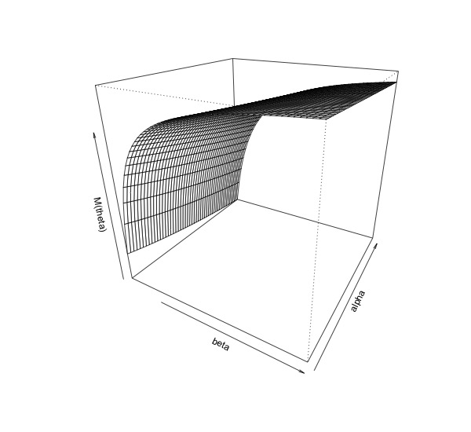

`r if(knitr:::is_latex_output()) '\\appendix'`

`r if(!knitr:::is_latex_output()) '# (APPENDIX) Appendix {-}'` 


# Appendix

```{r, include=FALSE}

knitr::opts_chunk$set(echo = FALSE, 
                      eval = TRUE,
                      message = FALSE,
                      warning = FALSE,
                      cache = FALSE,
                      fig.align ='center',
                      out.width="100%")
library(knitr)

```


## LOESS Smoothing {#loess}

### Fitting the LOESS Curve

To introduce some notation for the model at hand, we have a dependent variable $\mathbf y$ and independent variable $\mathbf  x$, where $\mathbf  y$ and $\mathbf x$ are related by some unknown function $g$, that is,  $y = g(x) + \boldsymbol \epsilon$^[Recall we use bold type for vectors, e.g., $\mathbf x \in \mathbb R^n$ is a vector with observations $x_i \in \mathbb R$.]. When we want to use LOESS smoothing to estimate $g$, often this function is complex, so we break up the problem into estimating a set of local regressions.

To obtain a predicted value $\hat g(x^*)$ for a particular value of the independent variable $x^*$,  we fit a polynomial with greatest weight placed on points in the neighborhood of $x^*$, where the width of this neighborhood is defined by the choice of smoothing span. Let $\alpha \in (0,1]$ denote the chosen smoothing span.

For a particular value of $x^*$, we estimate the predicted value $\hat g(x^*)$ by fitting a local regression. We first compute the weights by computing the vector of distances from this point $x^*$, that is,

$$\Delta (x^*) = |\mathbf x -x^* | $$

We define $q = \text{floor}(\alpha n)$, and take  $\Delta_q(x^*) \in \mathbb R$  to be the $q^{th}$ smallest distance of $\Delta (x^*)$.

The vector of weights is then 
$$T(\Delta(x^*), \Delta_q(x^*))$$

where $T$ is the tricube weight function given by

$$
T(x) = \begin{cases} (1-(x)^3)^3 \hspace{9 mm}  \text{ for } |x| < 1\\
0  \hspace{25 mm} \text{ for $|x|$ } \geq 1 \end{cases}.
$$
Essentially, this process gives weight to points in the neighborhood of $x^*$. When we consider $x^* = 500$ and $\text{smoothing span} = \alpha = .2$, the the weights we obtain are given in Figure \ref{fig:weights}.

```{r, include=FALSE}

library(tidyverse)
library(latex2exp)


set.seed(123)
smoothing_span <- .2
y<- rnorm(1e3, mean = 10, sd = 80)
div <- seq(1,5, length = 1000)
y <- cumsum(y)
y <- y /div

data <- tibble(x = 1:1000, y = y)


tricube <- function(x) {
  ifelse(abs(x) < 1, (1-(abs(x))^3)^3, 0) 
}


alpha <- 0.2
x_star <- 500
width <- alpha*length(data$x)

delta_q <- sort(abs(x_star-data$x), decreasing = FALSE)[floor(alpha*1000)]
weights <- tricube( abs(x_star - data$x )/(delta_q))


data %>%
  mutate(Weight = weights,
         lower = x_star -width/2,
         upper = x_star + width/2) %>%
  ggplot(aes(x = x, y =weights)) +
  geom_point(size = .8) +
  geom_vline(aes(xintercept = upper),
             color = "darkred", alpha = .6) +
  geom_vline(aes(xintercept = lower),
                 color = "darkred", alpha = .6) +
  annotate(x = 280, geom= "text", y = .5, 
           label = TeX("$500 - (\\alpha)(n)$"), parse =TRUE) +
  annotate(x = 700, geom= "text", y = .5, 
           label = TeX("$500 + (\\alpha)(n)$"), parse =TRUE) +
  theme_bw()+
  theme(plot.title = element_text(hjust = .5, face="bold", size = 11),
        plot.subtitle = element_text(hjust = .5, face="italic", size = 11),
        axis.title = element_text(size = 11)) +
  labs(title = TeX("Weights Computed for $x^* = 500$"))


ggsave('thesis/figure/weights.jpeg',width=6,height=3)

```


```{r,fig.cap = "\\label{fig:weights} The only values with nonzero weights are those within the interval $(500 - \\alpha (n), 500 - \\alpha (n))$. That is, the proportion $\\alpha$ of the data points closest to $x^*$ will have nonzero weights.", fig.width =6, fig.asp = .6}


```


We fit a linear regression with polynomial terms, typically with degree up to 2, with these weights. For example, fitting the model for this same $x^*=500$, we obtain the polynomial in Figure \ref{fig:ex-poly}.


```{r, fig.cap = "\\label{fig:ex-poly}", fig.asp = .52, fig.width = 5}

model <- lm(y ~ x + I(x^2), weights = weights, data = data)

data %>%
  mutate(Weight = weights,
         predicted = predict(model)) %>%
  ggplot(aes(x = x, y =y)) +
  geom_point(size = .5, alpha = .6) +
  geom_line(aes(y = predicted),color = "#728BC8") +
  geom_point(x =500, 
             y = data[data$x==x_star,]$y,
             size =2,
             color = "orange",
             alpha = .8) +
  theme_bw()+
  theme(plot.title = element_text(hjust = .5, face="bold", size = 10),
        plot.subtitle = element_text(hjust = .5, face="italic", size = 12),
        axis.title = element_text(size = 12)) +
  labs(title = TeX("Local Model Estimated for Neighborhood about $x^* = 500$")) +
  ylim(min(data$y)- 50, max(data$y) + 50)


```


By fitting the model for every point in $\mathbf x$, we obtain the smoothed line shown in red in Figure \ref{fig:loess-all}.

```{r, fig.cap = "\\label{smooth-functions}Plotting the set of all local models used to obtain the LOESS curve shown in red."}

get_predicted <- function(x_i, all = FALSE) {

  delta_q <- sort((abs(x_i-data$x)), decreasing = FALSE)[floor(alpha*1000)]

  weights <- tricube( abs(x_i - data$x )/(delta_q))
  
  model <- lm(y ~ x + I(x^2), weights = weights, data = data)
  
  if(all) predict(model) 
  else predict(model, newdata = list(x=x_i))
}


get_predicted_all <- function(x_i) {


  delta_q <- sort(abs(x_i-data$x), decreasing = FALSE)[floor(alpha*1000)]
 # message(delta_q)
  
  weights <- tricube((data$x -x_i)/(delta_q))
  
  # message(head(weights))
  model <- lm(y ~ x + I(x^2), weights = weights, data = data)
  
   predict(model)
  
}

```

```{r make loess figure, fig.asp = .6, include=FALSE, eval=FALSE}

predicted_all <- map_df(data$x, ~tibble(fit = paste0("fit_", .x), 
                                        x_pred = .x,
                                        x = data$x,
                                        y = data$y,
                                        fitted = get_predicted(.x, all = TRUE)))


predicted_all %>%
  group_by(x_pred) %>%
  # get smoothed line
  mutate(fitted_star =  fitted[which(x==x_pred)]) %>%
  ungroup() %>%
  ggplot() +
  geom_line(aes(x = x, y = fitted, 
                color = fit, 
                group = fit),
            alpha = .5,
            show.legend=FALSE) +
  geom_line(aes(x = x_pred, y = fitted_star), color = "darkred", size = 1.2) +
#  geom_point(alpha = .5, aes(x =x, y = y), show.legend = FALSE) +
  ylim(min(data$y)-10, max(data$y) + 10) +
  viridis::scale_color_viridis(option="mako", discrete = TRUE) +
  theme_bw()+
  theme(plot.title = element_text(hjust = .5, 
                                  face="bold",
                                  size = 12),
        plot.subtitle = element_text(hjust = .5, 
                                     face="italic",
                                     size = 12),
        axis.title = element_text(size = 12)) +
  labs(title = TeX("All Local Models to Produce LOESS Curve"),
       y  = TeX("$\\hat{y}$"))


ggsave(here::here('thesis/figure/loess.jpeg'), width=8, height=5, dpi=600)

```

```{r, fig.cap="\\label{fig:loess-all}"}

knitr::include_graphics('figure/loess.jpeg')

```


```{r, include = FALSE, eval = FALSE}
dat <- data %>%
  mutate(pred = map_dbl(x, get_predicted))

dat %>%
  mutate(pred2 = predict(smoothed)) %>%
  ggplot(aes(x=x,y=y)) +
  geom_point() +
  geom_line(aes(y= pred), color = "darkred") +
  geom_line(aes(y = pred2))


# predicted_all %>%
#   filter(fit %in% paste0("fit_", c(500, 600, 700))) %>%
#   ggplot(aes(x =x,y = fitted, color = fit, group = fit)) +
#   geom_line(show.legend=FALSE) +
#   geom_line(alpha = .5, aes(y = y)) +
#   ylim(min(data$y)-10, max(data$y) + 10)


y<- rnorm(1e3, mean = 10, sd = 80)
div <- seq(1,5, length = 1000)
y <- cumsum(y)
y <- y /div

data <- tibble(x = 1:1000, y = y)

smoothed_1 <- loess(y ~ x, data = data[1:500,], span = 1) %>%
  predict()
smoothed_2 <- loess(y ~ x, data = data[501:1000,], span = 1) %>%
  predict()

smoothed_3 <-  loess(y ~ x, data = data[1:1000,], 
                     span = .5, 
                     model = TRUE,
                     control = loess.control( surface = c("interpolate")),
                     cell = 1) %>%
  predict()


alpha <- .2


# compute fitted value for y_i

x_i <- 1

weights <- c()


tricube <- function(x) {
  ifelse((x) < 1, (1-((x))^3)^3, 0) 
}

# weights <- tricube( u = (x_i - data$x ), t = (min(x_i-data$x)))


delta_q <- sort(x_i-data$x, decreasing = TRUE)[floor(alpha*1000)]


weights <- tricube(abs(x_i - data$x )/(delta_q))


model <- lm(y ~ x + I(x^2), weights = weights, data = data)

data %>% mutate(predicted = predict(model)) %>%
  filter(x==x_i)

model$coefficients


data %>% mutate(first_fit = predict(model)) %>%
  ggplot(aes(x = x, y = first_fit)) +
   geom_line() +
  geom_point(aes(x=x,y=y)) +
  ylim(min(NA), max(data$y))


# automate 


tricube <- function(x) {
  ifelse(abs(x) < 1, (1-(abs(x))^3)^3, 0) 
}


get_predicted <- function(x_i, all = FALSE) {

  delta_q <- sort((abs(x_i-data$x)), decreasing = FALSE)[floor(alpha*1000)]

  weights <- tricube( abs(x_i - data$x )/(delta_q))
  
  model <- lm(y ~ x + I(x^2), weights = weights, data = data)
  
  if(all) predict(model) 
  else predict(model, newdata = list(x=x_i))
}


get_predicted_all <- function(x_i) {


  delta_q <- sort(abs(x_i-data$x), decreasing = FALSE)[floor(alpha*1000)]
 # message(delta_q)
  
  weights <- tricube((data$x -x_i)/(delta_q))
  
  # message(head(weights))
  model <- lm(y ~ x + I(x^2), weights = weights, data = data)
  
   predict(model)
  
}

predicted_all <- map_df(data$x, ~tibble(fit = paste0("fit_", .x), 
                                        x = data$x,
                                        y = data$y,
                                        fitted = get_predicted(.x, all = TRUE)))


predicted_all %>%
  filter(fit %in% paste0("fit_", c(500, 600, 700))) %>%
  ggplot(aes(x =x,y = fitted, color = fit, group = fit)) +
  geom_line(show.legend=FALSE) +
  geom_line(alpha = .5, aes(y = y)) +
  ylim(min(data$y)-10, max(data$y) + 10)

predicted_all %>%
#  filter(fit %in% paste0("fit_", c(500, 600, 700))) %>%
  ggplot(aes(x =x,y = fitted, color = fit, group = fit)) +
  geom_line(show.legend=FALSE) +
  geom_line(alpha = .5, aes(y = y), show.legend = FALSE) +
  ylim(min(data$y)-10, max(data$y) + 10) +
  viridis::scale_color_viridis(option="mako", discrete = TRUE)

dat <- data %>%
  mutate(pred = map_dbl(x, get_predicted))

dat %>%
  mutate(pred2 = predict(smoothed)) %>%
  ggplot(aes(x=x,y=y)) +
  geom_point() +
  geom_line(aes(y= pred), color = "darkred") +
  geom_line(aes(y = pred2))


```

```{r, include = FALSE, eval = FALSE}
smoothed <- loess(y ~ x, data =data, span = .2)

# verify correspondence with loess function
dat %>%
  mutate(prediction_loess = predict(smoothed)) %>%
  ggplot(aes(x=x,y=y)) +
  geom_point() +
  geom_line(aes(y= pred), color = "darkred") +
  geom_line(aes(y = prediction_loess))


```


## Transformation Approach to Bounded Density Estimation {#bounded-density-transform}


Since $P(S_0|\text{untested}, \text{test}_+)$ is a probability hence is bounded between 0 and 1, we will focus on thinking about density estimation when the support is the unit interval. 


 Let $X \in [0,1]$. Since we want to transform it to the range $(-\infty,\infty)$, we can let $Y = \text{logit}(X) = \log \left( \frac{X}{1-X} \right)$.

We know if we have $X = g(Y)$, then we can acquire the distribution of $X$ from that of $Y$ by considering the change of variables of the probability density functions $f_X$ and $f_y$ given by 
$$f_X(x) = f_Y(g^{-1}(X)) \;\; \left| \frac{d}{dx} g^{-1}(X) \right|. \tag{1}$$ 

Thus, in this case, we have $Y = \text{logit}(X)$, so $g^{-1}$ is the logit function. By definition of the change of variables formula (1), we have
$$f_X(x) = f_Y(\text{logit}(X)) \;\; \left| \frac{d}{dx} \text{logit}(X) \right|.$$ 
Computing the derivative and simplifying, we have

\begin{align*} &= f_Y(logit(X)) \;\; \left| \frac{d}{dx}log(\frac{x}{1-x}) \right|\\
&= f_Y(logit(X)) \;\; \left| \left(\frac{1-x}{x} \right) (x(1-x)^{-1})' \right|\\ 
&= f_Y(logit(X)) \;\; \left| \left(\frac{1-x}{x} \right) ((1-x)^{-1} + x(1-x)^{-2} ) \right|\\
&= f_Y(logit(X)) \;\; \left| \left(\frac{1-x}{x} \right) \left(\frac{(1-x) + x }{ (1-x)^{2} }\right) \right|\\
&= f_Y(logit(X)) \;\; \left| \left(\frac{1-x}{x} \right) \left(\frac{1 }{ (1-x)^{2} }\right) \right|\\
&= f_Y(logit(X)) \;\; \left|  \frac{1 }{ x (1-x) } \right|.
\end{align*}


This means that we compute $Y = logit(X)$ and then estimate the density of the unbounded variable $Y$, and then we can recover the density $f_X$ by multiplying by $\frac{1 }{ x (1-x) }$.

In some cases, this approach works well. In Figure \ref{fig:trans}, we simulate a variable $X \sim Beta(3,2)$ and estimate the density with the transformation approach.


```{r}

library(latex2exp)

logit <- function(x) log(x/ (1-x))
invlogit <- function(x) exp(x)/(1+exp(x))

# ggplot() +
#   stat_function(fun = dbeta, 
#                 args = list(shape1=3, shape2=2),
#                 geom="area",
#                 alpha = .7) +
#   theme_bw() +
#   theme(axis.title = element_text(size = 18),
#         plot.title = element_text(size = 20, hjust = .5)) +
#   labs(x = TeX("$x$"),
#        y = TeX("$f_X(x)"),
#        title = TeX("$X \\sim \\beta(\\alpha=3, \\beta = 2)$"))


nsamp <- 1e4
# sample of X
X_sample <- rbeta(nsamp, shape1 = 3, shape2 = 2)


```


```{r, fig.cap = "\\label{fig:trans}"}

# Y = logit(X)
Y <- logit(X_sample)


# estimate density of Y
dens <- density(x = Y, n = nsamp, adjust = 2, kernel = "gaussian")


density_coordinates_Y <- dens$x
density_Y <- dens$y

# transform back with inverse logit function
density_coordinates_X <- invlogit(dens$x)

# according to change of variables formula
density_X <- density_Y / (density_coordinates_X * (1 - density_coordinates_X))


##################################
# estimated density
##################################

tibble(x=density_coordinates_X, y = density_X) %>%
  ggplot(aes(x= x, y=y)) +
  geom_area(alpha = .8) +
  labs(title = TeX("Estimating $f_X(x)$ from $f_Y(y)$"),
       y = TeX("Estimated $f_X(x)$"),
       subtitle = TeX("$X \\sim$ Beta(2,3)")) +
  theme_bw()+
  theme(axis.title = element_text(size = 12),
        plot.title = element_text(size = 14, hjust = .5),
        plot.subtitle = element_text(hjust = .5, size = 14))  +
  stat_function(fun = dbeta, 
                args = list(shape1=3, shape2=2),
               # geom="area",
                alpha = .7,
               color = "red") +
  geom_line(aes(x = density_coordinates_X, 
                y = dbeta(density_coordinates_X,
                          shape1 = 3, shape2 = 2),
                color = 'r')) +
  scale_color_manual(values = c('r' = 'red'),
                     labels = c('Theoretical Density'),
                     name='')

```

We see the difference between using the transformation approach versus estimating the density of $X$ without first transforming it to be unbounded in Figure \ref{fig:original}.

```{r create-fig-original,  fig.cap = "\\label{fig:original}"}

##################################
# compare to original approach
##################################

 density_original <- density(x = X_sample,
                            n = nsamp, 
                            adjust = 2,
                            kernel = "gaussian")


# jpeg(here::here('thesis/figure/comp_transformation_density.jpeg'), quality =500, width = 800, height =400)
tibble(x=density_coordinates_X,
         y = density_X,
         approach = "Transformation\nApproach") %>%
    bind_rows(
      tibble(
        x = density_original$x,
        y = density_original$y,
        approach = "Without Transformation"
      )
    ) %>%
    ggplot() +
    geom_line(alpha = .5, 
              aes( x=x, y = y, 
                   color = approach),
              show.legend=FALSE) +
   geom_ribbon( aes( x=x, ymin =0, ymax= y, fill=approach),
                alpha = .5) +
    stat_function(fun=dbeta,
                  args =list(shape1 = 3, shape2=2),
                  xlim=c(0, 1),
                  aes(color = "theoretical")) +
    geom_vline(aes(xintercept = 0), color = "darkred", 
               size = .4, alpha = .6) +
    geom_vline(aes(xintercept = 1), color = "darkred", 
               size = .4, , alpha = .6) +
    scale_x_continuous(n.breaks = 6) +
    labs(title = TeX("Comparing Approaches for Estimating $f_X(x)$"),
         y = TeX("Estimated $f_X(x)$"),
         subtitle = TeX(paste0("$X \\sim $ Beta(", 
                               3, ", ", 2, ")")),
         fill = "") +
    theme_bw() +
    theme(axis.title = element_text(size = 12),
          plot.title = element_text(size = 12, hjust = .5),
          plot.subtitle = element_text(size = 12, hjust = .5),
          legend.text = element_text(size = 12)) +
    viridis::scale_fill_viridis(discrete = TRUE, 
                                begin = .3, end = .8) +
    scale_color_manual(name = '', values=c('theoretical' = 'red'), 
                       labels = c('Theoretical Density')) +
  guides(color =guide_legend(override.aes = list(linewidth =2)))

# dev.off()

```

```{r, fig.width=7}

# knitr::include_graphics(here::here('thesis/figure/comp_transformation_density.jpeg'))

```

However, when we simulate densities that have greater mass toward the boundaries 0 or 1, we see that boundary bias becomes problematic (Figure \ref{fig:compare-beta-params}). This is evident in panels B, C, D, and G of Figure \ref{fig:compare-beta-params}, where the estimated density near the boundaries is a poor estimate of the true density.


```{r functions for transformation density estimation}

compare_density <- function(shape1, shape2, cap) {
  
  set.seed(123)
  X_sample <- rbeta(1e3, shape1, shape2)
  
  Y <- logit(X_sample)

  # estimate density of Y
  dens <- density(x = Y, n = nsamp, adjust = 2, kernel = "gaussian")
  
  
  density_coordinates_Y <- dens$x
  density_Y <- dens$y
  
  # transform back with inverse logit function
  density_coordinates_X <- invlogit(dens$x)
  
  # according to change of variables formula
  density_X <- density_Y / (density_coordinates_X * (1 - density_coordinates_X))
  
  
  # estimated density
  
  density_original <- density(x = X_sample,
                            n = nsamp, 
                            adjust = 2,
                            kernel = "gaussian")
  
  yupper <- max(dbeta(density_coordinates_X, 
                      shape1 =shape1, 
                      shape2 = shape2))

  tibble(x=density_coordinates_X,
         y = density_X,
         approach = "Transformation\nApproach") %>%
    bind_rows(
      tibble(
        x = density_original$x,
        y = density_original$y,
        approach = "Direct Estimation"
      )
    ) %>%
    ggplot() +
    geom_ribbon( aes( x=x, ymin =0, ymax= y, fill=approach),
                alpha = .5) +
    geom_line(alpha = .5, 
              aes( x=x, y = y, 
                   color = approach),
             # size = 1.03,
              show.legend=FALSE) +
    stat_function(fun=dbeta,
                  args =list(shape1 = shape1, shape2=shape2),
                  xlim=c(0, 1),
                  aes(color = "theoretical")) +
    geom_vline(aes(xintercept = 0), color = "darkred", 
               size = .4, alpha = .6) +
    geom_vline(aes(xintercept = 1), color = "darkred", 
               size = .4, , alpha = .6) +
    scale_x_continuous(n.breaks = 6) +
    labs(
      # title = TeX("Comparing Approaches for Estimating $f_X(x)$"),
         y = TeX("Estimated $f_X(x)$"),
         subtitle = TeX(paste0("$X \\sim $ Beta(", 
                               shape1, ", ", shape2, ")")),
         fill = "",
         caption = cap) +
    theme_bw() +
    theme(axis.title = element_text(size = 12),
          plot.title = element_text(size = 12, hjust = .5),
          plot.subtitle = element_text(size = 12, hjust = .5),
          legend.text = element_text(size = 16),
          legend.position="none",
          plot.caption = element_text(hjust = 0, size = 12, face = "bold")) +
    viridis::scale_fill_viridis(discrete = TRUE, 
                                begin = .3, end = .8) +
    ylim(0, yupper+2)+
    scale_color_manual(name = '', values=c('theoretical' = 'red'), 
                       labels = c('Theoretical Density'))

 
}


shapes <- expand.grid(seq(1 ,5, by = 1.5),
            seq(1, 5, by= 1.5)) %>%
  mutate(fig = LETTERS[1:nrow(.)])


```

```{r, fig.cap = "\\label{fig:compare-beta-params}", fig.height = 10}


plotlist <- pmap(shapes, ~{
  plt <- compare_density(shape1 = ..1, shape2 = ..2, cap = ..3)
 # print(plt)
} )


legend_b <- cowplot::get_legend(
  plotlist[[1]] + 
    guides(color = guide_legend(
      nrow = 1, 
      override.aes = list(
      linewidth=4))) +
    theme(legend.position = "top",
          legend.text = element_text(size = 14))
)


title_gg <- ggplot() + 
  labs(title =latex2exp::TeX("Comparing Approaches for Estimating $f_X(x)$",bold=TRUE),
  subtitle = latex2exp::TeX("for Different Beta Distributions",bold=TRUE)) + 
  theme(plot.title=element_text(face="bold",
                                hjust = .5, 
                                size =14),
        plot.subtitle = element_text(face="bold",
                                     hjust = .5,
                                     size = 14,
                                margin =margin(0,0,3,0)))


plts <- cowplot::plot_grid(plotlist = plotlist, ncol=2)

# jpeg(filename=here::here('thesis/figure/comp_density_by_params.jpeg'), height = 1000, width = 900, quality =300)
cowplot::plot_grid(title_gg,
                   legend_b,
                   plts, 
                   ncol = 1 ,
                   rel_heights = c(.05,.1, .85))
# dev.off()


```


\newpage


## Beta Kernel Density Estimation {#betakernel}


As defined in @chen1999, the most simple beta kernel estimator would be 
$$\hat f_1(x) = \dfrac{\sum_{i=1}^n K_{x/b + 1, \; (1-x)/b + 1} (X_i)}{n}$$

where $K_{\text{shape1}, \text{shape2}}$ is the density function $Beta(shape1, \; shape2)$.

However, @chen1999 show that the modified beta kernel estimator $\hat f_2(x)$ has lower variance and bias than $\hat f_1$, where we define $\hat f_2$ as follows:

$$
\hat f_2(x)  = \dfrac{\sum_{i=1}^n K_{x,b}^*(X_i)}{n},$$


$$K^*_{x,b} = \begin{cases}K_{x/b, \; (1-x)/b }(t)  & \text{if }x \in [2b,1-2b] \\
K_{\rho(x), \; (1-x)/b } (t)  & \text{if } x \in [0,2b) \\
K_{x/b, \; \rho(1-x)}(t) & \text{if } x\in(1-2b,1]
\end{cases},
$$
$$\rho(x,b) = 2b^2 + 2.5 - \sqrt{b^2 + 6b^2 +2.25-x^2 -x/b}.$$


Notably, for beta kernel estimators, the shape of the kernel depends on $x$ (Figure \ref{fig:depends-on-x}). 

```{r}

library(viridis)

rho <- function(x,b) {
  root <- 4*b^4 + 6*b^2 + 2.25 -x^2 -x/b
  # message(paste0("\n\nx:", x, "\nroot: ", root))
  ifelse(root >= 0, 2*b^2 + 2.5 - sqrt(root), 0) 
}

# by definition of f_2 in Chen 1999
beta_kernel <- function(t, x,b) {
  case_when(
  (x >= 2*b) & (x <= ( 1-2*b)) ~ dbeta(t, x/b, (1-x)/b),
  x >= 0 & x < 2*b ~ dbeta(t, rho(x,b), (1-x)/b),
  x > (1 - 2*b) & x <= 1 ~ dbeta(t,x/b, rho((1-x),b)))
}


f2 <- function(coords, sample, b) {
  n <- length(sample)
  dens <- map_dbl(coords, ~sum(beta_kernel(t=sample, x=.x, b= b)))
  dens/n
}

t_vec <- seq(0, 1, length = 1e3)

b0 <- .2

df <- map_df(seq(0,1, by = .1), 
       ~ {
         tibble(t = t_vec, 
       density = dbeta(t_vec, shape1= (.x/b0 + 1),
                             shape2 = ((1-.x)/b0 + 1)),
        x = .x)
       }
)

```

```{r, fig.cap = "\\label{fig:depends-on-x}"}

# svg(here::here('thesis/figure/depends_on_x.svg'), width = 8, height =5)
df %>%
  mutate(x=as.factor(x)) %>%
  ggplot(aes(x=t, y =density, color = x)) +
  geom_line() +
  labs(y = TeX("$K(t)$"),
       title = TeX(paste0("Beta Kernel with Shape 1 = ",
       "$\\frac{x}{b} +1$",
       " and Shape 2 =  $\\frac{(1-x)}{b+1}$")),
       subtitle = "b = 0.2") +
  theme_bw() +
  scale_color_viridis(option = "mako",
                      discrete = TRUE,
                      direction = -1,
                      end = .95) +
  theme(plot.title = element_text(hjust = .5, size =14),
        plot.subtitle = element_text(hjust = .5, size = 12))
 
# dev.off()

 
```


```{r,  fig.width=7}


# knitr::include_graphics(here::here('thesis/figure/depends_on_x.svg'))

```


```{r simple-example, include = FALSE,eval=FALSE}
X_sample <- rbeta(1e3, shape1, shape2)


dat <- tibble(coords = seq(0,1,length =100),
       density = f2(coords, X_sample, b=.2)) 

dat %>%
  ggplot() +
  geom_area(aes(x=coords, y =density),
            fill = "#51928D",
            alpha = .8) +
  stat_function(fun =dbeta, args =list(shape1=shape1,
                                       shape2=shape2),
                xlim=c(0,1),
                color = "red",
                size = 1.05) +
  ylim(0,1.3) +
  labs(title = TeX("Density Estimation Using Beta Kernel Estimator $\\widehat{f_2}(x)$"),
       x = "x",
       y = TeX("$\\widehat{f_2}(x)$"),
      subtitle = TeX(paste0("$X \\sim $ Beta(", 
                               shape1, ", ", shape2, ")"))) +
    theme_bw() +
    theme(axis.title = element_text(size = 14),
          plot.title = element_text(size = 12, hjust = .5),
          plot.subtitle = element_text(size = 12, hjust = .5),
          legend.text = element_text(size = 16),
          plot.caption = element_text(hjust = 0, size = 12, face = "bold")) 


```


As we did in Figure \ref{fig:compare-beta-params}, we can compare the performance of the beta kernel $\hat f_2$ for estimating the density of samples from different beta distributions (Figure \ref{fig:comp-beta}).


```{r, fig.cap = "\\label{fig:comp-beta}", fig.height =9, fig.width= 7}
library(cowplot)

beta_kernel_est_plot <- function(shape1,
                                 shape2, 
                                 panel_name,
                                 nsamp = 1e4,
                                 b = NULL) {
  
  b <- ifelse(is.null(b), nsamp^(-2/5), b)
  
  X_sample <- rbeta(nsamp, shape1 = shape1 , shape2 = shape2)

  dat <- tibble(coords = seq(0,1,length =100),
         density = f2(coords, X_sample, b=b)) 
  yupper <- max(max(dat$density),
                max(dbeta(dat$coords,
                          shape1=shape1,
                          shape2=shape2))) 
  yupper <- yupper + .2

  plt <- dat %>%
    ggplot() +
    geom_area(aes(x=coords, y =density),
              fill = "#51928D",
              alpha = .8) +
    stat_function(fun =dbeta, args =list(shape1=shape1,
                                         shape2=shape2),
                  xlim=c(0,1),
                  aes(color = "Theoretical")) +
    labs(
      # title = TeX("Density Estimation Using Beta Kernel Estimator $\\widehat{f_2}(x)$"),
         x = "x",
         y = TeX("$\\widehat{f_2}(x)$"),
         subtitle = TeX(paste0("$X \\sim $ Beta(", 
                               shape1, ", ", shape2, "), b = ", round(b,3))),
         caption = panel_name) +
      theme_bw() +
      theme(axis.title = element_text(size = 8),
            plot.title = element_text(size = 12, hjust = .5),
            plot.subtitle = element_text(size = 10, hjust = .5),
            legend.text = element_text(size = 16),
            plot.caption = element_text(hjust = 0, size = 12, face = "bold"),
            legend.position="none") +
      ylim(0,yupper) +
    scale_color_manual(values=c('Theoretical' = 'red'),
                       name='')
  
}

plotlist <- pmap(shapes, ~{
  
  plt <- beta_kernel_est_plot(shape1 = ..1, 
                              shape2 = ..2, 
                              panel_name = ..3)
  # print(plt)
  
} )


title_gg <- ggplot() + 
  labs(title = TeX("Density Estimation Using Beta Kernel Estimator $\\widehat{f_2}(x)$",
                          bold=TRUE)) + 
  theme(plot.title=element_text(face="bold",
                                hjust = .5, 
                                size =14,
                                margin =margin(5,0,2,0)))


legend_b <- get_legend(
  plotlist[[1]] +
  theme(legend.position="top",
        legend.text =element_text(size =7)) +
  guides(color = guide_legend(override.aes = list(linewidth= 3)))
)

plts <- cowplot::plot_grid(plotlist = plotlist, ncol=2)

# jpeg(filename=here::here('thesis/figure/comp_density_by_params.jpeg'), height = 1000, width = 900, quality =300)
cowplot::plot_grid(title_gg,
                   legend_b,
                   plts, 
                   ncol = 1 ,
                   rel_heights = c(.05,0.05,.9))


# check correspondence with bde implementation
# X_sample <- rbeta(1e4, shape1 = 4 , shape2 = 2.5)
# 
# dens <- bde::bde(dataPoints = X_sample,
#          dataPointsCache = seq(0,1,length =100),
#          estimator = "betakernel")
# 
# tibble(x = dens@dataPointsCache,
#        y = dens@densityCache) %>% 
#   ggplot(aes(x=x, y = y)) +
#   geom_line()

```


## Total Tests and Positive Tests Across All States


```{r, out.width="100%", fig.cap="\\label{fig:test-capacity-all-states} Percent change in positive tests and the percent change in total tests from March 2021 through the end of February 2022. We see in the period from July through September that the positive tests consistently increase at a higher rate than the total tests; this is related to the peaks we observe in the probabilistic bias intervals."}

knitr::include_graphics('figure/test_capacity_all_states.pdf')
                        
                        
```


## Comparing Johns Hopkins CSSE Cases to CDC Positive Tests


```{r, out.width="100%", fig.cap = "\\label{fig:jhu-cdc-all}Comparing the data sources for the probablistic bias analysis and the Covidestim model. The two solid lines are the data sources: the data source for the probabilistic analysis is PCR tests from the CDC's Diagnostic Laboratory Testing Time series, while the data source for the Covidestim model is Johns Hopkins CSSE case counts. Each is summed across 2-week intervals time scale. The test positivity is the positive tests from the CDC source over total tests for the two-week interval. Looking at trends in the test positivity are informative for better understanding when Covidestim estimates lag the probabilistic bias intervals. This figure contains half of the states; the next half are in the following figure."}

knitr::include_graphics('figure/jhu_cdc_all_states_1.jpeg')

```

```{r, fig.cap = "\\label{fig:jhu-cdc-all2} This figure provides the same information as \\ref{fig:jhu-cdc-all} for the second half of the states."}

knitr::include_graphics('figure/jhu_cdc_all_states_2.jpeg')

```

## First Implementation of Probabilistic Bias Analysis (Including All States)


Some states have insufficient data from the COVID-19 Trends and Impact Survey to run the implementations that center the distributions of $\beta$ and/or $P(S_1|\text{untested})$ at the survey values (versions 2 through 4). However, because testing data is available for all states, the implementation that does not inform priors based on survey data is possible for all states in the U.S. (Figure \ref{fig:all-states-first-impl}). 

\newpage

```{r, fig.cap = "\\label{fig:all-states-first-impl}  Probabilistic bias analysis 95\\% simulation intervals for each two-week interval and state for the implementation where priors do not vary by location or time-interval."}

knitr::include_graphics('figure/all-states-first-impl.jpeg')

```

## County Level Comparison to Covidestim in Massachusetts

```{r, fig.cap = "\\label{fig:ma-comp-covidestim}Probabilistic bias analysis intervals for each county in Massachusetts. Each probabilistic bias interval is a 95\\% simulation interval for the estimated infections in that particular two-week interval. Each column represents a distinct implementation of the probabilistic bias analysis, where columns 2 through 4 incorporate survey data from the COVID-19 Trends and Impact Survey for informing the prior distributions. The Covidestim medians are presented in blue to compare concordance between each implementation of the bias analysis to Covidestim estimates." }

knitr::include_graphics("figure/ma_pb_compared_to_covidestim.pdf")

```


## Full Set of Results at the County Level for Michigan

```{r, out.width ="100%", fig.cap = "\\label{fig:pb_versions_mi-1} Probabilistic bias intervals for each implementation of probabilistic bias analysis, for each county in Michigan. Each interval is a 95\\% simulation interval for the total number of infections in that county in that two-week interval. The counties in Michigan are divided into thirds; this figure shows the first third, and the following two figures show the remaining counties."}

knitr::include_graphics(paste0('figure/', 'mi1', '_pb_compared_to_observed.pdf'))

```

```{r, out.width ="100%", fig.cap = "\\label{fig:pb_versions_mi-2} This figure is identical to \\ref{fig:pb_versions_mi-1} but shows the second third of counties in Michigan."}

knitr::include_graphics(paste0('figure/', 'mi2', '_pb_compared_to_observed.pdf'))

```


```{r, out.width ="100%", fig.cap = "\\label{fig:pb_versions_mi-3}", fig.cap = "\\label{fig:pb_versions_mi-3} This figure is identical to \\ref{fig:pb_versions_mi-1} but shows the last third of counties in Michigan."}

knitr::include_graphics(paste0('figure/', 'mi3', '_pb_compared_to_observed.pdf'))

```

## Concordance with Covidestim by Version and County in Michigan

```{r, fig.cap="\\label{fig:mi-county-concordance} Considering the proportion of probabilistic bias intervals that contained the Covidestim median for each implementation, for each county in Michigan. For most counties, we see that the implementation centering $P(S_1|\\text{untested})$ at the survey value is most concordant with Covidestim."}


knitr::include_graphics('figure/mi_pb_compared_to_covidestim_proportions.pdf')


```

## Ratio of Estimated Infections to Observed in Michigan Counties, by Population Size

```{r, fig.cap="\\label{fig:mi-ratio-pop}Comparing the ratio of estimated infections to observed infections over time for counties of different population sizes in Michigan. Counties are split into four groups based on quartiles of the population size. Each point represents the ratio of the estimated infections to the observed infections for a county. Although the group with the smallest population size does have more outliers with very high ratios, the median ratios are highly similar across population sizes."}


```


\newpage 

## Lack of Change in $\alpha$ with Melding {#alpha-melding}

|    We see in any figure that shows the pre and post melding distributions that $\alpha$ undergoes little change. Recalling the function $M$ we use to relate $\alpha,\beta,\Pr(S_1|\text{untested})$ to the asymptomatic rate, 

$$\Pr(S_0|\text{test}_+, \text{untested}) = M(\theta)  = \dfrac{\beta (1- \Pr(S_1|\text{untested}))}{\beta(1- \Pr(S_1|\text{untested})) + \alpha(\Pr(S_1|\text{untested})},$$

we note that there are two reasons that this function is not as sensitive to changes in $\alpha$. For one, most of the density of $\Pr(S_1|\text{untested})$ is at very small values (less than 0.05), which means that even if $\alpha$ changes substantially, it will be multiplied by a very small value and thus will have a relatively small impact on $M(\theta)$. Simulations revealed that changing the prior for  $\Pr(S_1|\text{untested})$ to be shifted higher increased the extent to which $\alpha$ would change after melding.

The other reason is simply the form of the function itself, where $\beta$ is in both the numerator and denominator, while $\alpha$ is only a term in the denominator.

Below, we see that within the range of values of $\alpha$ and $\beta$ that will be sampled with the specification of the priors (considering $\beta$ in the range $(0.01,0.4)$ and $\alpha$ in the range $(0.7,1.3)$, $M(\theta)$ is much more sensitive to changes in $\beta$ across this range than changes in $\alpha$. We hold $\Pr(S_1|\text{untested})$ constant for the purposes of this figure. 


&nbsp; &nbsp; &nbsp; &nbsp;


```{r,fig.cap="\\label{fig:alpha-little-change}Holding $\\Pr(S_1|\\text{untested})$ constant and considering $\\alpha \\in (0.7,1.3)$ and $\\beta \\in (0.01,0.4)$, where these ranges contain all values where the prior distribution has nontrivial density, we see that $M(\\theta)$ is much more sensitive to changes in $\\beta$ than to changes in $\\alpha$. A consequence of this is the lack of change we see in $\\alpha$ in the post-melding distributions.", fig.height=3,out.width="70%"}



```

## Relationship Between $(X+Y)_\alpha$ and $X_{\alpha}$ +$Y_{\alpha}$ for Dependent Variables {#conservativeintervals}


### Simulation: Bivariate Normal 

We can see this in a concrete example. Let $(X,Y)$ be bivariate normal with $\boldsymbol \mu = \begin{pmatrix} 0\\0\end{pmatrix}$ and correlation matrix $\boldsymbol \Sigma = \begin{pmatrix} 1 & \rho \\ \rho & 1 \end{pmatrix}$, and hence where $X, Y$ are marginally standard normal random variables. 

We let the subscript $\alpha$ denote the $\alpha^{th}$ and the subscript $1-\alpha$ denote the $(1-\alpha)^{th}$ quantile of the distribution. 

In Figure \ref{fig:simmvn}, in each panel, we increase the correlation $\rho$ between $X$ and $Y$ by 0.25 units and plot the sum $X +Y$ against $X$. The vertical lines represent quantiles $X_{0.025}$ and $X_{0.975}$, and the horizontal lines represent the quantiles  $(X+Y)_{0.025}$ and $(X+Y)_{0.975}$.

We see in Figure \ref{fig:simmvn} that when we increase the correlation between $X$ and $Y$, the width of the interval $\Big((X+Y)_\alpha, (X+Y)_{1-\alpha}\Big)$ increases.


&nbsp;

&nbsp; 

&nbsp; 

&nbsp;

&nbsp;


&nbsp;

&nbsp; 

&nbsp; 

&nbsp;

&nbsp;


&nbsp;

&nbsp; 

&nbsp; 


&nbsp;

&nbsp; 

&nbsp; 


&nbsp;

&nbsp; 

&nbsp; 

&nbsp;

&nbsp;


```{r,fig.show = 'hold', out.width ="96%", fig.height = 2, fig.cap = "\\label{fig:simmvn}", cache=TRUE}


library(MASS)
library(latex2exp)
library(tidyverse)

nsamp <- 1e4
# corr = cov / sd_1 * sd_2
# since both sd = 1


sim <- function(corr, data = FALSE) {
  sigma <- matrix(c(1,corr, corr, 1), byrow = TRUE, nrow = 2)
  means <- c(0, 0)
  X <- MASS::mvrnorm(n = nsamp, mu = means, Sigma = sigma)


  sim_data <- X %>%
    as_tibble() %>%
    mutate(lb_v1 = quantile(V1, 0.025),
           ub_v1 = quantile(V1, 0.975),
           lb_v2 = quantile(V2, 0.025),
           ub_v2 = quantile(V2, 0.975))  %>%
    mutate(sum = V1 + V2,
           lb = quantile(sum, .025),
           ub = quantile(sum, .975))
  
  
  plt1 <- sim_data %>%
    ggplot(aes(x = sum)) +
    geom_density(fill = "black", alpha = .8) +
    geom_vline(aes(xintercept = lb),
               color = "darkred", size = .9) +
    geom_vline(aes(xintercept = ub),
               color = "darkred", size = .9) +
    labs(title =  TeX(paste0("$\\left( (X+Y)_\\alpha, (X+Y)_{1-\\alpha}\\right)$ =",
                             " (",
                      round(unique(sim_data$lb), 3),
                      ",",
                      round(unique(sim_data$ub), 3),
                      ")"
                      )),
         x = "X+Y")+
    theme_bw() +
    theme(plot.title = element_text(size = 11, hjust = .5),
          plot.subtitle = element_text(size = 11, hjust = .5)) +
    xlim(-8,8) +
    ylim(0,.3)

  plt2 <- sim_data %>%
    ggplot() +
    geom_point(aes(x= V1,y=V1+V2), alpha = .08, size = .2) +
    geom_point(color = "red", x = means[1], y = means[2]) +
    geom_density_2d(aes(x= V1,y=V1+V2)) +
   # geom_density_2d(aes(x= V1,y=V2)) +
    xlim(-6,6) +
    ylim(-6,6) +
    geom_vline(aes(xintercept = lb_v1), color = "darkred", size = .9) +
    geom_vline(aes(xintercept = ub_v1), color = "darkred", size = .9)+
    geom_hline(aes(yintercept = lb), color = "darkred", size = .9) +
    geom_hline(aes(yintercept = ub), color = "darkred", size = .9) +
    theme_bw() +
    theme(plot.title = element_text(size = 11, hjust = .5),
          plot.subtitle = element_text(size = 11, hjust = .5)) +
    labs(x = "X",
         y= "X+Y",
         title = paste0("Correlation: ",
                        corr, 
                        "\nX: (", round(unique(sim_data$lb_v1),3), ", ",
                        round( unique(sim_data$ub_v1),3), ")",
                        "\nY:  (", round(unique(sim_data$lb_v2),3), ", ", 
                        round(unique(sim_data$ub_v2),3), ")"
                        ),
         subtitle = TeX(paste0(
           "$(X_{\\alpha} + Y_{\\alpha}, X_{1-\\alpha} + Y_{1-\\alpha})$ = (", 
                               round(unique(sim_data$lb_v1) + unique(sim_data$lb_v2),3 ),
                               ", ",
                               round(unique(sim_data$ub_v1) + unique(sim_data$ub_v2),3 ),
                               ")")))
  
  if (data) {
    sim_data %>% 
      dplyr::select(-c(V1,V2,sum)) %>% 
      distinct() %>%
      mutate(corr= corr)
  }
  else {
    cowplot::plot_grid(plt1,plt2, nrow = 1)
  }
  
  
  
}


# plot_sim(.2)

walk(seq(0, 1, length = 5), ~{
  plt <-sim(.x)
  print(plt)
})

```

In Figure \ref{fig:comp-intervals}, we compare the intervals defined by taking the quantiles of the sum, $\Big((X+Y)_\alpha, (X+Y)_{1-\alpha}\Big)$, to the intervals taken by summing the quantiles individually, $\Big(X_\alpha +Y_\alpha, \; X_{1-\alpha} +Y_{1-\alpha}\Big)$. We notice that, as we saw in Figure \ref{fig:simmvn}, increasing the correlation increases the width of the interval $\Big((X+Y)_\alpha, (X+Y)_{1-\alpha}\Big)$, while the interval $\Big(X_\alpha +Y_\alpha, \; X_{1-\alpha} +Y_{1-\alpha}\Big)$ is constant since changing the correlation does not change the marginal quantiles $X_\alpha, X_{1-\alpha}$.,


```{r, fig.cap = "\\label{fig:comp-intervals}", fig.height = 3.5, fig.width = 6}
dat <- map_df(seq(-1, 1, length = 11), ~sim(corr = .x, data = TRUE))

dat %>%
  mutate(lb_separate = lb_v1+lb_v2,
         ub_separate = ub_v1+ub_v2) %>%
  dplyr::select(corr, lb,ub,lb_separate,ub_separate) %>%
  pivot_longer(-c(corr)) %>%
  mutate(source = ifelse(grepl("separate", name),
                         "Sum of Quantiles", "Quantiles of Sum")) %>%
  mutate(name = gsub("_separate", "", name)) %>%
  pivot_wider(names_from = name, values_from = value) %>%
  ggplot(aes(x= corr, ymin = lb, ymax = ub, color = source)) +
  geom_errorbar(position=position_dodge(width=.2),
                size = 1.2) +
  theme_bw() +
  scale_x_continuous(breaks =seq(-1, 1, length = 11)) +
  labs(x = "Correlation Between X and Y",
       y = "0.025 and 0.975 Quantiles",
       color = "") +
  viridis::scale_color_viridis(discrete = TRUE, begin = .2, end = .7)

```

```{r,  fig.show = 'hold', out.width ="96%", fig.height = 3.2, include = FALSE}

library(MASS)
library(latex2exp)
library(tidyverse)

nsamp <- 1e4
# corr = cov / sd_1 * sd_2
# since both sd = 1


sim <- function(corr, data = FALSE) {
  sigma <- matrix(c(1,corr, corr, 1), byrow = TRUE, nrow = 2)
  means <- c(0, 0)
  X <- MASS::mvrnorm(n = nsamp, mu = means, Sigma = sigma)


  sim_data <- X %>%
    as_tibble() %>%
    mutate(lb_v1 = quantile(V1, 0.025),
           ub_v1 = quantile(V1, 0.975),
           lb_v2 = quantile(V2, 0.025),
           ub_v2 = quantile(V2, 0.975))  %>%
    mutate(sum = V1 + V2,
           lb = quantile(sum, .025),
           ub = quantile(sum, .975))
  
  
  plt1 <- sim_data %>%
    ggplot(aes(x = sum)) +
    geom_density(fill = "black", alpha = .8) +
    geom_vline(aes(xintercept = lb),
               color = "darkred", size = .9) +
    geom_vline(aes(xintercept = ub),
               color = "darkred", size = .9) +
    labs(title =  TeX(paste0("$\\left( (X+Y)_\\alpha, (X+Y)_{1-\\alpha}\\right)$ =",
                             " (",
                      round(unique(sim_data$lb), 3),
                      ",",
                      round(unique(sim_data$ub), 3),
                      ")"
                      )),
         x = "X+Y")+
    theme_bw() +
    theme(plot.title = element_text(size = 11, hjust = .5),
          plot.subtitle = element_text(size = 11, hjust = .5)) +
    xlim(-8,8) +
    ylim(0,.3)

  plt2 <- sim_data %>%
    ggplot() +
    geom_point(aes(x= V1,y=V2), alpha = .08, size = .2) +
    geom_point(color = "red", x = means[1], y = means[2]) +
    geom_density_2d(aes(x= V1,y=V2)) +
    xlim(-4,4) +
    ylim(-4,4) +
    geom_density(aes(x = V1), fill = "black", alpha = .8)+
    geom_density(aes(y = V2), fill = "black", alpha = .8) +
    geom_vline(aes(xintercept = lb_v1), color = "darkred", size = .9) +
    geom_vline(aes(xintercept = ub_v1), color = "darkred", size = .9)+
    geom_hline(aes(yintercept = lb_v2), color = "darkred", size = .9) +
    geom_hline(aes(yintercept = ub_v2), color = "darkred",, size = .9) +
    theme_bw() +
    theme(plot.title = element_text(size = 11, hjust = .5),
          plot.subtitle = element_text(size = 11, hjust = .5)) +
    labs(x = "X",
         y= "Y",
         title = paste0("Correlation: ", 
                        corr, 
                        "\nX: (", 
                        round(unique(sim_data$lb_v1),3), ", ",
                        round( unique(sim_data$ub_v1),3), ")",
                        "\nY:  (", round(unique(sim_data$lb_v2),3), ", ", 
                        round(unique(sim_data$ub_v2),3), ")"
                        ),
         subtitle = TeX(paste0("$(X_{\\alpha} + Y_{\\alpha}, X_{1-\\alpha} + Y_{1-\\alpha})$ = (", 
                               round(unique(sim_data$lb_v1) + unique(sim_data$lb_v2),3 ),
                               ", ",
                               round(unique(sim_data$ub_v1) + unique(sim_data$ub_v2),3 ),
                               ")")))
  
  if (data) {
    sim_data %>% 
      dplyr::select(-c(V1,V2,sum)) %>% 
      distinct() %>%
      mutate(corr= corr)
  }
  else {
    cowplot::plot_grid(plt1,plt2, nrow = 1)
  }
  
  
  
}


# plot_sim(.2)

walk(seq(0, 1, length = 5), ~{
  plt <-sim(.x)
  print(plt)
})


dat <- map_df(seq(-1, 1, length = 11), ~sim(corr = .x, data = TRUE))

dat %>%
  mutate(lb_separate = lb_v1+lb_v2,
         ub_separate = ub_v1+ub_v2) %>%
  dplyr::select(corr, lb,ub,lb_separate,ub_separate) %>%
  pivot_longer(-c(corr)) %>%
  mutate(source = ifelse(grepl("separate", name),
                         "Sum of Quantiles", "Quantiles of Sum")) %>%
  mutate(name = gsub("_separate", "", name)) %>%
  pivot_wider(names_from = name, values_from = value) %>%
  ggplot(aes(x= corr, ymin = lb, ymax = ub, color = source)) +
  geom_errorbar(position=position_dodge(width=.2),
                size = 1.2) +
  theme_bw() +
  scale_x_continuous(breaks =seq(-1, 1, length = 11)) +
  labs(x = "Correlation Between X and Y",
       y = "0.025 and 0.975 Quantiles",
       color = "") +
  viridis::scale_color_viridis(discrete = TRUE, begin = .2, end = .7,
                               labels = c(
                                'Sum of Quantiles' = 
                                  TeX("Sum of Quantiles: $\\; X_\\alpha + Y_\\alpha$"),
                                'Quantiles of Sum' =
                                  TeX("Quantile of Sums: $\\; (X+Y)_\\alpha$")))


```


As we see in Figure \ref{fig:comp-intervals}, the intervals are identical when $X,Y$ are perfectly correlated. This result is not dependent on the choice of distribution, as we can show by considering  CDFs and quantile functions of a general distribution. 

\begin{tcolorbox}[title = Quantiles of the Sum of Perfectly Correlated Random Variables]
When two random variables $X$ and $Y$ are perfectly correlated,
$$X_\alpha + Y_\alpha = (X+Y)_\alpha.$$
\end{tcolorbox}

When $X$ and $Y$ are perfectly correlated, $Y$ must be a linear combination of $X$, so we can write $X+Y= X+bX=(1+b)X$.

Then, let the $\alpha^{th}$ quantile of $(1+b)X$ be $x_\alpha$. By definition of the quantile function, we have 

$$F^{-1}_{(1+b) X } (\alpha) = x_\alpha \implies P((1+b) X \leq x_\alpha) = \alpha.$$
Since $(1+b)$ is just a constant, we can divide to yield

$$P\Big( X \leq x_\alpha/(1+b) \Big) = \alpha.$$
To obtain the quantile for $bX$, we can multiply each side by $b$ to yield
$$P\Big( bX \leq bx_\alpha/(1+b) \Big) = \alpha.$$

Putting these results together, we have 

\begin{align*}
F^{-1}_X+F^{-1}_Y &= F^{-1}_{bX} (\alpha) + F^{-1}_{X} (\alpha) \\
&= \frac{bx_\alpha } { 1+b} + \frac{x_\alpha}{1+b}\\
&= x_\alpha \\
&= F^{-1}_{(1+b)X}(\alpha)\\
&=F^{-1}_{X+Y}(\alpha) \end{align*}


```{r,include=FALSE,eval=FALSE}
$$F_{2X}(x_\alpha) = P(2X\leq x_\alpha) = \alpha \implies P(X \leq x_\alpha/2) = \alpha.$$
Thus, we have $F_X^{-1} (\alpha) = x_\alpha/2$ and $F_{2X}^{-1}


$$F_{2X}^{-1}(\alpha) = x_\alpha \implies F^{-1}_X(\alpha) = x_\alpha /2$$
$$F_{2X}^{-1}(\alpha) = F^{-1}_X(\alpha) + F^{-1}_X(\alpha).$$
```


### Derivation of the Distribution of X+Y for Bivariate Normal


We can see why we observe this relationship between intervals in \ref{fig:comp-intervals}, where the 95% intervals $X_\alpha +Y_\alpha$ are wider than $(X+Y)_\alpha$ based on the the sum of the $\alpha^{th}$ quantiles of the individual distributions, $X_\alpha + Y_\alpha$, and the intervals based on the $\alpha^{th}$ quantile of the distribution of $X+Y$ by considering the definition of the quantile function of the normal distribution. 


Defining $Z=g(X,Y) = X+Y$, we can obtain the density function by a change of variables. Notice if $g(X,Y) = X+Y$, $g^{-1}(X,Z) = Z-X$, so we have

\begin{align*} f_{X,Z}(x,z) &= f_{X,Y}(x,g^{-1}(x,z)) \left|\frac{\partial g^{-1}(x,z)}{\partial z}\right| \\
f_{X,Z}(x,z) &= f_{X,Y}(x,z-x) \left|\frac{\partial (x-z)}{\partial z}\right|\\
f_{X,Z}(x,z) &= f_{X,Y}(x,z-x) \left|1\right|\\
f_{X,Z}(x,z) &= f_{X,Y}(x,z-x) \\
\end{align*}

Then, we can marginalize out $X$ to get the PDF of $f_Z$ by taking 

$$f_Z(z) = \int_{\infty}^\infty f(x,z-x) \; dx.$$ 

Since $(X,Y)$ is bivariate normal with correlation $\rho$, the PDF is given by 

$$f(x,y) = \dfrac{exp\left[\dfrac{-1}{2(1-\rho^2)} \left( \dfrac{(x-\bar x)^2}{\sigma_x^2}+\dfrac{(y-\bar y)^2}{\sigma_x^2} - \dfrac{2 \rho (x-\bar x)(y-\bar y)}{\sigma_x\sigma_y} \right)\right]}{2\pi \sigma_x \sigma_y \sqrt{1- \rho^2}}$$

Integrating with respect to $x$^[This integration is extremely long and technical, so we do not include it here.], we have

$$f_Z(z)  = \int_{-\infty}^\infty \dfrac{\exp\left[\dfrac{-1}{2(1-\rho^2)} \left( \dfrac{(x-\bar x)^2}{\sigma_x^2}+\dfrac{(y-\bar y)^2}{\sigma_x^2} - \dfrac{2 \rho (x-\bar x)(z-x-\bar y)}{\sigma_x\sigma_y} \right)\right]}{2\pi \sigma_x \sigma_y \sqrt{1- \rho^2}} dx $$
$$=\dfrac{\exp\left[-\dfrac{(z-(\bar x + \bar y ))^2}{2(\sigma^2_x+\sigma^2_y + 2\rho \sigma_x \sigma_y)}\right]}{\sqrt{2\pi(\sigma_x^2 + \sigma_y^2 + 2\rho \sigma_x \sigma_y)}}.$$
It follows that $Z$ is a normal random variable with mean $\bar x + \bar y$ and standard deviation $\sqrt{\sigma_x^2 +\sigma_y^2 + 2 \rho \sigma_x \sigma_y }$.


In Figure \ref{fig:ex-sim-normal}, we plot the density estimate of the distribution of $X+Y$ for $(X,Y) \sim MVN\left( \begin{pmatrix} 0\\0 \end{pmatrix}, \begin{pmatrix} 1 & 0.2 \\0.2 & 1 \end{pmatrix}\right)$ and plot the density of the random variable $X+Y = Z \sim N\left(\bar x + \bar y,\sqrt{\sigma_x^2 +\sigma_y^2 + 2 \rho \sigma_x \sigma_y }\right)$ and see they are in close alignment, as expected.


```{r, fig.cap="\\label{fig:ex-sim-normal} The theoretical density of $N\\left(\\bar x + \\bar y,\\sqrt{\\sigma_x^2 +\\sigma_y^2 + 2 \\rho \\sigma_x \\sigma_y }\\right)$ is plotted in red over the kernel density estimate of the observed distribution of $X+Y$.", fig.height=3}

nsamp <- 1e5
corr <- .25
sigma <- matrix(c(1,corr, corr, 1), byrow = TRUE, nrow = 2)
means <- c(0, 0)
X <- MASS::mvrnorm(n = nsamp, mu = means, Sigma = sigma)
  
sim_data <- X %>%
    as_tibble() %>%
    mutate(lb_v1 = quantile(V1, 0.025),
           ub_v1 = quantile(V1, 0.975),
           lb_v2 = quantile(V2, 0.025),
           ub_v2 = quantile(V2, 0.975))  %>%
    mutate(sum = V1 + V2,
           lb = quantile(sum, .025),
           ub = quantile(sum, .975))
  
  
  
# corr = covariance since both sd's are equal to 1
sim_data %>%
  mutate(theoretical_sum = rnorm(nsamp, mean = 0, sd = sqrt(1+1 + 2*corr*1*1)),
         observed_sum = V1+V2) %>%
 # dplyr::select(theoretical_sum, observed_sum) %>%
 # pivot_longer(everything()) %>%
  ggplot(aes(x = observed_sum))+
  geom_density(fill = "#46947A", alpha = .8) +
  stat_function(fun=dnorm, args = list(mean = 0, sd = sqrt(1+1 + 2*corr)),
                color = "darkred",
                size = 1.3) +
  theme_bw() +
  theme(plot.title = element_text(hjust = .5, size= 14),
        axis.title = element_text(size= 12)) +
  labs(title = TeX(paste0("$Z \\sim N\\left(\\bar x + \\bar y, ",
  "\\sqrt{\\sigma_x^2 +\\sigma_y^2 + 2 \\rho \\sigma_x \\sigma_y }\\right)$")),
  x = "X+Y",
  y = "Density") 


```


Since we now know $Z \sim N\left(\bar x + \bar y,\sqrt{\sigma_x^2 +\sigma_y^2 + 2 \rho \sigma_x \sigma_y }\right)$, we can consider the quantile function of the normal distribution, which is defined as

$$F_Z^{-1}(\alpha)=\mu +\sigma_Z \; \text{erf}^{-1}(2\alpha - 1).$$
and since $\sigma_Z=\sqrt{\sigma_x^2 +\sigma_y^2 + 2 \rho \sigma_x \sigma_y }$ we have
$$F_Z^{-1}(\alpha)=\mu + \left(\sqrt{\sigma_x^2 +\sigma_y^2 + 2 \rho \sigma_x \sigma_y } \right) \; \text{erf}^{-1}(2\alpha - 1).$$
Now, we note the inverse error function $\text{erf}^{-1}$ is increasing (Figure \ref{fig:erf}).

This means if $\alpha > 0.5$, $F_Z^{-1}$ is increasing with increasing values of $\rho$, and if $\alpha < 0.5$, $F_Z^{-1}$ is decreasing with increasing values of $\rho$.

This means that if we have a pair of correlated random variables $(X_1,Y_1)$ and $(X_2,Y_2)$ and $\rho_{X_1,Y_1} > \rho_{X_2,Y_2}$ and consider $\alpha < 0.5$,

$$(X_1+Y_1)_\alpha <(X_2+Y_2)_\alpha$$

and 

$$(X_1+Y_1)_{1-\alpha} > (X_2+Y_2)_{1-\alpha}.$$
This is exactly what we observed in Figure \ref{fig:comp-intervals}: when we increased the correlation, we saw the bounds of the 95% interval increase.


```{r, fig.cap = "\\label{fig:erf}", fig.height=3}


tibble(x = seq(-1,1, by = .01),
       y  = pracma::erfinv(x)) %>%
  ggplot(aes(x=x,y=y)) +
  geom_line(color = "#466094", size  =1.2) +
  theme_bw() +
  theme(plot.title = element_text(hjust = .5, size= 14),
        axis.title = element_text(size= 12)) +
  labs(y = TeX("$erf^{-1}(x)$"),
       title = TeX("$erf^{-1}(x)$ on (0,1)"))


```


<!--
If you feel it necessary to include an appendix, it goes here.
-->


```{r ref.label='include_packages', results='hide', echo = FALSE}
# 
# This first appendix includes all of the R chunks of code that were hidden throughout the document (using the `include = FALSE` chunk tag) to help with readibility and/or setup.


```

```{r ref.label='include_packages_2', results='hide', echo = TRUE}
```


