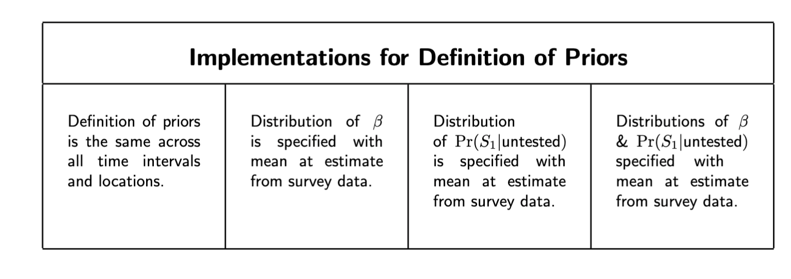
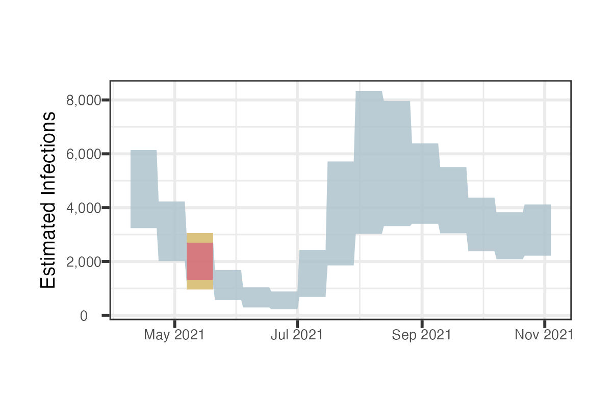

```{r, include=FALSE}
knitr::opts_chunk$set(echo = FALSE, 
                      eval = TRUE,
                      message = FALSE,
                      warning = FALSE,
                      cache = FALSE,
                      fig.align='c',
                      out.width="100%")


library(here)
library(tidyverse)
library(latex2exp)


theme_c <- function(...) {
  theme_bw() + 
    theme(
          ...,
          axis.title = element_text(size = 11),
          axis.text.x = element_text(size = 8),
          plot.title =element_text(size = 11,
                                   face="bold",
                                   hjust = .5),
        plot.subtitle =element_text(size = 11,
                                   face="italic",
                                   hjust = .5),
          strip.text = element_text(size = 11, color = "white"),
          strip.background = element_rect(fill = "#3E3D3D"),
          legend.text = element_text(size = 13))
}
```

# Details of Implementation


To see the impact of informing prior parameters with data from the COVID-19 Trends and Impact Survey, we include four implementations, summarized in  Table \ref{fig:priors-versions-table}.


```{r, fig.cap="\\label{fig:priors-versions-table}Description of each implementation of probabilistic bias analysis. Version 1 does not inform priors based on the COVID-19 Trends and Impact Survey, while versions 2-4 do utilize the survey data."}



```


To make the implementation of each more concrete, we will illustrate the steps of the probabilistic bias analysis with the infections in Suffolk County, Massachusetts in from May 9, 2021 to May 23, 2021.   


\newpage 

## Version 1: Priors do Not Vary by State or Date


```{r}


# include slow plots comparing melded distributions for modified priors to original melded distribution
include_slow <- TRUE
# only include subset of rows for testing 
testing <- FALSE
# whether to save results adj_v*.RDS (if testing, don't save results)
save <- TRUE

set.seed(123)


prior_params <- list(
  alpha_mean = .95,
  alpha_sd = 0.08,
  alpha_bounds = NA,
 # alpha_bounds = c(.8,1),
  beta_mean = .15,
  beta_sd =.09,
  beta_bounds = NA,
#  beta_bounds = c(0.002, 0.4),
  s_untested_mean = .03,
  s_untested_sd = .0225,
#  s_untested_bounds = c(0.0018, Inf),
  s_untested_bounds = NA,
  p_s0_pos_mean = .4,
  p_s0_pos_sd = .1225,
 p_s0_pos_bounds = NA,
#  p_s0_pos_bounds = c(.25, .7),
  pre_nsamp = 1e6,
  post_nsamp = 1e5)

corrected_sample_reps <- 1e3

# relevant for versions 2,3
beta_smoothing_span <- .33
# relevant for versions 3,4
s_untested_smoothing_span <- .2


```


```{r load functions, eval =TRUE}

source(here('analysis','base_functions','base_functions.R'))
source(here('analysis','base_functions','get_melded.R'))

```


As we did in the [Background](#sampling) section, we denote the sample size as $m$ and the posterior (resample) size as $r$.


We begin by sampling $m=10^6$ times from the defined prior distributions $\theta = \Big\{ \alpha, \beta, \Pr(S_1| \text{untested})\Big\}$, as we see in Figure \ref{fig:sample-priors}.

```{r, fig.width=7, fig.height=2, fig.cap = "\\label{fig:sample-priors}As the first step of the probabilistic bias analysis, we sample $m$ observations from the defined priors  $\\theta = \\{ \\alpha, \\beta, \\Pr(S_1| \\text{untested})\\}$."}

ma <- readRDS(here("data/county_level/ma/ma_county_biweekly.RDS"))

example <- ma %>% filter(county_name == "Suffolk" & biweek == 10)

theta <-  with(prior_params, { 
tibble(alpha = sample_gamma_density(pre_nsamp,
                                               mean = alpha_mean,
                                               sd = alpha_sd,
                                               bounds = alpha_bounds),
                  beta= sample_beta_density(pre_nsamp,
                                            mean = beta_mean,
                                            sd = beta_sd,
                                            bounds = beta_bounds),
                  P_S_untested = sample_beta_density(pre_nsamp,
                                                     mean = s_untested_mean,
                                                     sd = s_untested_sd,
                                                     bounds = s_untested_bounds)) %>%
    mutate(phi_induced = est_P_A_testpos(P_S_untested = P_S_untested,
                                         alpha = alpha,
                                         beta=beta))} )

theta %>% 
  pivot_longer(everything()) %>%
  mutate(name = case_when(
    name == "alpha" ~"$\\alpha$",
    name =="beta" ~"$\\beta$",
    name == "phi_induced" ~"$M(\\theta) = Pr(S_0|test_+,untested)$",
    name=="P_S_untested" ~ "$Pr(S_1|untested)$"
  )) %>%
  mutate(name = factor(name, levels = c("$\\alpha$",
                                        "$\\beta$",
                                        "$Pr(S_1|untested)$",
                                        "$M(\\theta) = Pr(S_0|test_+,untested)$"))) %>%
  filter(name != "$M(\\theta) = Pr(S_0|test_+,untested)$") %>%
  ggplot(aes(x=value)) +
    geom_density(fill="black", alpha=.8) +
    facet_wrap(~name, labeller=as_labeller(TeX, default=label_parsed),
               ncol=3,
               scales="free") +
  geom_point(aes(x=0,y=0), color=NA) +
  geom_point(aes(x=1,y=0), color=NA) +
  theme_c() 
  
                                         
                                         
```

At this point, we use Bayesian melding to obtain $r=10^5$  observations from the constrained priors for $\alpha, \; \beta, \;\Pr(S_1|\text{untested})$, and $\Pr(S_0|\text{test}_+,\text{untested})$, which we see in the first two rows of Figure \ref{fig:melded-all-together}. The melded distributions of $\alpha, \; \beta, \;\Pr(S_1|\text{untested})$, and $\Pr(S_0|\text{test}_+,\text{untested})$ are the inputs to the probabilistic bias analysis.

For use in the test inaccuracy correction step, we also sample $r=10^5$ values from the priors for sensitivity and specificity. However, these parameters are not involved in the Bayesian melding step. 


```{r, results = 'hide', fig.height=7, fig.cap="\\label{fig:melded-all-together}The full set of priors used in the probabilistic bias analysis. The first row is our sampled values of $\theta$, before and after melding. The post-melding distributions are what we use as inputs to the probabilistic bias analysis. The second row is $\\Pr(S_0|\\text{test}_+, \\text{untested})$, which is a part of the melding process that enables us to incorporate information on the asymptomatic rate to inform the definitions of $\\theta$; however, we do not use the parameter $\\Pr(S_0|\\text{test}_+, \\text{untested})$ directly in the bias correction; its only role is in the melding step."}

library(patchwork)


melded <- do.call(get_melded, prior_params)

title <- paste0("Mean of ${\\alpha}$: ")

melded_long <- reformat_melded(melded_df =  melded$post_melding,
                                      theta_df =  melded$pre_melding,
                                      p_s0_pos_mean = prior_params$p_s0_pos_mean,
                                      p_s0_pos_sd = prior_params$p_s0_pos_sd,
                                      p_s0_pos_bounds = prior_params$p_s0_pos_bounds,
                                      pre_nsamp = prior_params$pre_nsamp)

plt_melded <- plot_melded(melded_long,
            pre_nsamp=prior_params$pre_nsamp,
            post_nsamp=prior_params$post_nsamp) +
  theme_c() 
       


nsamp <- prior_params$post_nsamp
dist_Se <- truncdist::rtrunc(n = nsamp,spec = "beta",a = 0.65,b = 1,
                               shape1 = get_beta_params(mu = 0.8,
                                                        sd = (0.4)^2)$a,
                               shape2 = get_beta_params(mu = 0.8,
                                                        sd = (0.4)^2)$b)
dist_Sp <- truncdist::rtrunc(n = nsamp,spec = "beta",a = 0.9998,b = 1,
                               shape1 = get_beta_params(mu = 0.99995,
                                                        sd = (0.01)^2)$a,
                               shape2 = get_beta_params(mu = 0.99995,
                                                        sd = (0.01)^2)$b)


title_gg <- ggplot() + 
  labs(title =latex2exp::TeX("Set of Priors for Probabilistic Bias Analysis", 
                             bold = TRUE)) + 
  theme(plot.title=element_text(face="bold", hjust = .5, size = 14, margin =margin(5,0,2,0)))


plt <- tibble(Sensitivity = dist_Se,
              Specificity = dist_Sp) %>%
  pivot_longer(cols=everything()) %>%
  ggplot(aes(x=value)) +
  geom_density(fill="black", alpha =.8) +
  theme_c() +
  xlim(0,1) +
  facet_wrap(~name, scales="free_y")


cowplot::plot_grid(title_gg,
                   plt_melded, plt, ncol = 1,
                   rel_heights = c(.05, .7, .25))

# 
# 
# theta <- melded$pre_melding %>%
#   pivot_longer(cols=everything()) %>%
#   mutate(source = "Before Melding")
# 
# 
# theta_melded <- melded$post_melding %>%
#   pivot_longer(cols=everything())
# 
# melded$post_melding %>%
#   mutate(x = est_P_A_testpos(P_S_untested, alpha, beta)) %>%
#   ggplot(aes(x=x)) +
#   geom_histogram()


```


From here, we obtain the bias corrected estimates by sampling from the $r$ observations of the bias parameters and computing the unobserved infections. 

For example, suppose we sample a value from each of $\beta,\alpha,\Pr(S_1|\text{untested}), S_p$ and $S_e$.

We  first compute the number of untested individuals as the population size $N$ minus the number tested:

\[ N_{\text{untested}} =  N - N_{\text{tested}} .\]

We then use $\alpha$ and $\beta$ to estimate the test positivity rates of the symptomatic and asymptomatic partitions of the population, giving us the positivity rates
\[ \Pr( \text{test}_+ | S_1, \text{untested})  = \Pr( \text{test}_+ | \text{tested}) \cdot  \alpha  \]
and
\[ \Pr( \text{test}_+ | S_0, \text{untested})  = \Pr( \text{test}_+ | \text{tested}) \cdot  \beta. \]


We use these positivity rates to calculate the number of positive tests among the untested as 


\begin{align*}
N^*_{\text{untested},S_1} &= \Pr( \text{test}_+ | S_1, \text{untested}) ( N_{S_1,\text{untested}}) \\
&= \Pr( \text{test}_+ | S_1, \text{untested}) (N_{\text{untested}} ) \Pr(S_1|\text{untested})\\
N^*_{\text{untested},S_0} &= \Pr( \text{test}_+ | S_0, \text{untested}) ( N_{S_0,\text{untested}})\\
&= \Pr( \text{test}_+ | S_1, \text{untested}) (N_{\text{untested}} ) (1- \Pr(S_1|\text{untested}))
\end{align*}

We use $N^*$ to denote the number of people who would test positive, not the number who are infected. This distinction is important because we are not yet correcting for diagnostic test inaccuracy. With this notation, $N^*_{\text{untested}}$ is the number of people among the untested population we expect to test positive if everyone were tested, while $N^*_{\text{tested}}$ is simply the number of positive tests reported for this 2-week interval. This means we can write the total number of individuals who we expect to test positive as


\begin{align*}
 N^*_{\text{untested}}
 &= N^*_{\text{tested}} + N^*_{\text{untested}} \\
 &= N^*_{\text{tested}} + N^*_{\text{untested}, S_0} + N^*_{\text{untested}, S_1}.
\end{align*}


 To estimate the infections $N^+$, rather than positive tests $N^*$, we must correct for diagnostic test inaccuracy, which we can do by applying the formula for correcting for diagnostic test inaccuracy discussed [previously](#correct-test-inaccuracy).
 
That is, we take the sampled value of sensitivity $S_e$ and specificty $S_p$ and compute

$$N^+ = \dfrac{(N^* - (1 - S_p) N) } { (S_e + S_p - 1) }.$$


Repeating this process with sampled values of the bias parameters gives us a distribution for the corrected counts, as we see in Figure \ref{fig:correctedsuffolk}. The 95% simulation intervals presented in the [Results](#res) section are the 2.5% and 97.5% percentiles for each geographic unit and 2-week time interval, as we see in Figure {fig:corrected-suffolk-over-time}.


```{r, fig.cap='\\label{fig:correctedsuffolk}Here, we consider Suffolk County in a specific two-week interval. By sampling from the bias parameters, melding, correcting for incomplete testing, and then correcting for test inaccuracy, we obtain a distribution of estimated infections for the two-week interval. We can summarize this distribution with a 95\\% simulation interval.'}

# dist_Se <- truncdist::rtrunc(n = nsamp,spec = "beta",a = 0.65,b = 1,
#                                shape1 = get_beta_params(mu = 0.8,
#                                                         sd = (0.4)^2)$a,
#                                shape2 = get_beta_params(mu = 0.8,
#                                                         sd = (0.4)^2)$b)
# dist_Sp <- truncdist::rtrunc(n = nsamp,spec = "beta",a = 0.9998,b = 1,
#                                shape1 = get_beta_params(mu = 0.99995,
#                                                         sd = (0.01)^2)$a,
#                                shape2 = get_beta_params(mu = 0.99995,
#                                                         sd = (0.01)^2)$b)


all_priors <- process_priors_per_county(
      priors = melded$post_melding,
      county_df = example,
      nsamp = prior_params$post_nsamp)


corrected_sample <- all_priors %>%
      generate_corrected_sample(priors_by_county_df = ., num_reps = 1e4)

# 
# corrected_sample %>%
#   select(exp_cases) %>%
#   ggplot(aes(x=exp_cases)) +
#   geom_histogram() +
#   geom_vline(xintercept = unique(corrected_sample$positive),
#              color = 'red',
#              linewidth = 1.2) +
#   annotate(geom="label",x= unique(corrected_sample$positive)+250,
#              y = 1000, color = "red",label= "Observed", size = 6) +
#   theme_c() +
#   theme(plot.title = element_text(face="bold", hjust = .5, size = 20),
#         axis.title = element_text(size = 16)) +
#   labs(title = "Distribution of Bias-Corrected Cases",
#        y = "Frequency",
#        x = "Infections")
# 
# 


corrected_sample %>%
  select(exp_cases) %>%
  mutate(lower = quantile(exp_cases, 0.025),
         upper = quantile(exp_cases, 0.975)) %>%
  ggplot(aes(x=exp_cases)) +
  geom_histogram(alpha=.8) +
  geom_vline(aes(xintercept = lower),
             color = '#DBC37F',
             linewidth = 1.5) +
  geom_vline(aes(xintercept = upper),
             color = '#DBC37F',
             linewidth = 1.5) +
  theme_c() +
  theme(plot.title = element_text(face="bold", hjust = .5, size = 20),
        axis.title = element_text(size = 16)) +
  labs(title = "95% Simulation Interval",
       y = "Frequency",
       x = "Infections")


# 
# 
# process_priors_per_county(
#       priors = melded$post_melding,
#       county_df = list(...),
#       nsamp = prior_params$post_nsamp) %>%
#       generate_corrected_sample(., num_reps = corrected_sample_reps) %>%
#       summarize_corrected_sample()
#     })
# 
# 
# 
# process_priors_per_county(
#       priors = melded$post_melding,
#       county_df = list(...),
#       nsamp = prior_params$post_nsamp) %>%
#       generate_corrected_sample(., num_reps = corrected_sample_reps) %>%
#       summarize_corrected_sample()
#     })


```


```{r, fig.cap="\\label{fig:corrected-suffolk-over-time}Here, we show how we visualize the 95\\% simulation intervals like the one shown in \\ref{fig:correctedsuffolk}, which is highlighted in red. Presenting these intervals over time for a given location is often how we present the results of the probabilistic bias analysis."}


```


## Version 2-4: Allowing Some Prior Parameters to Vary 

The implementation for versions 2-4 when considering a single time and geographic unit are almost identical to version 1; the difference is in the source of the priors.

For one version, we allow $\beta$ to vary by date and state by using the COVID-19 Trends and Impact Survey [@salomon2021a]. Since $\beta$ represents the ratio of $\dfrac{\Pr(\text{test}_+|\text{untested},S_0)}{\Pr(\text{test}_+|\text{tested})}$, one way we can think about estimating this quantity empirically is as the screening test positivity over the overall test positivity. Since both these quantities are reported by the COVID-19 Trends and Impact Survey, we can center the distribution for $\beta$ for a given location and time interval at this ratio, after performing LOESS smoothing. That is, we use the same standard deviation assumed in the first version, where we do not allow priors to vary by state or date, but we set the mean to be the empirical estimate of beta.

For another version, we allow $\Pr(S_1|\text{untested})$ to vary by date and state by centering the distribution for  $\Pr(S_1|\text{untested})$ at the percentage of COVID-19-like illness reported by the COVID-19 Trends and Impact Survey, since this variable reflects the presents of symptoms related to COVID-19 among the general population.

Lastly, in one version we center both the distribution for  $\Pr(S_1|\text{untested})$ and $\beta$ at their empirical values.

While we recognize taking values of the survey may in itself introduce biases, in the United States, there is little alternative to inform the priors for $\beta$ or $\Pr(S_1|\text{untested})$, particularly at a fine geographic scale. Some countries, for example, the United Kingdom, conducted PCR tests and recorded symptoms for a random sample of the population to estimate community prevalence of COVID-19  [@riley2021]. A study like this would be able to estimate the test positivity rate among the untested population directly (and the asymptomatic or symptomatic positivity rates as well) rather than defining random variables $\alpha$ and $\beta$ to correct the observed test positivity rate.

In this sense, looking at the empirical estimates of $\Pr(S_1|\text{untested})$ and $\beta$ using the COVID-19 Trends and Impact Survey can provide a useful baseline for plausible values these parameters can take on, and allows us to see how the bias-corrected estimates differ depending on the data used to inform the priors. 


