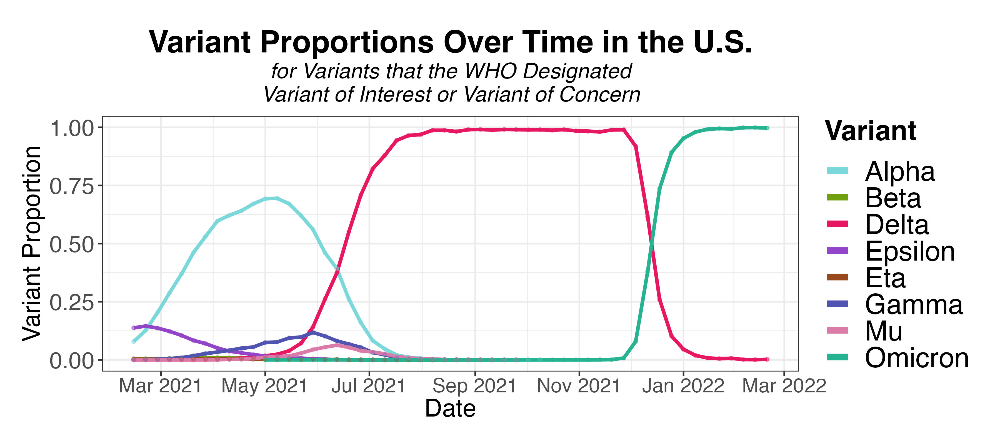
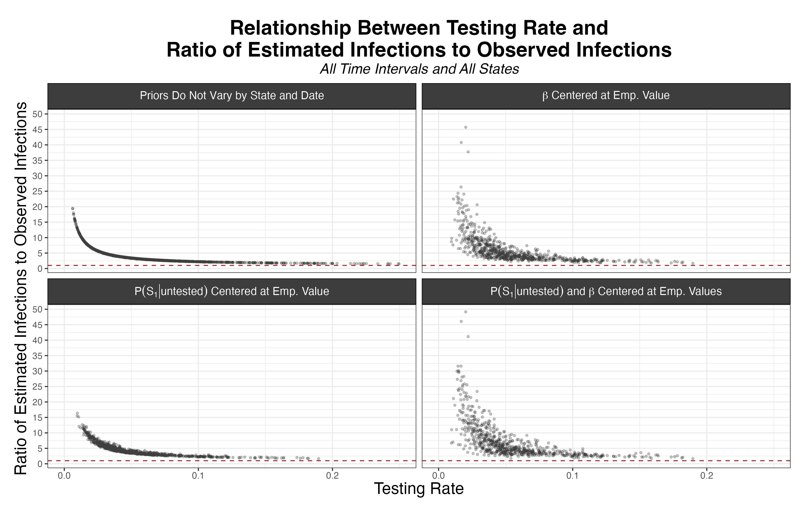
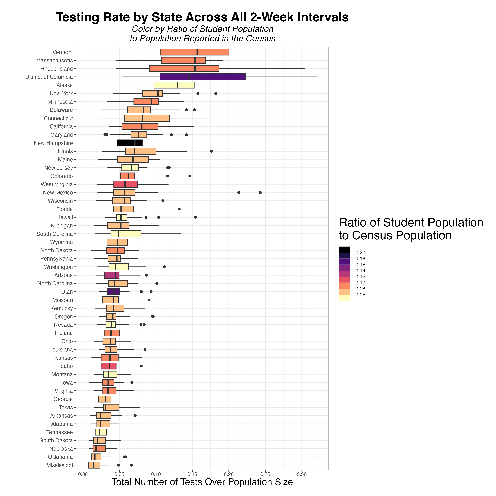
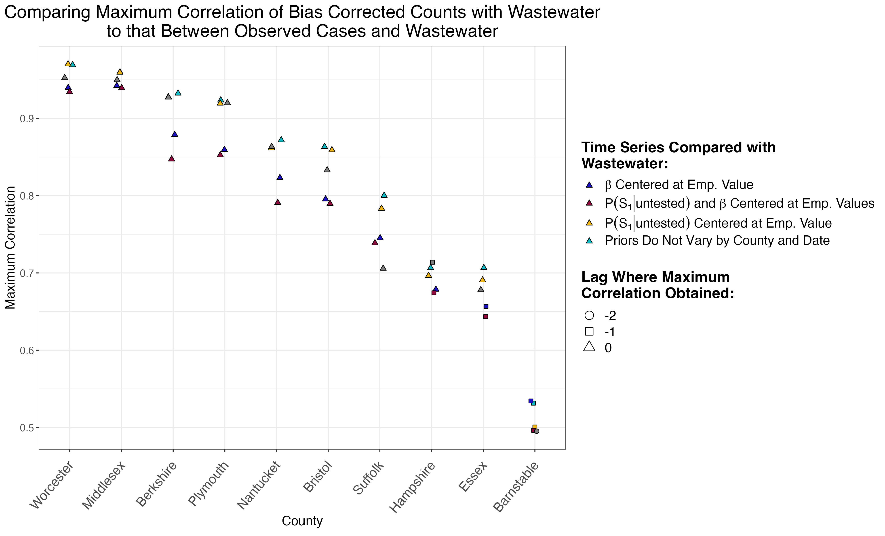

```{r, include=FALSE}
knitr::opts_chunk$set(echo = FALSE, 
                      eval = TRUE,
                      message = FALSE,
                      warning = FALSE,
                      cache = FALSE,
                      fig.align='c',
                      out.width="100%")


library(here)


theme_c <- function(...) {
  theme_bw() + 
    theme(
          ...,
          axis.title = element_text(size = 11),
          axis.text.x = element_text(size = 10),
          plot.title =element_text(size = 11,
                                   face="bold",
                                   hjust = .5),
        plot.subtitle =element_text(size = 11,
                                   face="italic",
                                   hjust = .5),
          strip.text = element_text(size = 11, color = "white"),
          strip.background = element_rect(fill = "#3E3D3D"),
          legend.text = element_text(size = 13))
}
```

# Results {#res}


## Comparison to the Covidestim Model

### Overview

One challenge in correcting for biases in general is that although we may have some information about the influence of possible biases, we do not have a ground truth for comparison. However, one approach to handle the fact that the true cases are unobserved is comparing our estimates to those from other approaches seeking to estimate a similar quantity. In particular, if other approaches make different assumptions and come to a similar result, this can give us more confidence in our estimates. 

One notable project seeking to estimate the true infection burden at the county-level over time is the COVIDestim project. In this work, Chitwood et al. proposed a mechanistic model that includes states for asymptomatic/pre-symptomatic infection, symptomatic but mild infection, severe COVID-19 presentations, and death. This approach also enables the estimation of $R_t$, the number of secondary infections a single infected individual causes at time $t$. This is a useful quantity to estimate, but is sensitive to reporting delays and changes in testing practices [@pitzer2021a].


### The Covidestim Model

Chitwood *et al.* propose a Bayesian evidence synthesis model to correct for reporting delays and time varying case ascertainment testing rate in the estimation of incident infections and $R_t$.

 To estimate the expected cases and deaths at a particular point in time, the model uses a convolution of the time series of observed cases and deaths and reporting delay distributions that are specific to the health state categories. This enables the model to account for the fact that reporting delay is different  For any health state, for example, asymptomatic, the individual can either transition to the next health state (symptomatic) or recover. Thus, with each transition between a defined health state, for example, asymptomatic, there is a probability of transitioning to the next health state (in this case, asymptomatic to symptomatic); the complement of this probability is the probability of recovery. 

Each of these transitions is defined by a delay distribution. For example, the distribution for moving from asymptomatic to symptomatic represents the probability an individual moves to the symptomatic state at a point in time. The probabilities asymptomatic to symptomatic and symptomatic to severe are modeled as not varying with time. Meanwhile, the probability of transitioning from severe to death was defined to be higher in 2020 due to higher case fatalities early in the pandemic. The infection fatality rates, adjusted to be specific to a given state or county based on age distributions and the prevalence of risk factors for COVID-19, are used to inform the probability of moving from the severe category to the death category. 

The change in daily infections from the previous day (i.e., the new infections) is calculated as a function of the estimated effective reproductive number $R_t$  and the mean serial interval, where serial interval is the time from the onset of infection of a primary case to the time of onset of infection in the secondary case. $R_t$ is estimated using a log-transformed cubic spline, under the assumption individuals can only be infected once.

They also defined a distribution for the delay to diagnosis, which was distinct by health state category to reflect differences in diagnosis delays that occur depending on the disease severity. 
The probability of diagnosis among different health states was allowed to vary by time to reflect changing testing rates throughout the pandemic.

A separate distribution models the reporting delay to correct the total number of diagnoses on a given day for the fact that these diagnoses correspond to past infections. 

The observed cases and death data for each state to the model were fitted using negative binomial likelihood functions. 

### Assumptions

This approach relies on infection fatality ratios and death counts to estimate the true case counts. Thus, it is sensitive to estimates of infection fatality rate, with higher infection fatality ratio estimates resulting in lower estimated infections. The infection fatality ratio is defined as the proportion of COVID-19 infections that lead to death, which means there is uncertainty in estimating both the numerator and the denominator of the ratio. The true cumulative incidence depends on the same uncertainties in estimating the true case burden at any point in time. Estimating the infection fatality ratio itself is a challenging task. 

The COVIDestim model uses age-specific estimates of IFR produced by @odriscoll2021. This group used national-level age-stratified, and when possible sex-stratified, COVID-19 death counts and cumulative infection estimates from seroprevalence studies. Of note, the estimates of infection fatality ratio are assumed to be constant over time, which may not be the case due to improving treatments (e.g., Paxlovid),  different variants leading to less severe presentations, or changes in the demographics of individuals being infected. However, reliable estimates of infection fatality ratio that vary with time difficult to acquire; COVIDestim assumed a higher case fatality in 2020 given the novelty of the virus and consequent lack of available treatments.


### Comparison to Serological Data

There are known issues with seroprevalence estimates. For one, these samples are drawn from a convenience (i.e. nonrandom) sample of individuals with blood specimens taken for purposes other than COVID-19 antibody detection [@zotero-1003]. Secondly, while a positive serological test is evidence for infection, a negative serological test is less clear to interpret. The person may have been infected but not yet have developed antibodies, or their immune system may not have produced antibodies at a detectable level [@cdc2020. 

 Indeed, Chitwood et al. found limited concordance between their estimates and seroprevalence data. However, there was a stronger correlation between estimates of cumulative infection and cumulative hospitalizations and cumulative deaths \footnote{The correlation employed here is the Spearman rank correlation, which measures the strength of the monotonic relationship rather than the strength of the linear relationship, in which case the Pearson correlation coefficient is the usual choice. The Spearman rank correlation is equivalent to the Pearson correlation of the rank values rather than the values themselves. }. 


### Limitations of this Comparison {#lims}

At this point in the pandemic, there is no true gold standard to compare to. Covidestim is one model, among many, that makes key assumptions about aspects of the virus. Another note is that estimates from the Covidestim model are reported on the daily timescale for counties, while the probabilistic approach we implemented here is at the biweekly time scale. 

To ensure the comparisons are on the same time scale, we sum the reported 95% credible intervals for the days in each 2-week interval. These intervals do not represent a 95% credible interval for the 2-week interval, and while such an interval would be ideal for the comparison, computation of a 95% credible interval for the two-week interval is not feasible because of the model structure. Due to the correlation between observations for each day for a given location, summing the intervals yields an estimate that is likely to be more conservative than a true 95% credible interval for the two-week interval would be. More detail on this assumption is in [the appendix](#conservativeintervals). 


## State-level Results
 
There is much more comprehensive testing data at the state-level than at the county level, as John Hopkins has tracked state-level testing data throughout the pandemic.
As a result, we can apply probabilistic bias analysis across the United States at the state-level.

However, since versions 2-4 of the analysis utilize empirical estimates of $P(S_1|\text{untested})$ or $\beta$ from the COVID-19 Trends and Impact Survey, these versions are only possible when there is sufficient data for the state. As we see in Figure \ref{fig:statectis}, some states have very little data for the empirical estimate of beta. However in Figure \ref{fig:statectis-s-untested} we see that there is more consistent reporting of $P(S_1|\text{untested})$.

For versions 2-4, we did not attempt the probabilistic bias analysis for states where more than 60% of observations were missing at the daily time step. Missing values for states with sufficient data were imputed before summarizing to the biweek level using a linear weighted moving average. 

```{r, out.width = "90%", fig.cap = '\\label{fig:statectis}'}

knitr::include_graphics('figure/ctis_beta_states.pdf')

```

```{r,out.width = "90%", fig.cap = '\\label{fig:statectis-s-untested}'}
knitr::include_graphics('figure/ctis_s_untested_states.pdf')

```

In Figures \ref{fig:state-results-1} and \ref{fig:state-results-2}, we compare the 95% credible intervals of Covidestim summed to be on the biweek time scale to the probabilistic bias analysis intervals^[As mentioned in the [limitations](#lims) section, the two week intervals cannot be interpreted as 95% credible intervals. However, the comparison is still useful to contextualize the results of the probabilistic bias analysis.]. We see correspondence is much higher before the time period spanning December 2021 through January 2022. From Figure \ref{fig:variant-prop}, we see that this period corresponds to the Omicron wave. Omicron wave in late 2021 through early 2022, where Covidestim estimates the cases to be much higher. 

```{r,out.width = "100%", fig.cap  = '\\label{fig:state-results-1}'}
knitr::include_graphics('figure/state_comp_covidestim1.pdf')

```
 
 
```{r,out.width = "100%", fig.cap  = '\\label{fig:state-results-2}'}
knitr::include_graphics('figure/state_comp_covidestim2.pdf')

```
 
```{r, out.width = "100%", fig.cap = "\\label{fig:variant-prop.jpeg}Variant proportions for variants designated as Variant of Interest or Variant of Concern by the World Health Organization. We see Delta begins its rise in May 2021 and reaches an estimated proportion of 0.98 of sequenced infections by mid-August 2021. Omicron's rise occurs more quickly, beginning its increase throughout December and becoming almost entirely dominant by mid-January.\nData source: SARS-CoV-2 Variant Proportions from Data.CDC.gov."}

```
 
 
As discussed in the Covidestim model change log, Chitwood *et al.* made substantial changes to handle the rise of the Omicron variant. Because the variant causes much milder infections, the infection fatality for Omicron infections is lower than previous variants. To handle the changes in the infection fatality ratio and very low death counts, rather than fitting model with deaths, they switched to using hospitalizations. They also allowed for the possibility of reinfections, since although reinfections were more rare with previous variants, Omicron is associated with higher reinfection rates [@pulliam2022].
 
 
 
## Relationship Between the Ratio of Estimated to Observed Infections Compared to Testing Rate

 
One question to consider is the relationship between the testing rate and the ratio of estimated cases to observed cases, as we would expect higher testing rates would lead to less underestimation of the true number of infections.

As we see in Figure \ref{fig:testrate}, the nature of the relationship between the testing rate and the ratio of estimated cases to observed cases depends on whether we allow $\beta$ and $P(S_1|\text{untested})$ to vary by location and date. In particular, when we sample from the same priors for every correction (the first panel of Figure \ref{fig:testrate}), we see there is little variability in the relationship between the testing rate and median estimated cases, because the form of the correction is identical for each two-week interval and state considered. Allowing $\beta$ and/or $P(S_1|\text{untested})$ to vary by time and location introduces additional variability in the relationship between the ratio of estimated infections to observed and testing rate.

The nonlinearity of the relationship between the testing rate and the ratio of estimated cases to observed cases is more clear when we think back to the correction formulas.

Denoting $N^*$ again to be the number who would test positive, on the $x$-axis, we have approximately^[This isn't exactly the estimated infections, because for simplicity of notation we are not writing out the correction for test inaccuracy.]
$$\frac{N^*_{\text{tested}} + N^*_{\text{untested}}}{N^*_{\text{tested}}},$$

where we calculate $N^*_{\text{untested}}$ using the other priors:
$$N^*_{\text{untested}} =\Pr(\text{test}_+|S_1,\text{untested}) (\Pr(S_1 | \text{untested})) ( N_{\text{untested}} ) + $$
$$\Pr(\text{test}_+|S_0,\text{untested}) (1-(\Pr(S_1 | \text{untested})) ( N_{\text{untested}} ).$$ 
On the $x$-axis we have the number tested over the population size, $\dfrac{N_{\text{tested}}}{N}$. Thus, we see the trend in each panel where for small changes in testing rate when the testing rate is very low, the ratio of unobserved to unobserved is very high since $N^*_{untested}$ will be large relative  $N^*_{tested}$. However, with higher testing rates,  $N^*_{untested}$ will be large relative  $N^*_{tested}$, and the ratio of estimated to observed infections nears one.


```{r,out.width = "100%", fig.cap  = '\\label{fig:testrate}The ratio of the median estimated infections to observed infections plotted against the testing rate, where the testing rate is calculated as the total number tested in a two-week interval over the population size. When the priors are the same for all time intervals and states, there is minimal variability relationship between the testing rate and the ratio of estimated to observed infections, since the correction for incomplete testing and diagnostic test inaccuracy is identical for each time-interval and location. However, when we allow $\\beta$ or $P(S_1|\text{untested})$ to vary by state and time interval, there is much variability in the relationship. A horizontal line in red at 1 is included to reference; a ratio of exactly one would indicate no infections went unobserved.'}




```


It is worth noting that in some cases, the ratio of total number of tests for a two-week interval over the population size is incredibly high. For example, there are two-week intervals in Vermont, Rhode Island, and DC where the total number of tests over the census population size exceeds 0.25. There are two major factors to consider when we interpret these really high testing rates.

For one, there is repeat testing. If people are part of a regular PCR screening program where they are tested multiple times in a 2-week time interval, this will go toward higher numbers of tests relative to the census population size. While some states also report the number of people who tested positive and people who tested total^[A data dictionary on the John Hopkins COVID-19 testing repository provides more detail on these definitions.] (rather than total positive tests and total tests), this level of granularity was not universal.  

Additionally, the census population is not exactly the tested population. This is in part because universities are a major source of PCR testing, and students who are out of state are not reflected in the census counts for the location where they are tested. 

When we look at the testing rates (taken as the total number of tests over the census population size) in Figure \ref{fig:college}, we see that the states with the highest biweekly testing rates are Vermont, Massachusetts, Rhode Island, and the District of Columbia. These are states that haves substantial student populations, who also may be tested more than once in a single two-week interval. 

```{r, fig.cap="\\label{fig:college} Comparing the biweekly testing rate by state across all 2-week intervals considered,  where color is by the ratio of the student population to the census population. States are ordered by median testing rate. Data source for student population by state: the U.S. Department of Education, National Center for Education Statistics, Integrated Postsecondary Education Data System (IPEDS), 12-month Enrollment component provisional data for 2020 to 2021. Student population counts include Title IV postsecondary institutions."}




```


## County-level Results

We performed county-level probabilistic bias analysis for Michigan and Massachusetts. This work can be expanded to consider other states as well where the needed data is available. In particular, we need both county-level positive PCR tests and county-level total PCR tests. Because the assumptions of the bias correction are related to test positivity, it does not make sense to apply the method to a positive cases count that includes positive PCR tests lumped together with probable cases. In some states, this is the only value reported.

While positive tests are more regularly reported, total tests are reported less frequently at the county level. 

### Massachusetts


Figure \ref{fig:pb_counts_ma} shows the bias corrected estimates for each implementation, as well as the observed cases. We note that the lower bounds of the bias corrected estimates are always above the observed cases because adding (unobserved) infections among the untested population to the observed positives among the population never results in a decrease in the estimated infections. In theory such a decrease could be possible since we do correct for differences due to imperfect test accuracy, and if the false positive rate was high enough, we might estimate the lower bound of cases as lower than the observed cases. However, the false positive rate of the COVID-19 PCR test is so low that in practice we do not see lower bounds lower than the number of infections.^[The false positive rate differs by platform and laboratory, but multiple analyses estimated that it is less than 0.10% [@chandler2021].]


We can see although the trends are broadly similar between versions for each county, centering the distribution at the empirical value of $\beta$ leads to peaks not present in the version where priors do not vary by county and date. However, only centering $P(S_1|\text{untested})$ at the empirical value leads to a distribution that is highly similar to the version  where priors do not vary by county and date.

These results make sense when we consider that this analysis is much more sensitive to the choice of $\beta$ than $P(S_1|\text{untested})$. This follows from the fact we compute the number of positive infections among those who are untested and *asymptomatic* as  

\begin{align*}
N^+_{untested,S_0} &= P(\text{test}_+| S_0,\text{untested}) (N_{S_0,\text{untested}})\\
&= \Big( \beta P(test_+ |tested) \Big) N_{\text{untested}} (1-P(S_1|\text{untested}))
\end{align*}

and the number of positive infections among those who are untested and *symptomatic* as  
\begin{align*} N^+_{\text{untested},S_1}& = P(\text{test}_+| S_1,\text{untested}) (N_{S_1,\text{untested}})\\
&= \Big( \alpha P(\text{test}_+ |\text{tested}) \Big) N_{\text{untested}} (P(S_1|\text{untested})).
\end{align*}

Since $N_{S_1, \text{untested}}$ is so much larger than $N_{S_1, \text{untested}}$ for any of the specified values of $P(S_1|\text{untested})$ (since the bulk of this distribution is less than 5%), $\beta$ has a larger impact on the number of estimated infections.


```{r, out.width ="95%", fig.cap = "\\label{fig:pb_counts_ma}"}

knitr::include_graphics('figure/ma_pb_compared_to_observed.pdf')
                        
```

To better see the overlap between versions, in Figure \ref{fig:pb_versions_ma} we can look at the versions together. This allows us to see more clearly how the version with both $P(S_1|\text{untested})$ and $\beta$ centered at their empirical values is consistently the highest. Meanwhile, the version with only $P(S_1|untested)$ centered at its empirical value corresponds so closely to the version that does not vary by date or location that there is no part of the intervals for the version not varying by date or location that do not overlap with the $P(S_1|\text{untested})$ version.

```{r, out.width ="95%", fig.cap = "\\label{fig:pb_versions_ma}"}

knitr::include_graphics('figure/ma_pb_compare_versions.pdf')

```


Now, we can also compare the extent to which these intervals agree with the Covidestim estimates. In \ref{fig:pb_covidestim_ma}, we see that when Covidestim estimates fall outside the probabilistic bias intervals, they fall below the intervals, estimating that there are less infections. The exception here is Hampshire County, which actually is very likely to be related to the high amount of asymptomatic testing done among the five colleges. Smith College alone, with a student body of about 2,500 and mandatory PCR testing twice a week, would contribute a substantial amount of tests to the test count in Hampshire County. Given the low infection burden, the vast majority of these tests were negative throughout most of 2021, reducing the positivity rate (Figure \ref{fig:hamp}). The extensive amount of asymptomatic testing done here would mean that 
means that our correction factor $\beta$ in probabilistic analysis^[Recall $P(\text{test}_+ | S_0, \text{untested}) = \beta \; P(\text{test}_+|\text{tested})$. ], which we use to estimate the positivity rate among the untested asymptomatic population, would be too low. This is because the observed test positivity rate when so much asymptomatic testing is conducted would be closer to what expect the positivity rate among the asymptomatic test positivity rate to be among the untested population. Because the assumptions of the probabilistic bias analysis here did not assume such extensive asymptomatic testing was contributing to the test positivity rate, we are likely underestimating the true number of unobserved infections if there is a substantial amount of screening testing. It would be simple, however, to adjust $\beta$ to account for cases where there is increased asymptomatic testing. 

```{r, fig.cap = "\\label{fig:pb_covidestim_ma}"}

knitr::include_graphics("figure/ma_pb_compared_to_covidestim.pdf")

```

```{r, fig.cap = "\\label{fig:hamp} We see that Hampshire County has among the lowest test positivity rates among counties in Massachusetts in the time period considered.", out.width="90%", fig.height=2}

knitr::include_graphics("figure/hampshire.pdf")

```


To summarize which versions are most concordant with the Covidestim estimates, we can consider the proportion of the biweeks where the interval contains the Covidestim estimate. As we see in Figure \ref{fig:covidestimprop}, the implementation with the prior for $P(S_1|\text{untested})$ centered at the empirical value tends to agree most with the Covidestim estimates.


```{r, fig.cap = "\\label{fig:covidestimprop}"}

knitr::include_graphics('figure/ma_pb_compared_to_covidestim_proportions.pdf')

```


### Michigan

```{r, out.width ="100%", fig.cap = "\\label{fig:pb_versions_mi}"}

knitr::include_graphics(paste0('figure/', 'mi1', '_pb_compared_to_observed.pdf'))
knitr::include_graphics(paste0('figure/', 'mi2', '_pb_compared_to_observed.pdf'))
knitr::include_graphics(paste0('figure/', 'mi3', '_pb_compared_to_observed.pdf'))

```

```{r}

knitr::include_graphics('figure/mi_pb_compared_to_covidestim_proportions.pdf')

```

\newpage

## Cross Correlation Comparison

### Background 


An ongoing challenge for assessing the quality of the probabilistic bias intervals is that there is no ground truth to compare to. To broaden our comparison beyond Covidestim, we can look at wastewater data.

Wastewater data is a source of data that has been of rising interest throughout the pandemic, in part due to its cost effectiveness in assessing community-level burden, but also due to the fact it represents a much more unbiased sample than COVID-19 testing does.

That said, there are challenges in relating wastewater concentrations to the true number of infections, in part because of the same issue we face here of the lack of ground truth for the true number of infections in any location. The choice of normalization of the viral RNA concentrations of SARS-CoV-2 is important for understanding how these concentrations scale to the number of infections, since the concentration of virus (in genome copies per liter) in a sample will be influenced by various factor unrelated to the true prevalence COVID-19, such as processing differences between treatment plants or trends in water usage. One common choice is to normalize against the concentration of a virus that has a relatively stable population in wastewater, such as Pepper Mild Mottle Virus (PMMoV) [@zhan2022].

Wastewater testing has become increasingly widespread throughout the pandemic as the technology and analysis approaches have evolved, as well as the demand for a source of data on the presence of COVID-19 that is less reliant on access to tests (or symptoms strong enough to warrant a test, which differ by the variants circulating). A comprehensive source of wastewater data across the United States is provided by Biobot Analytics, which is the institution partnering with the CDC for the National Wastewater Surveillance System (NWSS) [@duvallet2022]. Biobot Analytics provide wastewater concentrations aggregated at the county scale by using a weighted average of the concentrations at sampling locations within the county, weighted by the size of the corresponding sewershed populations. This data is publicly available on a public github repository.

Most notable for this work, several counties in Massachusetts have reported wastewater data for a substantial period throughout 2021 to 2022. This allows us to compare the bias-corrected estimates -- as well as the Covidestim estimates -- to the wastewater concentrations. 

Wastewater concentrations are typically a leading indicator of observed cases, though there may be some variability in the lead time during different waves of the pandemic [@hopkins2023]. In particular, the lead time was strongest in the earliest waves of the pandemic, and has since declined [@xiao2022]. Various factors can create the changes we see in lead time over the course of the pandemic; for example, the lead time can be impacted by differences in viral shedding, diagnostic testing turnaround times, and testing capacity and behavior [@olesen2021]. 

Since the correlation between the time series as well as the lag at which the maximum correlation occurs are both of interest, we assessed the cross correlation between the series. 

First, we define autocorrelation since the definition of cross correlation is very similar. The definition here uses the notation of @shumway2011.

\begin{tcolorbox}[title=Definition: Autocorrelation]

Denote the set of time points of a time series $T$. For any time series $(x_t)_{t\in T}$, we define the auto-correlation function (ACF)  as 

$$\rho_{XX}(\tau) = \dfrac{E[(X_{t + \tau} - \mu_{X_{t+\tau}}) (X_t - \mu_{X_t})]}{sd(X_{t+\tau}) sd(X_t)}.$$
\end{tcolorbox}


Assuming second order stationarity^[Second order stationarity is also referred to as weak stationarity, and implies that the mean, variance are constant over time and the autocovariance function depends only on the difference between time points.], we have $\mu_{X_{t+\tau}}=\mu_{X_{t}}$
and similarly $\text{Var}({X_{t+\tau}})=\text{Var}({X_{t}})$, so we an simplify the expression for $\rho_{XX} (\tau)$ to yield  
$$\rho_{XX} (\tau)=\dfrac{E[(X_{t + \tau} - \mu_{X}) (X_t - \mu_{X})]}{Var(X)}.$$ 


The auto-correlation function $\rho_{XX}(\tau)$ measures the linear dependence between $X_{1+\tau}, \dots X_n$ and $X_1, \dots, X_{n-\tau}$, that is, the difference between the original time series and the time series shifted forward by $\tau$ time units.

We can extend this definition to quantify the linear relationship between distinct lagged time series  $X_1, X_2, \dots, X_t$ and $Y_1, Y_2, \dots, Y_t$ by defining the cross correlation function. The function is only defined on two time series that are over the same time interval and sampled at the same frequency.

\begin{tcolorbox}[title=Definition: Cross-Correlation]

We compute the cross-correlation function (CCF) as

$$\rho_{XY}(s,t) = \dfrac{E[(X_s - \mu_{X_s})(Y_t-\mu_{Y_t})]}{\sqrt{\text{Var}(X_s) \text{Var}(Y_t)}}.$$
Again assuming the series satisfy second-order stationarity, we have

$$\rho_{XY}(s,t) = \dfrac{E[(X_s - \mu_{X})(Y_t-\mu_{Y})]}{\sqrt{\text{Var}(X) \text{Var}(Y)}}.$$

\end{tcolorbox}

The implementation of the cross correlation in base R (`stats::ccf`) assumes second order stationarity [@venables2002].


Looking at cross correlation can be useful in the sense that we can both consider the strength of correlation and the lag at which the correlation is maximized. Before presenting the cross correlation results of the county level time series, we can consider a more concrete example, where the lag is known. 

In Figure \ref{fig:compdiff}, we consider simulated data where $(Z_t)$ is $(Y_t)$ lagged by 3 time units with noise added. We can see that  $Z_t$ and $Y_t$ are not second-order stationary since the mean clearly is not constant over time. However, to stabilize the mean, we can apply first order differencing, where we take the differences between consecutive observations.


```{r, fig.show ='hold', out.width='100%', fig.height=3.5, fig.cap = "\\label{fig:compdiff}"}


library(tidyverse)
library(latex2exp)


################################
# z is lagged 3 units behind y
################################
nsamp <- 50
lagged <- 3


set.seed(999)
y <-  as.numeric(arima.sim(list(order = c(1,1,0), ar = 0.7),
                           n = nsamp+lagged-1))
n <- length(y)

z <- y[1:(n-lagged)]
# add noise
z <- z + rnorm(length(z), -5, .5)
y <- y[(lagged+1):n]

# apply differencing 
sim <- tibble(y_notdifferenced = y,
              z_notdifferenced = z,
              y = y -lag(y,1),
              z=  z - lag(z,1),
              x = 1:length(y)) %>%
  filter(!is.na(y))


sim %>% 
  pivot_longer(c(y, z,y_notdifferenced, z_notdifferenced)) %>%
  mutate(differenced = ifelse(grepl("notdifferenced", name),
                              "not differenced", "differenced"),
         differenced = factor(differenced, levels = c(
           "not differenced", "differenced")),
         name = gsub("_notdifferenced", "", name)) %>% 
  ggplot(aes(x=x, y = value, color = name)) +
  geom_hline(yintercept = 0,
             linetype = 2, 
             color = "darkred", 
             alpha = .5) +
  geom_point(size = .5, alpha = .6) +
  geom_line() +
  viridis::scale_color_viridis(discrete=TRUE, begin = .2, end = .8) +
  theme_c() +
  labs(title ="Time Series with and without Differencing",
       color = "",
       x = "Index") +
  facet_wrap(~differenced) +
  guides(color = guide_legend(override.aes = list(size = 3))) 

```


We can see the effect of applying differencing to the time series when we compute the cross correlations of $(Z_t)$ and $(Y_t)$, as shown in Figure \ref{fig:corzy}. The true lag of $-3$ time units was recovered when considering the differenced time series, but not when we considered the original time series.  In what follows, because the time series we are considering are not stationary, we consider the cross correlation between the differenced time series.
\vspace{5 cm}

```{r, fig.show='hold', out.width ='45%', fig.cap = "\\label{fig:corzy}", fig.height = 3.5}
##############################################
# CROSS CORRELATION NO DIFFERNCING
##############################################
res_notdiff <- ccf(sim$y_notdifferenced, sim$z_notdifferenced, plot=FALSE)


tibble(lag = res_notdiff$lag[,,1], correlation=res_notdiff$acf[,,1]) %>%
  mutate(max = ifelse(correlation == max(correlation), 
                      lag, NA)) %>%
  ggplot(aes(x=lag, y = correlation)) +
  geom_point() +
  geom_linerange(aes(ymin = 0, ymax=correlation)) +
  theme_c() +
  labs(title =TeX("Cross Correlation between $(Y_t)$ and $(Z_t)$ (No Differencing)")) +
  geom_label(aes(x = max, y = correlation,
                 label = paste0("Max Correlation at Lag: ", max)),
             hjust = -.1)


##############################################
# CROSS CORRELATION WITH DIFFERNCING
##############################################

# compute cross correlation 
res <- ccf(sim$y, sim$z, plot=FALSE)


tibble(lag = res$lag[,,1], correlation=res$acf[,,1]) %>%
  mutate(max = ifelse(correlation == max(correlation), 
                      lag, NA)) %>%
  ggplot(aes(x=lag, y = correlation)) +
  geom_point() +
  geom_linerange(aes(ymin = 0, ymax=correlation)) +
  theme_c() +
  labs(title =TeX("Cross Correlation between $(Y_t)$ and $(Z_t)$ (with Differencing)")) +
  geom_label(aes(x = max, y = correlation,
                 label = paste0("Max Correlation at Lag: ", max)),
             hjust = -.1)


```

### Cross Correlation Results Comparing Bias Corrected Counts, Covidestim Estimates, and Wastewater Concentrations 


Because wastewater data is reported at the weekly time scale while the bias corrected estimates are at the 2-week time scale, we take a mean of the effective concentration for each 2 week interval, such that the time series are sampled at the same frequency.^[We cannot interpret the cross correlation if the time steps are different.]

Since the effective concentration of SARS-CoV-2 in wastewater samples reported by Biobot is in genome copies per liter and is not directly comparable to estimates of infections, we place the wastewater concentration on a separate scale.


Looking at the counties in Figure \ref{fig:wastewater_ma_by_county}, we see that, with the exception of Barnstable, MA, the wastewater trends are highly similar to trends captured by the bias corrected infection counts. We also see that the trends are similar both with regard to shape but also with regard to time, with little visible lag between the series. This is expected because although wastewater cases do in general lead cases, lead times generally are not on the order of 2 weeks. This means that since we are summarizing to 2-week intervals we would expect the lag to be very small, if present at all. 


```{r, fig.cap = "\\label{fig:wastewater_ma_by_county}", out.width="100%", fig.height = 13}


# figure produced by cross_correlation_wastewater.Rmd
knitr::include_graphics("figure/wastewater_ma_by_county.pdf")


```


#### Comparison Between Implementations of Probabilistic Bias Analysis 

In Figure \ref{fig:correlation_observed_pb}, we see that, in general, infections were highly correlated with the wastewater effective concentrations, which was true across all implementations of probabilistic bias analysis. In most cases, the implementation where priors did not vary by state or date were the most highly correlated with the wastewater concentrations. Exceptions to this were Barnstable County (25001), where the implementation with the prior for $\beta$ centered at the empirical value was the most highly correlated, and  Worcester County (25027), where the implementation with the prior for $P(S_1|\text{untested})$ centered at empirical value was the most highly correlated. In all counties except for Barnstable, the lag at which the maximum correlation was obtained was 0 units, while for Barnstable it was -1, indicating that wastewater concentrations led infections by one two-week interval.

Given the small size of Barnstable relative to other counties and high variability in its early estimates in 2021 (as seen in Figure  \ref{fig:wastewater_ma_by_county}), it is possible that there were still aspects of the SARS-CoV-2 detection process that took time to refine. Another possibility is that the way Biobot aggregated wastewater concentrations by county failed to capture the infection dynamics in this county, since wastewater catchments are not contained within county lines. This is a central challenge in relating cases to wastewater concentrations, since these values are recorded for distinct geographic units.

Comparing the maximum correlations obtained the observed cases, only in Hampshire County were the observed cases more correlated with the wastewater concentrations than all implementations of probabilistic bias analysis. We also see again that in most cases the maximum correlation is obtained at zero lag in observed cases; however, for Barnstable, the correlation is highest when wastewater concentrations lead infections by two biweeks, and for Hampshire the correlation is highest when wastewater concentrations lead infections by 1 biweek. 


```{r, fig.cap = "\\label{fig:correlation_observed_pb}", out.width="100%"}

# figure produced by cross_correlation_wastewater.Rmd



```


#### Comparison Between Covidestim, Observed Cases, and Bias Corrected Counts


In Figure \ref{fig:correlation_observed_pb_covidestim}, we also compare the Covidestim estimates to the wastewater concentrations. In general, both Covidestim and bias-corrected counts are more correlated with wastewater concentrations than observed infections. Of note, Nantucket County (25019) is not included here because Covidestim does not report estimates are not reported for Nantucket.^[In reporting of COVID-19 data, Nantucket values are grouped with Dukes County, which is likely why Covidestim does not try to estimate the grouped counts.] 

```{r,fig.cap = "\\label{fig:correlation_observed_pb_covidestim}", out.width="100%"}
# figure produced by cross_correlation_wastewater.Rmd

knitr::include_graphics("figure/correlation_observed_pb_covidestim.jpeg")


```


#### Takeaways

The aim of the cross correlation analysis was to add another source of comparison for the county-level counts from an entirely different source of data -- in particular, a source of data that is less impacted by access to testing or test behavior. We see that in most counties considered here, there is high agreement between the time series. An avenue for future exploration would be to consider this analysis among a broader set of counties to see which time series tends to be most highly correlated with wastewater concentrations, a question that we cannot confidently address here when looking only at counties in Massachusetts. 
 

