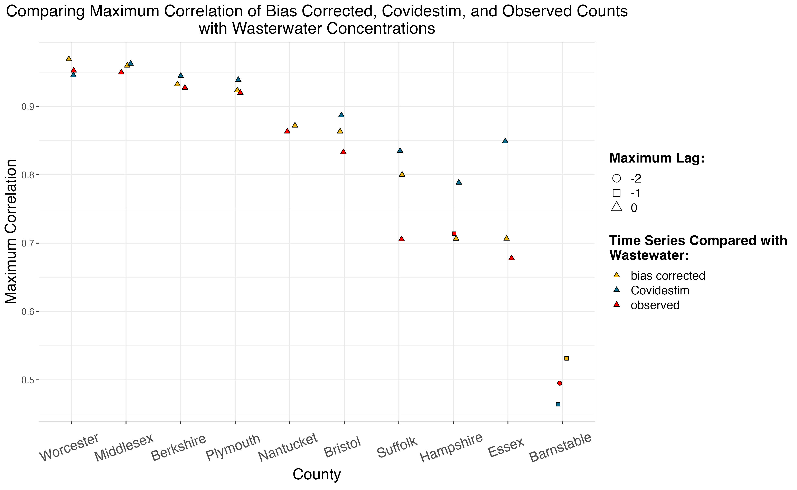

```{r, include=FALSE}
knitr::opts_chunk$set(echo = FALSE, 
                      eval = TRUE,
                      message = FALSE,
                      warning = FALSE,
                      cache = FALSE,
                      fig.align='c',
                      out.width="100%")


library(here)


theme_c <- function(...) {
  theme_bw() + 
    theme(
          ...,
          axis.title = element_text(size = 11),
          axis.text.x = element_text(size = 10),
          plot.title =element_text(size = 11,
                                   face="bold",
                                   hjust = .5),
        plot.subtitle =element_text(size = 11,
                                   face="italic",
                                   hjust = .5),
          strip.text = element_text(size = 11, color = "white"),
          strip.background = element_rect(fill = "#3E3D3D"),
          legend.text = element_text(size = 13))
}
```


# Comparison to the Covidestim Model

## Overview

One challenge in correcting for biases in general is that although we may have some information about the influence of possible biases, we do not have a ground truth for comparison. However, one approach to handle the fact that the true cases are unobserved is comparing our estimates to those from other approaches seeking to estimate a similar quantity. In particular, if other approaches make different assumptions and come to a similar result, this can give us more confidence in our estimates. 

One notable project seeking to estimate the true infection burden at the county-level over time is the COVIDestim project. In this work, Chitwood et al. proposed a mechanistic model that includes states for asymptomatic/pre-symptomatic infection, symptomatic but mild infection, severe COVID-19 presentations, and death. This approach also enables the estimation of $R_t$, the number of secondary infections a single infected individual causes at time $t$. This is a useful quantity to estimate, but is sensitive to reporting delays and changes in testing practices [@pitzer2021a].


## The Covidestim Model

Chitwood *et al.* propose a Bayesian evidence synthesis model to correct for reporting delays and time varying case ascertainment testing rate in the estimation of incident infections and $R_t$.

 To estimate the expected cases and deaths at a particular point in time, the model uses a convolution of the time series of observed cases and deaths and reporting delay distributions that are specific to the health state categories. This enables the model to account for the fact that reporting delay is different depending on the severity of an infection; for instance, someone with severe COVID-19 may be diagnosed more quickly than someone with a mild infection.
 
 For any health state, for example, asymptomatic, the individual can either transition to the next health state (symptomatic) or recover. Thus, with each transition between a defined health state, for example, asymptomatic, there is a probability of transitioning to the next health state (in this case, asymptomatic to symptomatic); the complement of this probability is the probability of recovery. 

Each of these transitions is defined by a delay distribution. For example, the distribution for moving from asymptomatic to symptomatic represents the probability an individual moves to the symptomatic state at a point in time. The probabilities asymptomatic to symptomatic and symptomatic to severe are modeled as not varying with time. Meanwhile, the probability of transitioning from severe to death was defined to be higher in 2020 due to higher case fatalities early in the pandemic. The infection fatality rates, adjusted to be specific to a given state or county based on age distributions and the prevalence of risk factors for COVID-19, are used to inform the probability of moving from the severe category to the death category. 

The change in daily infections from the previous day (i.e., the new infections) is calculated as a function of the estimated effective reproductive number $R_t$  and the mean serial interval, where serial interval is the time from the onset of infection of a primary case to the time of onset of infection in the secondary case. $R_t$ is estimated using a log-transformed cubic spline, under the assumption individuals can only be infected once.

They also defined a distribution for the delay to diagnosis, which was distinct by health state category to reflect differences in diagnosis delays that occur depending on the disease severity. 
The probability of diagnosis among different health states was allowed to vary by time to reflect changing testing rates throughout the pandemic.

A separate distribution models the reporting delay to correct the total number of diagnoses on a given day for the fact that these diagnoses correspond to past infections. 

The observed cases and death data for each state to the model were fitted using negative binomial likelihood functions. 

## Assumptions

This approach relies on infection fatality ratios and death counts to estimate the true case counts. Thus, it is sensitive to estimates of infection fatality rate, with higher infection fatality ratio estimates resulting in lower estimated infections. The infection fatality ratio is defined as the proportion of COVID-19 infections that lead to death, which means there is uncertainty in estimating both the numerator and the denominator of the ratio. The true cumulative incidence depends on the same uncertainties in estimating the true case burden at any point in time. Estimating the infection fatality ratio itself is a challenging task. 

The COVIDestim model uses age-specific estimates of the infection fatality ratio (IFR)^[The infection fatality ratio of an infectious disease is the proportion of those infected who die.] produced by @odriscoll2021. They used national-level age-stratified, and when possible sex-stratified, COVID-19 death counts and cumulative infection estimates from seroprevalence studies. Of note, the estimates of infection fatality ratio are assumed to be constant over time, which may not be the case due to improving treatments (e.g., Paxlovid),  different variants leading to less severe presentations, or changes in the demographics of individuals being infected. However, reliable estimates of infection fatality ratio that vary with time difficult to acquire; COVIDestim assumed a higher case fatality in 2020 given the novelty of the virus and consequent lack of available treatments.


## Comparison to Serological Data

There are known issues with seroprevalence estimates. For one, these samples are drawn from a convenience (i.e. nonrandom) sample of individuals with blood specimens taken for purposes other than COVID-19 antibody detection [@zotero-1003]. Secondly, while a positive serological test is evidence for infection, a negative serological test is less clear to interpret. The person may have been infected but not yet have developed antibodies, or their immune system may not have produced antibodies at a detectable level [@cdc2020]. 

 Indeed, Chitwood et al. found limited concordance between their estimates and seroprevalence data. However, there was a stronger correlation between estimates of cumulative infection and cumulative hospitalizations and cumulative deaths \footnote{The correlation employed here is the Spearman rank correlation, which measures the strength of the monotonic relationship rather than the strength of the linear relationship, in which case the Pearson correlation coefficient is the usual choice. The Spearman rank correlation is equivalent to the Pearson correlation of the rank values rather than the values themselves. }. 


### Limitations of this Comparison {#lims}

At this point in the pandemic, there is no true gold standard to compare to. Covidestim is one model, among many, that makes key assumptions about aspects of the virus. Another note is that estimates from the Covidestim model are reported on the daily timescale for counties, while the probabilistic approach we implemented here is at the biweekly time scale. 

To ensure the comparisons are on the same time scale, we sum the reported 95% credible intervals for the days in each 2-week interval. These intervals do not represent a 95% credible interval for the 2-week interval, and while such an interval would be ideal for the comparison, computation of a 95% credible interval for the two-week interval is not feasible because of the model structure. Due to the correlation between observations for each day for a given location, summing the intervals yields an estimate that is likely to be more conservative than a true 95% credible interval for the two-week interval would be. More detail on this assumption is in [the appendix](#conservativeintervals). 


# Results {#res}


## State-level Results
 
There is much more comprehensive testing data at the state-level than at the county level, as John Hopkins has tracked state-level testing data throughout the pandemic.
As a result, we can apply probabilistic bias analysis across the United States at the state-level.

However, since versions 2-4 of the analysis utilize empirical estimates of $P(S_1|\text{untested})$ or $\beta$ from the COVID-19 Trends and Impact Survey, these versions are only possible when there is sufficient data for the state. As we see in Figure \ref{fig:statectis}, some states have very little data for the empirical estimate of beta. However in Figure \ref{fig:statectis-s-untested} we see that there is more consistent reporting of the prevalence of COVID-19-like symptoms, which we can use as an estimate of $P(S_1|\text{untested})$.

For versions 2-4, we did not attempt the probabilistic bias analysis for states where more than 40% of observations for that state in the survey data were missing at the daily time step. For states retained, missing values for states with sufficient data were imputed before summarizing to the biweek level using a linear weighted moving average. 

```{r, out.width = "100%", fig.cap = '\\label{fig:statectis}The screening test positivity over the overall test positivity from the COVID-19 Trends and Impact Survey, by state. For states where less than 40\\% of observations were missing at the daily time step, the LOESS smoothed line is shown in red.'}

knitr::include_graphics('figure/ctis_beta_states.pdf')

```

```{r,out.width = "100%", fig.cap = '\\label{fig:statectis-s-untested} The percent of the population experiencing COVID-19-like illness from the COVID-19 Trends and Impact Survey, by state. The LOESS smoothed line is shown in red. For the implementations of probabilistic bias analysis where we use this indicator to inform $P(S_1|\\text{untested})$, we center the distribution of $P(S_1|\\text{untested})$ at the smoothed value from the survey. We note that there is less missing data for this indicator than for $\\beta$ (Figure \\ref{fig:statectis}), for which we need both the screening positivity and overall test positivity.'}


knitr::include_graphics('figure/ctis_s_untested_states.pdf')


```

In Figures \ref{fig:state-results-1} and \ref{fig:state-results-2}, we compare the 95% credible intervals of Covidestim summed to be on the biweek time scale to the probabilistic bias analysis intervals^[As mentioned in the [limitations](#lims) section, the two week intervals cannot be interpreted as 95% credible intervals. However, the comparison is still useful to contextualize the results of the probabilistic bias analysis.]. In these figures, we only consider the states were there was enough survey data to do all four of the implementations. However, since testing data is availlable for all states, the first implementation, which does not rely on survey data, was possible for all states in the U.S. (Supplementary Figure \ref{fig:all-states-first-impl}).

We see correspondence is much higher before the time period spanning December 2021 through January 2022, where Covidestim intervals tend to be higher than the probabilistic bias intervals. From Figure \ref{fig:variant-prop}, we see that this period corresponds to the Omicron wave of the pandemic.


```{r,out.width = "100%", fig.cap  = '\\label{fig:state-results-1}95\\% simulation intervals for each state and two-week interval. Only states with all four versions are included; this figure represents the first half of states with all four versions, and \\ref{fig:state-results-2} represents thee second half. Each column represents a distinct implementation of the probabilistic bias analysis. The first is where priors do not vary by state or location; that is, priors are specified once and these same priors are used for all states and time inteervals considered. The second implementation centers the distribution of $\\beta$ at the ratio of screening test positivity to overall test positivity from the COVID-19 Trends and Impact Survey. The third implementation centers the distribution of $P(S_1|\\text{untested})$ at the percent of the population experiencing COVID-19-like illness. The fourth implementation centers both $\\beta$ and $P(S_1|\\text{untested})$ at the survey values.'}

knitr::include_graphics('figure/state_comp_covidestim1.pdf')

```
 
 
```{r,out.width = "100%", fig.cap  = '\\label{fig:state-results-2} As in \\ref{fig:state-results-1}, this figure contains the probabilistic bias analysis intervals for states where all four implementations were possible for the second half of states (where \\ref{fig:state-results-1} corresonds to the first half). More detail on each column is discussed in \\ref{fig:state-results-1}.'}

knitr::include_graphics('figure/state_comp_covidestim2.pdf')

```
 
 
 
```{r, out.width = "100%", fig.cap = "\\label{fig:variant-prop}Variant proportions for variants designated as Variant of Interest or Variant of Concern by the World Health Organization. We see Delta begins its rise in May 2021 and reaches an estimated proportion of 0.98 of sequenced infections by mid-August 2021. Omicron's rise occurs more quickly, beginning its increase throughout December and becoming almost entirely dominant by mid-January.\nData source: SARS-CoV-2 Variant Proportions from Data.CDC.gov.", fig.height=3.5}

knitr::include_graphics('figure/variant_prop.pdf')


```
 
This period of disagreement between the approaches in December 2021 through January 2022 corresponds to the Omicron wave of the pandemic, which we can see in Figure \ref{fig:variant-prop}. This was a major shift in the pandemic: the Omicron variant is highly transmissible compared to previous variants, and it has immune invasion capacity, which means vaccines provides less protection against infection [@andrews2022]. Omicron also is associated with a lower infection fatality ratio [@liu2022], as well as milder infection overall, which may influence testing behavior. Omicron's rise was rapid too, presumably as a result of this enhanced transmissibility and immune escape;  it became the dominant variant over the course of a single month.


Beyond the clear differences during the Omicron wave, we also see in several states that there is an additional rise in July with the probabilistic bias analysis implementations that include data from the COVID-19 Trends and Impact Survey (columns 2 through 4), while this peak is smaller in the Covidestim intervals. States exhibiting this trend include Arizona, Maryland, Michigan, Minnesota, Missouri, New Jersey, New York, and Wisconsin. Meanwhile, there are some states where there is a peak of similar size in the Covidestim intervals that lags the peak in the probabilistic bias analysis, for example, Colorado, Kentucky, Texas, and Virginia.


This peak beginning close to July corresponds to the Delta wave, where the more transmissible B.1.617.2 (Delta) variant of concern displaced the previously dominant B.1.351 (Alpha) variant [@delrio2021]. 


To better understand the differences between the probabilistic bias analysis and Covidestim during the Delta wave in the summer of 2021, we consider two examples that represent different trends. 


First, we can take a closer look at Michigan to see the trends in the probabilistic intervals in relation to changes in circulating variants (Figure \ref{fig:michigan-variant}). We see, as we observe across most states in Figure \ref{fig:state-results-1} and Figure \ref{fig:state-results-2}, that the times when the probabilistic bias intervals differ the most from Covidestim are in the increases around late July and in December, where we see that July corresponds to the Delta Wave and December corresponds to the Omicron wave.


### Example Where July Peak is Larger in Probablistic Bias Analysis Intervals: Michigan


```{r, out.width = "100%", fig.cap = "\\label{fig:michigan-variant}Probabilistic intervals for Michigan along with the variant proportions for variants designated as Variant of Interest or Variant of Concern by the World Health Organization. These variant proportions are not specific to Michigan; the estimates are for the United States. The rise in Omicron corresponds to the dramatic increase in both the probabilistic bias intervals and Covidestim estimates in December of 2021 through January of 2022. We also see the increase in the Delta variant that precedes the Delta wave in the summer of 2021."}


knitr::include_graphics('figure/michigan_variant.pdf')


```
 

As discussed in the Covidestim model change log, Chitwood *et al.* made substantial changes to handle the rise of the Omicron variant. Because the variant causes much milder infections, the infection fatality for Omicron infections is lower than previous variants. To handle the changes in the infection fatality ratio and very low death counts, rather than fitting model with deaths, they switched to using hospitalizations. They also allowed for the possibility of reinfections, since although reinfections were more rare with previous variants, Omicron is associated with higher reinfection rates [@pulliam2022]. The changes in the model may contribute to the differences we see between the probabilistic bias intervals and Covidestim intervals during the Omicron wave.

In July, meanwhile, the difference we see between the Covidestim estimates and probabilistic bias intervals is likely a result of the way these approaches treat incomplete testing. The focus of the probabilistic bias analysis is to correct for incomplete testing, and as such the method is sensitive to changes in the total number tested and the positivity rate. By contrast, while Covidestim models probabilities of diagnosis by symptom state to allow for variation in case ascertainment, the total number of tests is not an input into the model, so model estimates are not affected by changes in testing rate. This is particularly relevant in the time interval where we observe a larger peak in the probabilistic bias intervals. While the trend in observed tests follows a more steady upward trend like that we see in the Covidestim estimates, the probabilistic bias intervals are influenced by the relationship between positive tests and total tests in this time period.

In Figure \ref{fig:test-capacity}, we consider the number of positive and total tests reported in Michigan. In the period from July through September, the positive tests increase at a higher rate than the total tests. Because the number of infections among the untested population is calculated based on the observed test positivity rate, the higher test positivity rate (resulting from positive tests increasing more than total tests) results in the peak we see in this time interval in the probabilistic bias intervals. A similar trend appears across several states, wehre the positive tests increase more rapidly than the total tests during this time period  (Supplementary Figure \ref{fig:test-capacity-all-states}). 


```{r, fig.cap = "\\label{fig:test-capacity} Percent change in positive tests and the percent change in total tests from March 2021 through the end of February 2022. We see in the period from July through September that the positive tests increase at a higher rate than the total tests, which relates to the increase we see beginning in July in the probabilistic bias intervals." }

knitr::include_graphics('figure/test_capacity.pdf')


```

### Example Where Covidestim Intervals Lag Probabilistic Bias Intervals: Texas


Texas is one state where there the peak corresponding to the Delta wave is lagged in the Covidestim intervals compared to the probabilistic bias intervals.   In Figure \ref{fig:texas}, we narrow in on two implementations of the probabilistic bias analysis: the one that does not incorporate survey data to inform the priors, and the implementation that centers $\beta$ and $\Pr(S_1|\text{untested})$ at the values from the survey data. The presence of the lag in both versions indicates that it is not the survey data that is causing this lag. From Figures \ref{fig:state-results-1} and \ref{fig:state-results-2}, this is often the case across the U.S.: when there is a lag, it is generally present in all implementations, but size of the increase may be different for each implementation. 


```{r, fig.cap="\\label{fig:texas} Probabilistic bias analysis intervals for Texas across time. Each probabilistic bias interval is a 95\\% simulation interval for the estimated infections for that entire 2-week period. In red are Covidestim estimates summed to be on the same biweekly time scale. Texas is one state where the Covidestim estimates appear to lag the probabilistic bias analysis for the Delta wave beginning in July. This is true for both the version that does not incorporate survey data from the COVID-19 Trends and Impact Survey, as well as the version that does, so the difference cannot be explained by the survey data alone."}


knitr::include_graphics('figure/texas-lag.pdf')

```

To consider the reasons we see this lag, we can first compare the data sources. For the probabilistic bias analysis we use the CDC's reports of positive and total tests by state, while the Covidestim model uses the Johns Hopkins Center for Systems Science and Engineering (CSSE) case counts. 

We see that the CDC positive test counts are very similar to the Johns Hopkins CSSE case counts, so the difference in data sources does not appear to be driving the lag. However, the test positivity, calculated as the total number of positive tests over total tests for each 2-week interval, begins to increase in early June, before we see positive tests or cases increasing, due to how total tests are changing relative to positive tests (Supplementary Figure \ref{fig:test-capacity-all-states}). 

Since the probabilistic bias analysis uses the observed test positivity to estimate the (hypothetical) test positivity in the untested population, increases in test positivity lead to the increases we see in the bias intervals.


This means that if positive tests are steady but total tests are decreasing (as is the case in this particular example in mid June), we will see an increase in the probabilistic bias estimates due how we use test positivity to estimate the number of unobserved infections. 

```{r,  fig.cap="\\label{fig:texas-source} Comparing the data sources for the probablistic bias analysis and the Covidestim model to look into the source of the lag observed in Texas, as shown in Figure \\ref{fig:texas}. The two solid lines are the data sources: the data source for the probabilistic analysis is PCR tests from the CDC's Diagnostic Laboratory Testing Time series, while the data source for the Covidestim model is Johns Hopkins CSSE case counts. Each source is summed on the biweekly time scale. The test positivity is the positive tests from the CDC source over total tests for the two-week interval. The Johns Hopkins CSSE and  CDC positive tests are largely concordant, so differences in data source do not appear to explain the lag for the delta wave in Texas. The test positivity, however, does clarifies the lag. The test positivity begins increasing in early June, before we see positive tests or cases increasing, due to total tests at first decreasing and then increasing, but not at the same rate as the positive tests (Supplementary Figure \\ref{fig:test-capacity-all-states}) . This increase in test positivity is reflected in the probabalistic bias intervals in Figure \\ref{fig:texas-source}, where increases corresponding to the Delta wave start begin earlier, in early to mid June, compared to July, where the increase is at about a two-week lag."}


knitr::include_graphics('figure/texas-data-sources.pdf')


```

Although we focus on the example of Texas here, we see similar trends in other states where Covidestim lags the probabilistic bias intervals, where, in these states, there is a lag to the increase in positive tests relative to total tests at the beginning of the Delta wave (Supplementary Figure \ref{fig:jhu-cdc-all}).


### Summarizing Concordance with Covidestim 

To summarize the trends we see across states in Figure \ref{fig:state-results-1} and Figure \ref{fig:state-results-2}, we can consider the proportion of probabilistic bias intervals, including all states, where the Covidestim median fell within, above, or below the probabilistic bias interval (Figure \ref{fig:summarize-concordance-state}). We see in Figure \ref{fig:summarize-concordance-state} that the implementation of the priors where we center the prior for $P(S_1|\text{untested})$ at the percentage of COVID-19-like illness from the COVID-19 Trends and Impact Survey is most concordant with Covidestim.

```{r, fig.cap = "\\label{fig:summarize-concordance-state} To summarize the concordance with Covidestim for each state, we consider the proportion of all probabilistic bias intervals that contain the Covidestim median for that time interval, and the proportions where the Covidestim median falls above or below the interval. We see the implementation that centers the prior for $P(S_1|\\text{untested})$ at the percent of COVID-19-like illness in the population is the most concordant with Covidestim."}

knitr::include_graphics('figure/covidestim_concordance_state.pdf')

```


## Ratio Between Estimated Infections and Observed Infections

To get a better sense for number of true infections relative to those that were observed, we can compare the ratio of estimated infections to observed infections, where the number of observed infections is the number of positive PCR tests. 

In Figure \ref{fig:ratio-est-observed}, we compare the ratios of estimated to observed infections across locations and two-week intervals. The states are ordered by median ratio of estimated infections to observed infections across the set of time intervals. 

For example, we see that in Mississippi, the ratio of estimated infections to observed was often than 10 in several cases, indicating that for every observed positive PCR test in the state, there were 10 true infections. For Mississipi, the ratio exceeded 10 for a third of all two-week intervals considered.

Meanwhile, states with substantial testing tended to have lower ratios across the entire time period considered. For example, in Rhode Island, Massachusetts, and the District of Columbia, the ratio never exceeded 4.

In general, the ratio of estimated to observed infections was highest in the summer of 2021 in the time period spanning June 18, 2021 through July 16, 2021. 

The ratio is distinct from considering general peaks -- for example, even though we see the ratio of estimated infections to observed is highest in the summer, the number of estimated infections is far higher during the Omicron wave. 

The higher ratio in the summer is related to the drop in testing during this time period (Figure \ref{fig:test-low-summer}).


```{r,  fig.cap = "\\label{fig:ratio-est-observed} The ratio of estimated infections to observed infections for each 2-week interval and each state, only considering the version of the priors that does not vary by state or time. States are ordered from highest to lowest by median ratio of estimated infections to observed infections over all 2-week intervals considered. The two-week intervals with highest ratios are in June 18, 2021 through July 16, 2021."}

knitr::include_graphics('figure/heatmap_ratio_est_observed.pdf')


```

```{r, out.width="80%", fig.cap="\\label{fig:test-low-summer}Testing rate, calculated as the etotal number of tests for a 2-week interval in a state over the census population in that state, over time. The median across states for each two-week interval is shown in red. In relation to Figure \\ref{fig:ratio-est-observed}, where we see the period where the ratio of estimated to observed infections is the highest in June 18, 2021 through July 16, 2021, we see here that testing rates across states are at a minimum during this time period." }

knitr::include_graphics('figure/testrate-low-summer.pdf')


```


Since the Omicron wave is of interest given the aspects of this variant that were dramatically different to previous variants, we can also look specifically at the ratio of estimated infections to observed during the peak of this wave in December 31, 2021 through January 14, 2022 (Figure \ref{fig:ratio-peak-omicron}).


```{r, fig.cap = "\\label{fig:ratio-peak-omicron}The ratio of estimated infections to observed infections for each state from December 31, 2021 through January 14, 2022; this time interval corresponds to the peak of the Omicron wave. States are ordered by the highest median ratio, which is shown in red."}

knitr::include_graphics('figure/ratio-peak-omicron.pdf')

```


To get a sense for how states compare to each other across time in the number of infections going unobserved, we can compare how states rank in the ratio of estimated infections to observed across the two-week intervals.

In Figure \ref{fig:rank-ratio-over-time}, we look at the states that consistently had the largest ratios or the smallest ratios across time. More precisely, we consider states that were ranked in the top 10 or bottom 10 by the ratio of estimated to observed infections in at least 80% of all time intervals considered.

The states that had the lowest ratios of estimated to observed infections were the District of Columbia, Vermont, Massachusetts, New York, Rhode Island, and Alaska, indicating that case ascertainment (the proportion of infections that were detected) was highest in these states.

Meanwhile, the states that had the highest ratios of estimated to observed infections, and as such the lowest case ascertainment rates, were Nebraska, Oklahoma, South Dakota, Mississippi, Tennessee, and Alabama.

Nebraska was one of the only states that did not have a mandatory stay-at-home order in 2020 or recommendations to stay at home; Mississippi and South Dakota never had a mandatory stay-at-home order but did have recommendations to stay at home [@moreland2020].


```{r, fig.cap="\\label{fig:rank-ratio-over-time}For each two-week interval, we rank each state's ratio of estimated to observed infections, where 1 corresponds to the state with the \\emph{lowest} ratio (indicating less infections are going unobserved), and 51 corresponds to the state with the \\emph{highest} ratio (indicating more infections are going unobserved). Visualized here are the states that consistently ranked as among the lowest ratios or highest ratios over time: specifically, states were among the top 10 highest ratios or top 10 lowest ratios for at least 80\\% of the time intervals are shown."}

knitr::include_graphics('figure/rank-ratio-over-time.pdf')

```


 
## Relationship Between the Ratio of Estimated to Observed Infections Compared to Testing Rate

 
Another question to consider is the relationship between the testing rate and the ratio of estimated infections to observed infections, as we would expect higher testing rates would lead to less underestimation of the true number of infections.

As we see in Figure \ref{fig:testrate}, the nature of the relationship between the testing rate and the ratio of estimated infections to observed infections depends on whether we allow $\beta$ and $P(S_1|\text{untested})$ to vary by location and date. In particular, when we sample from the same priors for every correction (the first panel of Figure \ref{fig:testrate}), we see there is little variability in the relationship between the testing rate and median estimated infections, because the form of the correction is identical for each two-week interval and state considered. Allowing $\beta$ and/or $P(S_1|\text{untested})$ to vary by time and location introduces additional variability in the relationship between the ratio of estimated infections to observed and testing rate.

The nonlinearity of the relationship between the testing rate and the ratio of estimated infections to observed infections is more clear when we think back to the correction formulas.

Denoting $N^*$ again to be the number who would test positive, on the $x$-axis, we have approximately^[This isn't exactly the estimated infections, because for simplicity of notation we are not writing out the correction for test inaccuracy.]
$$\frac{N^*_{\text{tested}} + N^*_{\text{untested}}}{N^*_{\text{tested}}},$$

where we calculate $N^*_{\text{untested}}$ using the other priors:
$$N^*_{\text{untested}} =\Pr(\text{test}_+|S_1,\text{untested}) (\Pr(S_1 | \text{untested})) ( N_{\text{untested}} ) + $$
$$\Pr(\text{test}_+|S_0,\text{untested}) (1-(\Pr(S_1 | \text{untested})) ( N_{\text{untested}} ).$$ 
On the $x$-axis we have the number tested over the population size, $\dfrac{N_{\text{tested}}}{N}$. Thus, we see the trend in each panel where for small changes in testing rate when the testing rate is very low, the ratio of unobserved to unobserved is very high since $N^*_{untested}$ will be large relative  $N^*_{tested}$. However, with higher testing rates,  $N^*_{untested}$ will be large relative  $N^*_{tested}$, and the ratio of estimated to observed infections nears one.


```{r,out.width = "100%", fig.cap  = '\\label{fig:testrate}The ratio of the median estimated infections to observed infections plotted against the testing rate, where the testing rate is calculated as the total number tested in a two-week interval over the population size. When the priors are the same for all time intervals and states, there is minimal variability relationship between the testing rate and the ratio of estimated to observed infections, since the correction for incomplete testing and diagnostic test inaccuracy is identical for each time-interval and location. However, when we allow $\\beta$ or $P(S_1|\\text{untested})$ to vary by state and time interval, there is much variability in the relationship. A horizontal line in red at 1 is included to reference; a ratio of exactly one would indicate no infections went unobserved.'}

knitr::include_graphics('figure/testing_rate_ratio.pdf')


```


It is worth noting that in some cases, the ratio of total number of tests for a two-week interval over the population size is incredibly high. For example, there are two-week intervals in Vermont, Rhode Island, and DC where the total number of tests over the census population size exceeds 0.25. There are two major factors to consider when we interpret these really high testing rates.

For one, there is repeat testing. If people are part of a regular PCR screening program where they are tested multiple times in a 2-week time interval, this will go toward higher numbers of tests relative to the census population size. While some states also report the number of people who tested positive and people who tested total^[A data dictionary on the John Hopkins COVID-19 testing repository provides more detail on these definitions.] (rather than total positive tests and total tests), this level of granularity was not universal.  

Additionally, the census population is not exactly the tested population. This is in part because universities are a major source of PCR testing, and students who are out of state are not reflected in the census counts for the location where they are tested. 

When we look at the testing rates (taken as the total number of tests over the census population size) in Figure \ref{fig:college}, we see that the states with the highest biweekly testing rates are Vermont, Massachusetts, Rhode Island, and the District of Columbia. These are states that haves substantial student populations, who also may be tested more than once in a single two-week interval. 

```{r, fig.cap="\\label{fig:college} Comparing the biweekly testing rate by state across all 2-week intervals considered,  where color is by the ratio of the student population to the census population. States are ordered by median testing rate. Data source for student population by state: the U.S. Department of Education, National Center for Education Statistics, Integrated Postsecondary Education Data System (IPEDS), 12-month Enrollment component provisional data for 2020 to 2021. Student population counts include Title IV postsecondary institutions."}

knitr::include_graphics('figure/college_populations.pdf')


```


## County-level Results

We performed county-level probabilistic bias analysis for Michigan and Massachusetts.  Among states that report the needed data, Michigan is among the largest, and hence this gives us a large number of counties to consider with a variety of demographic characteristics. Massachusetts, meanwhile, is interesting in the sense that it is a state with a very high testing rate and has counties where there is a substantial amount of screening testing (e.g., Hampshire County).

This work can be expanded to consider other states as well where the needed data is available. In particular, we need both county-level positive PCR tests and county-level total PCR tests.  Because the assumptions of the bias correction are related to test positivity, it does not make sense to apply the method to a positive cases count that includes positive PCR tests lumped together with probable cases. In some states, this is the only value reported.

While positive tests are more regularly reported, total tests are reported less frequently at the county level. This is particularly true for states that do less testing overall.


### Massachusetts

#### Comparing Implementations of Probabilistic Bias Analysis

Figure \ref{fig:pb_counts_ma} shows the bias-corrected estimates for each implementation, as well as the observed infections. We note that the lower bounds of the bias-corrected estimates are always above the observed infections because adding (unobserved) infections among the untested population to the observed positives among the population never results in a decrease in the estimated infections. In theory such a decrease could be possible since we do correct for differences due to imperfect test accuracy, and if the false positive rate was high enough, we might estimate the lower bound of cases as lower than the observed infections. However, the false positive rate of the COVID-19 PCR test is so low that in practice we do not see lower bounds lower than the number of infections.^[The false positive rate differs by platform and laboratory, but multiple analyses estimated that it is less than 0.10% [@chandler2021].]


We can see although the trends are broadly similar between versions for each county, centering the distribution at the empirical value of $\beta$ leads to peaks not present in the version where priors do not vary by county and date. However, only centering $P(S_1|\text{untested})$ at the empirical value leads to a distribution that is highly similar to the version where priors do not vary by county and date.

These results make sense when we consider that this analysis is much more sensitive to the choice of $\beta$ than $P(S_1|\text{untested})$. This follows from the fact we calculate the number of positive infections among those who are untested and *asymptomatic* as  

\begin{align*}
N^+_{\text{untested},S_0} &= P(\text{test}_+| S_0,\text{untested}) (N_{S_0,\text{untested}})\\
&= \Big( \beta P(\text{test}_+ |\text{tested}) \Big) N_{\text{untested}} (1-P(S_1|\text{untested}))
\end{align*}

and the number of positive infections among those who are untested and *symptomatic* as  
\begin{align*} N^+_{\text{untested},S_1}& = P(\text{test}_+| S_1,\text{untested}) (N_{S_1,\text{untested}})\\
&= \Big( \alpha P(\text{test}_+ |\text{tested}) \Big) N_{\text{untested}} (P(S_1|\text{untested})).
\end{align*}

Since $N_{S_1, \text{untested}}$ is so much larger than $N_{S_1, \text{untested}}$ for any of the specified values of $P(S_1|\text{untested})$ (since the bulk of this distribution is less than 5%), $\beta$ has a larger impact on the number of estimated infections.


```{r, out.width ="100%", fig.cap = "\\label{fig:pb_counts_ma}Probabilistic bias intervals for counties in Massachusetts. Each probabilistic bias interval corresponds to a 95\\% simulation interval for the total number of estimated infections for that county in that two-week time interval. The columns represent different implementations of the probabilistic bias analysis. The first column corresponds to the implementation where we specify priors without using data from the COVID-19 Trends and Impact Survey. For the second column, we center the distribution of $\\beta$ at the ratio of the screening test positivity to the oerall test positivity from the survey. For the third column, we center the distribution of $P(S_1|\\text{untested})$ at the percentage of the population experiencing COVID-19-like illness from the survey. The fourth column centers both  $\\beta$ and $P(S_1|\\text{untested})$ at the aforementioned values."}

knitr::include_graphics('figure/ma_pb_compared_to_observed.pdf')
                        
```

To better see the overlap between versions, in Figure \ref{fig:pb_versions_ma} we can look at the versions together. This allows us to see more clearly how the version with both $P(S_1|\text{untested})$ and $\beta$ centered at their empirical values is consistently the highest. Meanwhile, the version with only $P(S_1|\text{untested})$ centered at its empirical value corresponds so closely to the version that does not vary by date or location that there is no part of the intervals for the version not varying by date or location that does not overlap with the version only centering $P(S_1|\text{untested})$ at the survey value.


```{r, out.width ="100%", fig.cap = "\\label{fig:pb_versions_ma}"}

knitr::include_graphics('figure/ma_pb_compare_versions.pdf')

```

Beyond comparing the versions to each other, we can also compare the extent to which these intervals agree with the Covidestim estimates. 

To compare the probabilistic bias intervals to the Covidestim estimates, we can again look at the proportion of time intervals where the probabilistic bias intervals contained the Covidestim median infections. We can summarize concordance for each implementation of the bias analysis by calculating, across all counties and time intervals, the fraction of bias intervals for a particular version that contained the Covidestim median (Figure \ref{summarize-concordance-mass-counties). From Figure \ref{summarize-concordance-mass-counties, we see that for counties in Massachusetts, the implementation of probabilistic bias analysis that centers the prior for  $P(S_1|\text{untested})$ at the percentage experiencing COVID-19-like illness is most concordant with the Covidestim estimates.


```{r, fig.cap = "\\label{fig:summarize-concordance-mass-counties} To summarize the concordance with Covidestim for each county in Massachusetts, we consider the proportion of all probabilistic bias intervals (each corresponding to a two-week interval) that contain the Covidestim median for that time interval, or where the Covidestim median falls above or below the interval."}


```


To see how concordance differs by county, we can consider a specific implementation of the priors -- here, we compare the concordance with the version with $P(S_1|\text{untested})$, since we see this implementation is the most concordant from Figure \ref{summarize-concordance-mass-counties}. Then, for that implementation, we can see what proportion of probabilistic bias intervals for a particular county contain the Covidestim median (Figure \ref{fig:above-below-by-county-ma}).


In Figure \ref{fig:above-below-by-county-ma}, we see that for most counties, more than 3/4 of the probabilistic bias intervals contain the Covidestim estimates. 


However, Suffolk County and Hampshire County are two notable exceptions, where for a substantial proportion of time-intervals, the Covidestim median falls above the probabilistic bias interval. For example, across the entire time period considered, the Covidestim median fell above the probabilistic bias intervals for Hampshire County in 16 out of 25 two-week intervals (64%). We can see where these differences occur across time in Supplementary Figure \ref{fig:ma-comp-covidestim}. 

These exceptions are likely driven by the high amount of testing, particularly screening testing, in counties that contain universities or colleges. For example, in Hampshire County, there is a high amount of asymptomatic testing done among the five colleges. Smith College alone, with a student body of about 2,500 and mandatory PCR testing twice a week, would contribute a substantial amount of tests to the test count in Hampshire County. Given the low infection burden, the vast majority of these tests were negative throughout most of 2021, reducing the positivity rate (Figure \ref{fig:hamp}). The extensive amount of asymptomatic testing done here would mean that 
means that our correction factor $\beta$ in probabilistic analysis^[Recall $P(\text{test}_+ | S_0, \text{untested}) = \beta \; P(\text{test}_+|\text{tested})$. ], which we use to estimate the positivity rate among the untested asymptomatic population, would be too low. This is because the observed test positivity rate when so much asymptomatic testing is conducted would be closer to what expect the positivity rate among the asymptomatic test positivity rate to be among the untested population. Because the assumptions of the probabilistic bias analysis here did not assume such extensive asymptomatic testing was contributing to the test positivity rate, we are likely underestimating the true number of unobserved infections if there is a substantial amount of screening testing. It would be simple, however, to adjust $\beta$ to account for cases where there is increased asymptomatic testing. 


```{r,fig.cap = "\\label{fig:above-below-by-county-ma} To summarize the concordance with Covidestim for each county in Massachusetts, we consider the proportion of all probabilistic bias intervals (each corresponding to a two-week interval) that contain the Covidestim median for that time interval, or where the Covidestim median falls above or below the interval. We "}


```


```{r, fig.cap = "\\label{fig:hamp}Hampshire County has among the lowest test positivity rates among counties in Massachusetts in the time period considered.", out.width="90%", fig.height=2}

knitr::include_graphics("figure/hampshire.pdf")

```


It is worth emphasizing again that when we compare to the Covidestim estimates, we must recognize that Covidestim is a model, with a particular set of assumptions, and is not a ground truth. Concordance of the probabilistic bias intervals with Covidestim, then, should not be treated as a measure of accuracy. However, when there is disagreement between the approaches, this can allow us to think more deeply about the distinct assumptions of these approaches that underscore the differences we observe. 


#### Comparing Counties


As we did at the state level, we can see how counties differ across time in the ratio of estimated infections to observed infections. In Figure \ref{fig:ma-heatmap}, we look at the ratios of estimated infections to observed infections across time. 

Counties with the lowest ratios include Suffolk County and Hampshire County, both of which contain multiple colleges and universities. Students testing more frequently than the general population may contribute to the lower ratios we see in these counties.


```{r, fig.cap="\\label{fig:ma-heatmap} The ratio of estimated to observed infections across time for counties in Massachusetts. Counties are ordered by the median ratio across time intervals, from the highest ratio (Barnstable) to the lowest (Hampshire). Similar to what we saw at the state level in \\ref{fig:ratio-est-observed}, the highest ratios were during the summer of 2021 during the Delta wave -- a period of decreased testing. The span of time with the highest ratio of estimated to observed infections was July 2, 2021 through July 30, 2021." }


```

To see how counties compare to each other with regard to the ratio of estimated to observed infections across the full time span considered, we can rank the counties for each two-week interval, and see which counties consistently have the highest ratios and which have the lowest.

In Figure \ref{fig:rank-ratio-over-time-ma-county}, we see that Hampshire County, Suffolk County, and Middlesex County were consistently the three counties with the lowest ratios of estimated infections to observed infections. Hampshire County's rank declines during periods where school was not in session (June until the beginning of September) and in December; this may be related to the drops in asymptomatic testing during these periods. 

Two counties that consistently had among the highest ratios of estimated infections to observed infections were 

```{r, fig.cap  = "\\label{fig:rank-ratio-over-time-ma-county}The rank of the ratio of estimated infections to observed infections over time. For each two-week interval, we rank the counties by the ratio of estimated infections to observed, where a rank of 13 would indicate the county had the *highest* ratio of estimated infections to observed, and a rank of 1   would indicate the county had the *lowest* ratio of estimated infections to observed. Only counties that were consistently at the extremes, that is, that were among the highest 3 or lowest 3 for at least 80\\% of the time intervals considered, are included."}


```


### Michigan

```{r, out.width ="100%", fig.cap = "\\label{fig:pb_versions_mi}"}

knitr::include_graphics(paste0('figure/', 'mi1', '_pb_compared_to_observed.pdf'))
knitr::include_graphics(paste0('figure/', 'mi2', '_pb_compared_to_observed.pdf'))
knitr::include_graphics(paste0('figure/', 'mi3', '_pb_compared_to_observed.pdf'))

```

```{r}

knitr::include_graphics('figure/mi_pb_compared_to_covidestim_proportions.pdf')

```

\newpage

## Cross Correlation Comparison

### Background 


An ongoing challenge for assessing the quality of the probabilistic bias intervals is that there is no ground truth to compare to. To broaden our comparison beyond Covidestim, we can look at wastewater data.

Wastewater data is a source of data that has been of rising interest throughout the pandemic, in part due to its cost effectiveness in assessing community-level burden, but also due to the fact it represents a much more unbiased sample than COVID-19 testing does.

That said, there are challenges in relating wastewater concentrations to the true number of infections, in part because of the same issue we face here of the lack of ground truth for the true number of infections in any location. The choice of normalization of the viral RNA concentrations of SARS-CoV-2 is important for understanding how these concentrations scale to the number of infections, since the concentration of virus (in genome copies per liter) in a sample will be influenced by various factor unrelated to the true prevalence COVID-19, such as processing differences between treatment plants or trends in water usage. One common choice is to normalize against the concentration of a virus that has a relatively stable population in wastewater, such as Pepper Mild Mottle Virus (PMMoV) [@zhan2022].

Wastewater testing has become increasingly widespread throughout the pandemic as the technology and analysis approaches have evolved, as well as the demand for a source of data on the presence of COVID-19 that is less reliant on access to tests (or symptoms strong enough to warrant a test, which differ by the variants circulating). A comprehensive source of wastewater data across the United States is provided by Biobot Analytics, which is the institution partnering with the CDC for the National Wastewater Surveillance System (NWSS) [@duvallet2022]. Biobot Analytics provide wastewater concentrations aggregated at the county scale by using a weighted average of the concentrations at sampling locations within the county, weighted by the size of the corresponding sewershed populations. This data is publicly available on a public github repository.

Most notable for this work, several counties in Massachusetts have reported wastewater data for a substantial period throughout 2021 to 2022. This allows us to compare the bias-corrected estimates -- as well as the Covidestim estimates -- to the wastewater concentrations. 

Wastewater concentrations are typically a leading indicator of observed infections, though there may be some variability in the lead time during different waves of the pandemic [@hopkins2023]. In particular, the lead time was strongest in the earliest waves of the pandemic, and has since declined [@xiao2022]. Various factors can create the changes we see in lead time over the course of the pandemic; for example, the lead time can be impacted by differences in viral shedding, diagnostic testing turnaround times, and testing capacity and behavior [@olesen2021]. 

Since the correlation between the time series as well as the lag at which the maximum correlation occurs are both of interest, we assessed the cross correlation between the series. 

First, we define autocorrelation since the definition of cross correlation is very similar. The definition here uses the notation of @shumway2011.

\begin{tcolorbox}[title=Definition: Autocorrelation]

Denote the set of time points of a time series $T$. For any time series $(x_t)_{t\in T}$, we define the auto-correlation function (ACF)  as 

$$\rho_{XX}(\tau) = \dfrac{E[(X_{t + \tau} - \mu_{X_{t+\tau}}) (X_t - \mu_{X_t})]}{sd(X_{t+\tau}) sd(X_t)}.$$
\end{tcolorbox}


Assuming second order stationarity^[Second order stationarity is also referred to as weak stationarity, and implies that the mean, variance are constant over time and the autocovariance function depends only on the difference between time points.], we have $\mu_{X_{t+\tau}}=\mu_{X_{t}}$
and similarly $\text{Var}({X_{t+\tau}})=\text{Var}({X_{t}})$, so we an simplify the expression for $\rho_{XX} (\tau)$ to yield  
$$\rho_{XX} (\tau)=\dfrac{E[(X_{t + \tau} - \mu_{X}) (X_t - \mu_{X})]}{Var(X)}.$$ 


The auto-correlation function $\rho_{XX}(\tau)$ measures the linear dependence between $X_{1+\tau}, \dots X_n$ and $X_1, \dots, X_{n-\tau}$, that is, the difference between the original time series and the time series shifted forward by $\tau$ time units.

We can extend this definition to quantify the linear relationship between distinct lagged time series  $X_1, X_2, \dots, X_t$ and $Y_1, Y_2, \dots, Y_t$ by defining the cross correlation function. The function is only defined on two time series that are over the same time interval and sampled at the same frequency.

\begin{tcolorbox}[title=Definition: Cross-Correlation]

We compute the cross-correlation function (CCF) as

$$\rho_{XY}(s,t) = \dfrac{E[(X_s - \mu_{X_s})(Y_t-\mu_{Y_t})]}{\sqrt{\text{Var}(X_s) \text{Var}(Y_t)}}.$$
Again assuming the series satisfy second-order stationarity, we have

$$\rho_{XY}(s,t) = \dfrac{E[(X_s - \mu_{X})(Y_t-\mu_{Y})]}{\sqrt{\text{Var}(X) \text{Var}(Y)}}.$$

\end{tcolorbox}

The implementation of the cross correlation in base R (`stats::ccf`) assumes second order stationarity [@venables2002].


Looking at cross correlation can be useful in the sense that we can both consider the strength of correlation and the lag at which the correlation is maximized. Before presenting the cross correlation results of the county level time series, we can consider a more concrete example, where the lag is known. 

In Figure \ref{fig:compdiff}, we consider simulated data where $(Z_t)$ is $(Y_t)$ lagged by 3 time units with noise added. We can see that  $Z_t$ and $Y_t$ are not second-order stationary since the mean clearly is not constant over time. However, to stabilize the mean, we can apply first order differencing, where we take the differences between consecutive observations.


```{r, fig.show ='hold', out.width='100%', fig.height=3.5, fig.cap = "\\label{fig:compdiff}"}


library(tidyverse)
library(latex2exp)


################################
# z is lagged 3 units behind y
################################
nsamp <- 50
lagged <- 3


set.seed(999)
y <-  as.numeric(arima.sim(list(order = c(1,1,0), ar = 0.7),
                           n = nsamp+lagged-1))
n <- length(y)

z <- y[1:(n-lagged)]
# add noise
z <- z + rnorm(length(z), -5, .5)
y <- y[(lagged+1):n]

# apply differencing 
sim <- tibble(y_notdifferenced = y,
              z_notdifferenced = z,
              y = y -lag(y,1),
              z=  z - lag(z,1),
              x = 1:length(y)) %>%
  filter(!is.na(y))


sim %>% 
  pivot_longer(c(y, z,y_notdifferenced, z_notdifferenced)) %>%
  mutate(differenced = ifelse(grepl("notdifferenced", name),
                              "not differenced", "differenced"),
         differenced = factor(differenced, levels = c(
           "not differenced", "differenced")),
         name = gsub("_notdifferenced", "", name)) %>% 
  ggplot(aes(x=x, y = value, color = name)) +
  geom_hline(yintercept = 0,
             linetype = 2, 
             color = "darkred", 
             alpha = .5) +
  geom_point(size = .5, alpha = .6) +
  geom_line() +
  viridis::scale_color_viridis(discrete=TRUE, begin = .2, end = .8) +
  theme_c() +
  labs(title ="Time Series with and without Differencing",
       color = "",
       x = "Index") +
  facet_wrap(~differenced) +
  guides(color = guide_legend(override.aes = list(size = 3))) 

```


We can see the effect of applying differencing to the time series when we compute the cross correlations of $(Z_t)$ and $(Y_t)$, as shown in Figure \ref{fig:corzy}. The true lag of $-3$ time units was recovered when considering the differenced time series, but not when we considered the original time series.  In what follows, because the time series we are considering are not stationary, we consider the cross correlation between the differenced time series.
\vspace{5 cm}

```{r, fig.show='hold', out.width ='45%', fig.cap = "\\label{fig:corzy}", fig.height = 3.5}
##############################################
# CROSS CORRELATION NO DIFFERNCING
##############################################
res_notdiff <- ccf(sim$y_notdifferenced, sim$z_notdifferenced, plot=FALSE)


tibble(lag = res_notdiff$lag[,,1], correlation=res_notdiff$acf[,,1]) %>%
  mutate(max = ifelse(correlation == max(correlation), 
                      lag, NA)) %>%
  ggplot(aes(x=lag, y = correlation)) +
  geom_point() +
  geom_linerange(aes(ymin = 0, ymax=correlation)) +
  theme_c() +
  labs(title =TeX("Cross Correlation between $(Y_t)$ and $(Z_t)$ (No Differencing)")) +
  geom_label(aes(x = max, y = correlation,
                 label = paste0("Max Correlation at Lag: ", max)),
             hjust = -.1)


##############################################
# CROSS CORRELATION WITH DIFFERNCING
##############################################

# compute cross correlation 
res <- ccf(sim$y, sim$z, plot=FALSE)


tibble(lag = res$lag[,,1], correlation=res$acf[,,1]) %>%
  mutate(max = ifelse(correlation == max(correlation), 
                      lag, NA)) %>%
  ggplot(aes(x=lag, y = correlation)) +
  geom_point() +
  geom_linerange(aes(ymin = 0, ymax=correlation)) +
  theme_c() +
  labs(title =TeX("Cross Correlation between $(Y_t)$ and $(Z_t)$ (with Differencing)")) +
  geom_label(aes(x = max, y = correlation,
                 label = paste0("Max Correlation at Lag: ", max)),
             hjust = -.1)


```

### Cross Correlation Results Comparing Bias-Corrected Counts, Covidestim Estimates, and Wastewater Concentrations 


Because wastewater data is reported at the weekly time scale while the bias-corrected estimates are at the 2-week time scale, we take a mean of the effective concentration for each 2 week interval, such that the time series are sampled at the same frequency.^[We cannot interpret the cross correlation if the time steps are different.]

Since the effective concentration of SARS-CoV-2 in wastewater samples reported by Biobot is in genome copies per liter and is not directly comparable to estimates of infections, we place the wastewater concentration on a separate scale.


Looking at the counties in Figure \ref{fig:wastewater_ma_by_county}, we see that, with the exception of Barnstable, MA, the wastewater trends are highly similar to trends captured by the bias-corrected infection counts. We also see that the trends are similar both with regard to shape but also with regard to time, with little visible lag between the series. This is expected because although wastewater cases do in general lead cases, lead times generally are not on the order of 2 weeks. This means that since we are summarizing to 2-week intervals we would expect the lag to be very small, if present at all. 


```{r, fig.cap = "\\label{fig:wastewater_ma_by_county}", out.width="100%", fig.height = 13}


# figure produced by cross_correlation_wastewater.Rmd
knitr::include_graphics("figure/wastewater_ma_by_county.pdf")


```


#### Comparison Between Implementations of Probabilistic Bias Analysis 

In Figure \ref{fig:correlation_observed_pb}, we see that, in general, infections were highly correlated with the wastewater effective concentrations, which was true across all implementations of probabilistic bias analysis. In most cases, the implementation where priors did not vary by state or date were the most highly correlated with the wastewater concentrations. Exceptions to this were Barnstable County (25001), where the implementation with the prior for $\beta$ centered at the empirical value was the most highly correlated, and  Worcester County (25027), where the implementation with the prior for $P(S_1|\text{untested})$ centered at empirical value was the most highly correlated. In all counties except for Barnstable, the lag at which the maximum correlation was obtained was 0 units, while for Barnstable it was -1, indicating that wastewater concentrations led infections by one two-week interval.

Given the small size of Barnstable relative to other counties and high variability in its early estimates in 2021 (as seen in Figure  \ref{fig:wastewater_ma_by_county}), it is possible that there were still aspects of the SARS-CoV-2 detection process that took time to refine. Another possibility is that the way Biobot aggregated wastewater concentrations by county failed to capture the infection dynamics in this county, since wastewater catchments are not contained within county lines. This is a central challenge in relating cases to wastewater concentrations, since these values are recorded for distinct geographic units.

Comparing the maximum correlations obtained for the observed infections, only in Hampshire County were the observed infections more correlated with the wastewater concentrations than all implementations of probabilistic bias analysis. We also see again that in most cases the maximum correlation is obtained at zero lag in observed cases; however, for Barnstable, the correlation is highest when wastewater concentrations lead infections by two two-week intervals, and for Hampshire the correlation is highest when wastewater concentrations lead infections by 1 two-week interval. 


```{r, fig.cap = "\\label{fig:correlation_observed_pb}", out.width="100%"}

# figure produced by cross_correlation_wastewater.Rmd
knitr::include_graphics("figure/correlation_observed_pb.jpeg")


```


#### Comparison Between Covidestim, Observed Cases, and Bias-Corrected Counts


In Figure \ref{fig:correlation_observed_pb_covidestim}, we also compare the Covidestim estimates to the wastewater concentrations. In general, both Covidestim and bias-corrected counts are more correlated with wastewater concentrations than observed infections. Of note, Nantucket County (25019) is not included here because Covidestim does not report estimates are not reported for Nantucket.^[In reporting of COVID-19 data, Nantucket values are grouped with Dukes County, which is likely why Covidestim does not try to estimate the grouped counts.] 

```{r,fig.cap = "\\label{fig:correlation_observed_pb_covidestim}", out.width="100%"}
# figure produced by cross_correlation_wastewater.Rmd




```


#### Takeaways

The aim of the cross correlation analysis was to add another source of comparison for the county-level counts from an entirely different source of data -- in particular, a source of data that is less impacted by access to testing or test behavior. We see that in most counties considered here, there is high agreement between the time series. An avenue for future exploration would be to consider this analysis among a broader set of counties to see which time series tends to be most highly correlated with wastewater concentrations, a question that we cannot confidently address here when looking only at counties in Massachusetts. 
 

